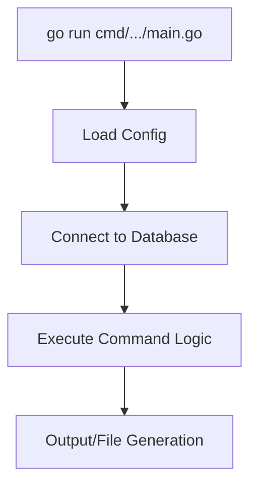

# Cmd

> Command-line utilities for the QuizNinja API

## What is this?

The `cmd` package contains standalone command-line tools for development and maintenance tasks. These are separate from the main API server and can be run independently.

Currently available commands:
- **generate-schema** - Generates `schema.sql` from the current database state

**Problems it solves:**
- Provides developer tools outside the main application
- Enables database schema documentation
- Supports CI/CD workflows for schema management

## Quick Start

### Running commands

Commands are run using `go run`:

```bash
# Generate schema.sql
go run cmd/generate-schema/main.go
```

Or build and run:

```bash
# Build
go build -o bin/generate-schema cmd/generate-schema/main.go

# Run
./bin/generate-schema
```

## Architecture Diagram



## Contents

```
cmd/
└── generate-schema/
    └── main.go      # Schema generation command
```

## Available Commands

### generate-schema

Generates a `schema.sql` file from the current database schema. This is useful for:

- Documenting the current database structure
- Comparing schema changes
- Setting up new development environments
- Code review of schema changes

**Usage:**

```bash
go run cmd/generate-schema/main.go
```

**What it does:**

1. Loads configuration from `.env`
2. Connects to the database
3. Queries the database for:
   - Table definitions
   - Column types and constraints
   - Indexes
   - Foreign keys
   - Views
   - Functions
4. Writes everything to `database/schema.sql`

**Output location:**

```
database/schema.sql
```

**Example output:**

```sql
-- Generated schema.sql
-- Tables
CREATE TABLE users (
    id UUID PRIMARY KEY DEFAULT gen_random_uuid(),
    email VARCHAR(255) UNIQUE NOT NULL,
    name VARCHAR(100),
    ...
);

CREATE TABLE quizzes (
    id UUID PRIMARY KEY DEFAULT gen_random_uuid(),
    title VARCHAR(200) NOT NULL,
    ...
);

-- Indexes
CREATE INDEX idx_users_email ON users(email);
...
```

**Requirements:**

- Database must be running and accessible
- `.env` file must be configured with database credentials

## Common Tasks

### How to Run Schema Generation

1. **Ensure database is running**:

```bash
# If using Docker
docker-compose up -d

# If using local PostgreSQL
pg_isready -h localhost -p 5432
```

2. **Ensure `.env` is configured**:

```bash
DB_HOST=localhost
DB_PORT=5432
DB_USER=postgres
DB_PASSWORD=your_password
DB_NAME=quizninja
```

3. **Run the command**:

```bash
go run cmd/generate-schema/main.go
```

4. **Check the output**:

```bash
cat database/schema.sql
```

### How to Add a New Command

1. **Create a new directory** under `cmd/`:

```bash
mkdir -p cmd/my-command
```

2. **Create the main file**:

```go
// cmd/my-command/main.go
package main

import (
    "log"
    "quizninja-api/config"
    "quizninja-api/database"
)

func main() {
    // Load configuration
    cfg := config.Load()

    // Connect to database if needed
    database.Connect(cfg)
    defer database.Close()

    // Your command logic here
    log.Println("Command completed successfully")
}
```

3. **Run your command**:

```bash
go run cmd/my-command/main.go
```

### How to Use Commands in CI/CD

**GitHub Actions example:**

```yaml
jobs:
  generate-schema:
    runs-on: ubuntu-latest
    steps:
      - uses: actions/checkout@v3

      - name: Set up Go
        uses: actions/setup-go@v4
        with:
          go-version: '1.23'

      - name: Start PostgreSQL
        run: |
          docker-compose up -d db
          sleep 5

      - name: Generate schema
        run: go run cmd/generate-schema/main.go
        env:
          DB_HOST: localhost
          DB_PORT: 5432
          DB_USER: postgres
          DB_PASSWORD: postgres
          DB_NAME: quizninja

      - name: Upload schema artifact
        uses: actions/upload-artifact@v3
        with:
          name: schema
          path: database/schema.sql
```

## Command Ideas for Future Development

Here are some commands that could be added:

| Command | Purpose |
|---------|---------|
| `seed-data` | Seed the database with test data |
| `migrate` | Run migrations manually |
| `rollback` | Rollback last migration |
| `cleanup` | Clean up old/expired data |
| `export-users` | Export user data for backup |
| `stats` | Print database statistics |
| `health-check` | Check database connectivity |

## Best Practices for Commands

1. **Load config** - Always use `config.Load()` to get configuration
2. **Handle cleanup** - Use `defer` to close database connections
3. **Log progress** - Provide feedback about what's happening
4. **Handle errors** - Use `log.Fatal` for critical errors
5. **Document usage** - Add comments explaining what the command does
6. **Keep focused** - Each command should do one thing well

## Related Documentation

- [Config README](../config/README.md) - Configuration loading
- [Database README](../database/README.md) - Database connection and migrations