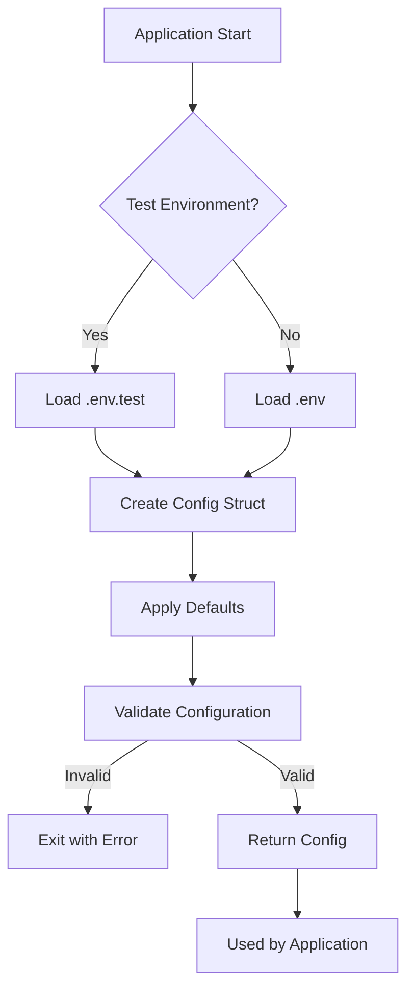

# Config

> Configuration management for the QuizNinja API

## What is this?

The `config` package handles all application configuration through environment variables. It loads settings from `.env` files (or system environment variables) and provides a centralized `Config` struct that the rest of the application uses.

**Problems it solves:**
- Centralizes all configuration in one place
- Provides sensible defaults for all settings
- Validates configuration at startup
- Supports multiple environments (development, test, production)
- Handles both PostgreSQL and Supabase database configurations

## Quick Start

### 1. Create your environment file

```bash
cp .env.example .env
```

### 2. Edit the configuration

Open `.env` and set your values:

```bash
# Minimum required for local development
DB_HOST=localhost
DB_PORT=5432
DB_USER=postgres
DB_PASSWORD=your_password
DB_NAME=quizninja
```

### 3. Configuration is loaded automatically

When the application starts, `config.Load()` is called in `main.go`:

```go
cfg := config.Load()
```

## Architecture Diagram



## Contents

| File | Purpose |
|------|---------|
| `config.go` | Main configuration loader, struct definition, and validation |

## How It Works

### Loading Order

1. **Detect environment**: Checks if running tests (`go test`)
2. **Load .env file**: Loads `.env` or `.env.test` based on environment
3. **Apply defaults**: Uses default values for any missing variables
4. **Validate**: Ensures required values are present
5. **Return Config**: Returns the populated Config struct

### Environment Detection

The config automatically detects test environments by checking:
- `flag.Lookup("test.v")` - Go test flag
- Executable name contains `.test`
- `GO_ENV=test` environment variable
- Any `-test.*` arguments

## Environment Variables Reference

### Server Configuration

| Variable | Default | Description |
|----------|---------|-------------|
| `PORT` | `8080` | HTTP server port |
| `GIN_MODE` | `debug` | Gin framework mode (`debug` or `release`) |
| `ALLOWED_ORIGINS` | `http://localhost:3000` | CORS allowed origins (comma-separated) |

### Database Configuration (PostgreSQL)

| Variable | Default | Description |
|----------|---------|-------------|
| `DB_HOST` | `localhost` | Database host |
| `DB_PORT` | `5432` | Database port |
| `DB_USER` | `postgres` | Database username |
| `DB_PASSWORD` | (empty) | Database password |
| `DB_NAME` | `quizninja` | Database name |

### Supabase Configuration

| Variable | Default | Description |
|----------|---------|-------------|
| `USE_SUPABASE` | `false` | Enable Supabase mode |
| `SUPABASE_URL` | (empty) | Supabase project URL |
| `SUPABASE_ANON_KEY` | (empty) | Supabase anonymous key |
| `SUPABASE_SERVICE_KEY` | (empty) | Supabase service key (admin operations) |
| `SUPABASE_DB_HOST` | (empty) | Supabase database host |
| `SUPABASE_DB_PORT` | `5432` | Supabase database port |
| `SUPABASE_DB_USER` | (empty) | Supabase database user |
| `SUPABASE_DB_PASSWORD` | (empty) | Supabase database password |
| `SUPABASE_DB_NAME` | (empty) | Supabase database name |

### Rate Limiting

| Variable | Default | Description |
|----------|---------|-------------|
| `RATE_LIMIT_ENABLED` | `true` | Enable rate limiting |
| `RATE_LIMIT_GLOBAL` | `100` | Requests per minute per IP (global) |
| `RATE_LIMIT_AUTH` | `5` | Requests per minute per IP (auth endpoints) |
| `RATE_LIMIT_WRITE` | `20` | Requests per minute per IP (write operations) |
| `RATE_LIMIT_PER_USER` | `60` | Requests per minute per authenticated user |

### Request Size Limits

| Variable | Default | Description |
|----------|---------|-------------|
| `REQUEST_SIZE_LIMIT_ENABLED` | `true` | Enable request size limiting |
| `REQUEST_SIZE_DEFAULT` | `10` | Default max request size in MB |
| `REQUEST_SIZE_AUTH` | `1` | Max request size for auth endpoints in MB |
| `REQUEST_SIZE_WRITE` | `5` | Max request size for write operations in MB |

### Logging

| Variable | Default | Description |
|----------|---------|-------------|
| `LOG_LEVEL` | `INFO` | Log level: `DEBUG`, `INFO`, `WARN`, `ERROR`, `FATAL` |
| `LOG_FORMAT` | `json` | Log format: `text` or `json` |
| `LOG_OUTPUT` | `stdout` | Output: `stdout`, `file`, or `both` |

### Internal API

| Variable | Default | Description |
|----------|---------|-------------|
| `INTERNAL_API_SECRET` | (empty) | Shared secret for internal API authentication |
| `INTERNAL_SERVICE_URL` | `http://localhost:8080` | Base URL for internal service calls |

### Testing

| Variable | Default | Description |
|----------|---------|-------------|
| `USE_MOCK_AUTH` | `false` | Use mock authentication (testing only, disabled in release mode) |

## Common Tasks

### How to Add a New Configuration Variable

1. **Add the field to the Config struct** in `config.go`:

```go
type Config struct {
    // ... existing fields
    MyNewSetting string
}
```

2. **Set the value in Load()** with a default:

```go
cfg := &Config{
    // ... existing fields
    MyNewSetting: getEnv("MY_NEW_SETTING", "default_value"),
}
```

3. **Add validation if required** in `ValidateConfig()`:

```go
if c.MyNewSetting == "" {
    errors = append(errors, "MY_NEW_SETTING is required")
}
```

4. **Document the variable** in this README.

### How to Use Configuration in Your Code

```go
// In handlers, services, or other packages
func NewMyHandler(cfg *config.Config) *MyHandler {
    return &MyHandler{
        someSetting: cfg.MyNewSetting,
    }
}
```

### How to Set Up for Supabase

1. Set `USE_SUPABASE=true`
2. Provide all `SUPABASE_*` variables
3. The application will use Supabase for both database and authentication

```bash
USE_SUPABASE=true
SUPABASE_URL=https://your-project.supabase.co
SUPABASE_ANON_KEY=your-anon-key
SUPABASE_SERVICE_KEY=your-service-key
SUPABASE_DB_HOST=db.your-project.supabase.co
SUPABASE_DB_PORT=5432
SUPABASE_DB_USER=postgres
SUPABASE_DB_PASSWORD=your-db-password
SUPABASE_DB_NAME=postgres
```

### How to Set Up for Local PostgreSQL

```bash
USE_SUPABASE=false
DB_HOST=localhost
DB_PORT=5432
DB_USER=postgres
DB_PASSWORD=your_password
DB_NAME=quizninja
```

## Security Notes

- **Never commit `.env` files** to version control
- **Mock auth is blocked in release mode** for security
- **Internal API secret** should be a strong, random string in production
- **Service keys** should only be used server-side, never exposed to clients

## Related Documentation

- [Root README](../README.md) - Project overview
- [Database README](../database/README.md) - Database connection details
- [Middleware README](../middleware/README.md) - How config affects middleware
