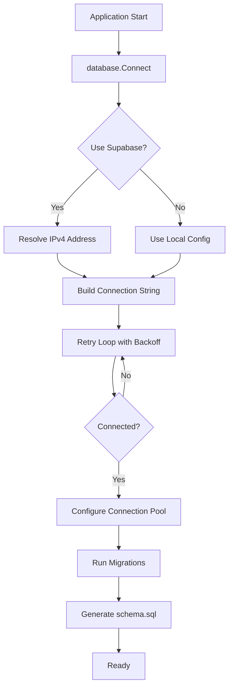
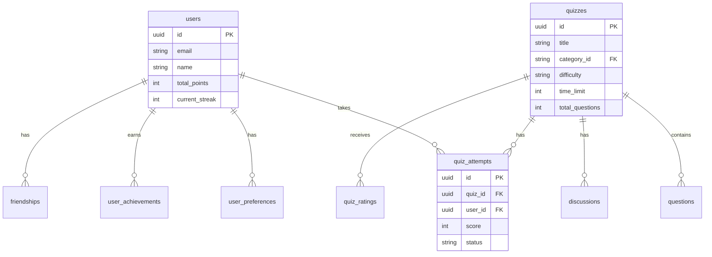

# Database

> Database connection, migrations, and schema management for QuizNinja API

## What is this?

The `database` package handles everything related to database connectivity and schema management:

- **Connection management**: Establishes and maintains PostgreSQL connections
- **Migration system**: Automatically applies SQL migrations on startup
- **Schema generation**: Auto-generates `schema.sql` from the current database state

**Problems it solves:**
- Reliable database connections with automatic retry
- Version-controlled database schema changes
- Support for both local PostgreSQL and Supabase
- Docker-friendly with IPv4 resolution for compatibility

## Quick Start

### 1. Set up your database

**Option A: Local PostgreSQL**
```bash
# Create the database
createdb quizninja

# Configure in .env
DB_HOST=localhost
DB_PORT=5432
DB_USER=postgres
DB_PASSWORD=your_password
DB_NAME=quizninja
```

**Option B: Supabase**
```bash
# Configure in .env
USE_SUPABASE=true
SUPABASE_DB_HOST=db.your-project.supabase.co
SUPABASE_DB_PORT=5432
SUPABASE_DB_USER=postgres
SUPABASE_DB_PASSWORD=your-password
SUPABASE_DB_NAME=postgres
```

### 2. Run the application

Migrations run automatically on startup:
```bash
go run main.go
```

You'll see logs like:
```
INFO Connecting to traditional PostgreSQL database
INFO Successfully connected to traditional database
INFO Successfully applied migration 001_initial_schema.sql
INFO All migrations completed successfully
```

## Architecture Diagram



## Contents

| File | Purpose |
|------|---------|
| `database.go` | Connection management, retry logic, connection pooling |
| `migrate.go` | Migration runner, tracks applied migrations |
| `schema.sql` | Auto-generated schema (do not edit manually) |
| `schema_generator.go` | Generates schema.sql from database |
| `migrations/` | SQL migration files (63 files) |

## How It Works

### Connection Flow

1. **Build connection string** from config (PostgreSQL or Supabase)
2. **Resolve hostname** to IPv4 (for Docker compatibility)
3. **Attempt connection** with exponential backoff retry
4. **Configure pool** (25 max connections, 5 idle)
5. **Run migrations** automatically
6. **Generate schema.sql** for reference

### Connection Pool Settings

| Setting | Value | Description |
|---------|-------|-------------|
| Max Open Connections | 25 | Maximum simultaneous connections |
| Max Idle Connections | 5 | Connections kept ready |
| Connection Max Lifetime | 5 minutes | How long to reuse a connection |
| Connection Max Idle Time | 2 minutes | How long idle connections stay open |

### Retry Logic

The connection uses exponential backoff:
- **Initial interval**: 100ms
- **Max interval**: 10 seconds
- **Multiplier**: 1.5x
- **Total timeout**: 30 seconds

### Migration System

Migrations are tracked in a `migrations` table:

```sql
CREATE TABLE migrations (
    id SERIAL PRIMARY KEY,
    filename VARCHAR(255) UNIQUE NOT NULL,
    applied_at TIMESTAMP DEFAULT CURRENT_TIMESTAMP
);
```

Migration files are executed in alphabetical order, and each is wrapped in a transaction.

## Key Database Tables



### Core Tables

| Table | Purpose |
|-------|---------|
| `users` | User accounts and statistics |
| `user_preferences` | User settings and privacy options |
| `quizzes` | Quiz definitions |
| `questions` | Quiz questions with answers |
| `quiz_attempts` | User quiz attempts and scores |
| `quiz_statistics` | Aggregated quiz performance data |
| `achievements` | Achievement definitions |
| `user_achievements` | Unlocked achievements per user |
| `friendships` | Friend connections |
| `friend_requests` | Pending friend requests |
| `notifications` | User notifications |
| `discussions` | Discussion threads |
| `discussion_replies` | Discussion comments |
| `quiz_ratings` | Quiz ratings and reviews |
| `leaderboard_snapshots` | Historical ranking data |
| `categories` | Quiz categories |
| `difficulty_levels` | Difficulty level definitions |

## Common Tasks

### How to Create a New Migration

1. **Create a new SQL file** in `database/migrations/`:

```bash
# Use the next number in sequence
touch database/migrations/064_your_migration_name.sql
```

2. **Write your SQL**:

```sql
-- database/migrations/064_add_new_column.sql

-- Add the column
ALTER TABLE users ADD COLUMN bio TEXT;

-- Add an index if needed
CREATE INDEX idx_users_bio ON users(bio) WHERE bio IS NOT NULL;
```

3. **Restart the application** - migration runs automatically:

```bash
go run main.go
```

4. **Verify** - check the logs and `schema.sql` is updated

### How to Check Migration Status

Connect to your database and query:

```sql
SELECT filename, applied_at
FROM migrations
ORDER BY applied_at DESC
LIMIT 10;
```

### How to Reset the Database (Development Only)

```bash
# Drop and recreate
dropdb quizninja
createdb quizninja

# Restart app - all migrations will run fresh
go run main.go
```

### How to Access the Database in Code

```go
import "quizninja-api/database"

// The global DB variable is available after Connect()
rows, err := database.DB.Query("SELECT * FROM users WHERE id = $1", userID)
```

### How to Debug Connection Issues

1. **Check logs** for connection attempts:
```
WARN Database connection attempt failed - error pinging database
```

2. **Verify config** in `.env`:
```bash
DB_HOST=localhost
DB_PORT=5432
# etc.
```

3. **Test direct connection**:
```bash
psql -h localhost -U postgres -d quizninja
```

4. **For Supabase**, ensure IPv4 connectivity:
```bash
# The app automatically resolves to IPv4, but you can test:
dig +short db.your-project.supabase.co A
```

## Migration Best Practices

1. **One change per migration** - easier to debug and rollback
2. **Use transactions** - migrations are automatically wrapped in transactions
3. **Test migrations** - try on a copy of production data first
4. **Never edit applied migrations** - create a new migration instead
5. **Use IF EXISTS/IF NOT EXISTS** - make migrations idempotent when possible

```sql
-- Good: Safe to run multiple times
CREATE INDEX IF NOT EXISTS idx_users_email ON users(email);

-- Bad: Will fail if run twice
CREATE INDEX idx_users_email ON users(email);
```

## Supabase vs PostgreSQL

| Feature | PostgreSQL | Supabase |
|---------|------------|----------|
| SSL | Optional (`sslmode=disable`) | Required (`sslmode=require`) |
| Host Resolution | Direct | IPv4 resolved (Docker fix) |
| Auth | App-managed JWT | Supabase Auth integration |
| Connection | Direct | Via Supabase pooler |

## Related Documentation

- [Config README](../config/README.md) - Database configuration variables
- [Repository README](../repository/README.md) - Data access layer using the database
- [Models README](../models/README.md) - Go structs that map to tables
