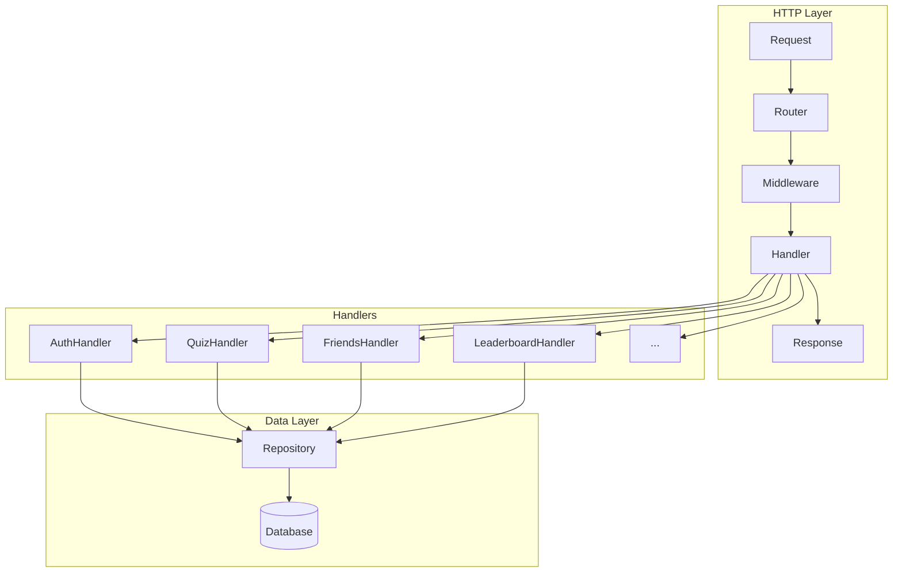

# Handlers

> HTTP request handlers for the QuizNinja public API

## What is this?

The `handlers` package contains all HTTP request handlers for the public API (`/api/v1/*`). Each handler:

- Processes incoming HTTP requests
- Validates request data
- Calls repository methods for data operations
- Returns JSON responses

**Problems it solves:**
- Separates HTTP handling from business logic
- Provides consistent request/response patterns
- Handles input validation and error responses
- Organizes endpoints by domain (quiz, user, friends, etc.)

## Quick Start

### Handler structure pattern

All handlers follow the same pattern:

```go
func (h *QuizHandler) GetQuiz(c *gin.Context) {
    // 1. Parse parameters
    quizID := c.Param("id")

    // 2. Validate input
    id, err := uuid.Parse(quizID)
    if err != nil {
        c.JSON(400, gin.H{"error": "Invalid quiz ID"})
        return
    }

    // 3. Call repository
    quiz, err := h.repo.Quiz.GetQuizByID(id)
    if err != nil {
        c.JSON(500, gin.H{"error": "Failed to get quiz"})
        return
    }

    // 4. Return response
    c.JSON(200, gin.H{"quiz": quiz})
}
```

### Handlers are registered in routes

```go
// routes/routes.go
quizHandler := handlers.NewQuizHandler(cfg)
r.GET("/quizzes/:id", quizHandler.GetQuiz)
```

## Architecture Diagram



## Contents

| File | Purpose | Auth Required |
|------|---------|---------------|
| `auth_handler.go` | Registration, login, profile | Partial |
| `quiz_handler.go` | Quiz CRUD, attempts, submissions | Partial |
| `user_handler.go` | User profile viewing | Yes |
| `friends_handler.go` | Friend requests, friendships | Yes |
| `leaderboard_handler.go` | Rankings and scores | Yes |
| `achievement_handler.go` | Achievements and progress | Yes |
| `notification_handler.go` | User notifications | Yes |
| `discussion_handler.go` | Quiz discussions | Yes |
| `favorites_handler.go` | Favorite quizzes | Yes |
| `rating_handler.go` | Quiz ratings | Yes |
| `preferences_handler.go` | User preferences | Partial |
| `categories_handler.go` | Quiz categories | No |
| `app_settings_handler.go` | Application settings | No |

## Handler Overview

### AuthHandler

Handles user authentication and profile management.

| Method | Endpoint | Auth | Description |
|--------|----------|------|-------------|
| `Register` | `POST /auth/register` | No | Create new user account |
| `Login` | `POST /auth/login` | No | Authenticate user |
| `Logout` | `POST /auth/logout` | Yes | End user session |
| `GetProfile` | `GET /auth/profile` | Yes | Get current user profile |
| `UpdateProfile` | `PUT /auth/profile` | Yes | Update current user profile |
| `GetUserStats` | `GET /users/stats` | Yes | Get user statistics |

### QuizHandler

Manages quizzes and quiz attempts.

| Method | Endpoint | Auth | Description |
|--------|----------|------|-------------|
| `GetQuizzes` | `GET /quizzes` | No | List quizzes with filters |
| `GetFeaturedQuizzes` | `GET /quizzes/featured` | No | Get featured quizzes |
| `GetQuizzesByCategory` | `GET /quizzes/category/:category` | No | Filter by category |
| `GetQuizByID` | `GET /quizzes/:id` | No | Get quiz details |
| `GetQuizQuestions` | `GET /quizzes/:id/questions` | Yes | Get quiz questions |
| `StartQuizAttempt` | `POST /quizzes/:id/attempts` | Yes | Start new attempt |
| `SubmitQuizAttempt` | `POST /quizzes/:id/attempts/:attemptId/submit` | Yes | Submit answers |
| `GetUserQuizAttempt` | `GET /users/quizzes/:quizId/attempt` | Yes | Get active attempt |
| `GetUserLatestCompletedAttempt` | `GET /users/quizzes/:quizId/completed-attempt` | Yes | Get last completed |
| `AbandonQuizAttempt` | `DELETE /quizzes/:id/attempts/:attemptId/abandon` | Yes | Abandon attempt |

### FriendsHandler

Manages social features.

| Method | Endpoint | Auth | Description |
|--------|----------|------|-------------|
| `SendFriendRequest` | `POST /friends/requests` | Yes | Send friend request |
| `GetFriendRequests` | `GET /friends/requests` | Yes | Get pending requests |
| `RespondToFriendRequest` | `PUT /friends/requests/:id` | Yes | Accept/reject request |
| `CancelFriendRequest` | `DELETE /friends/requests/:id` | Yes | Cancel sent request |
| `GetFriends` | `GET /friends` | Yes | List friends |
| `RemoveFriend` | `DELETE /friends/:id` | Yes | Remove friend |
| `SearchUsers` | `GET /friends/search` | Yes | Search for users |

### LeaderboardHandler

Manages rankings and scores.

| Method | Endpoint | Auth | Description |
|--------|----------|------|-------------|
| `GetLeaderboard` | `GET /leaderboard` | Yes | Get global/friends leaderboard |
| `GetLeaderboardStats` | `GET /leaderboard/stats` | Yes | Get leaderboard statistics |
| `GetUserRank` | `GET /leaderboard/rank` | Yes | Get user's rank |
| `UpdateUserScore` | `POST /leaderboard/score` | Yes | Update user score |

### AchievementHandler

Manages achievements and progress.

| Method | Endpoint | Auth | Description |
|--------|----------|------|-------------|
| `GetAllAchievements` | `GET /achievements` | Yes | List all achievements |
| `GetUserAchievements` | `GET /users/achievements` | Yes | Get unlocked achievements |
| `GetAchievementProgress` | `GET /achievements/progress` | Yes | Get progress toward achievements |
| `GetAchievementStats` | `GET /achievements/stats` | Yes | Get achievement statistics |
| `CheckAchievements` | `POST /achievements/check` | Yes | Check for new unlocks |

### NotificationHandler

Manages user notifications.

| Method | Endpoint | Auth | Description |
|--------|----------|------|-------------|
| `GetNotifications` | `GET /notifications` | Yes | List notifications |
| `GetNotificationStats` | `GET /notifications/stats` | Yes | Get notification stats |
| `MarkNotificationAsRead` | `PUT /notifications/:id/read` | Yes | Mark as read |
| `MarkAllNotificationsAsRead` | `PUT /notifications/read-all` | Yes | Mark all as read |
| `DeleteNotification` | `DELETE /notifications/:id` | Yes | Delete notification |

### DiscussionHandler

Manages quiz discussions.

| Method | Endpoint | Auth | Description |
|--------|----------|------|-------------|
| `GetDiscussions` | `GET /discussions` | Yes | List discussions |
| `CreateDiscussion` | `POST /discussions` | Yes | Create discussion |
| `GetDiscussion` | `GET /discussions/:id` | Yes | Get discussion |
| `LikeDiscussion` | `PUT /discussions/:id/like` | Yes | Like discussion |
| `GetDiscussionReplies` | `GET /discussions/:id/replies` | Yes | Get replies |
| `CreateDiscussionReply` | `POST /discussions/:id/replies` | Yes | Add reply |

### FavoritesHandler

Manages favorite quizzes.

| Method | Endpoint | Auth | Description |
|--------|----------|------|-------------|
| `AddFavorite` | `POST /favorites` | Yes | Add to favorites |
| `RemoveFavorite` | `DELETE /favorites/:quizId` | Yes | Remove from favorites |
| `GetFavorites` | `GET /favorites` | Yes | List favorites |
| `CheckFavorite` | `GET /favorites/check/:quizId` | Yes | Check if favorited |

### RatingHandler

Manages quiz ratings.

| Method | Endpoint | Auth | Description |
|--------|----------|------|-------------|
| `CreateRating` | `POST /quizzes/:id/ratings` | Yes | Rate a quiz |
| `GetQuizRatings` | `GET /quizzes/:id/ratings` | Yes | Get quiz ratings |
| `GetAverageRating` | `GET /quizzes/:id/ratings/average` | Yes | Get average rating |
| `GetUserRating` | `GET /quizzes/:id/ratings/user` | Yes | Get user's rating |
| `UpdateRating` | `PUT /quizzes/:id/ratings/:ratingId` | Yes | Update rating |
| `DeleteRating` | `DELETE /quizzes/:id/ratings/:ratingId` | Yes | Delete rating |

## Common Tasks

### How to Create a New Handler

1. **Create the handler file**:

```go
// handlers/my_handler.go
package handlers

import (
    "quizninja-api/config"
    "quizninja-api/repository"
    "github.com/gin-gonic/gin"
    "github.com/google/uuid"
)

type MyHandler struct {
    repo   *repository.Repository
    config *config.Config
}

func NewMyHandler(cfg *config.Config) *MyHandler {
    return &MyHandler{
        repo:   repository.NewRepository(),
        config: cfg,
    }
}
```

2. **Add handler methods**:

```go
func (h *MyHandler) GetItem(c *gin.Context) {
    // Parse ID from URL
    idStr := c.Param("id")
    id, err := uuid.Parse(idStr)
    if err != nil {
        c.JSON(400, gin.H{"error": "Invalid ID format"})
        return
    }

    // Get from repository
    item, err := h.repo.My.GetByID(id)
    if err != nil {
        c.JSON(500, gin.H{"error": "Failed to get item"})
        return
    }

    c.JSON(200, gin.H{"item": item})
}
```

3. **Register in routes**:

```go
// routes/routes.go
myHandler := handlers.NewMyHandler(cfg)
r.GET("/items/:id", myHandler.GetItem)
```

### How to Get the Authenticated User

```go
func (h *MyHandler) MyProtectedHandler(c *gin.Context) {
    // Get user ID from context (set by auth middleware)
    userID := c.MustGet("user_id").(uuid.UUID)

    // Use userID for queries
    data, err := h.repo.My.GetByUserID(userID)
    // ...
}
```

### How to Parse Request Body

```go
func (h *MyHandler) CreateItem(c *gin.Context) {
    var req models.CreateItemRequest

    // Bind and validate JSON body
    if err := c.ShouldBindJSON(&req); err != nil {
        c.JSON(400, gin.H{"error": err.Error()})
        return
    }

    // req is now validated and populated
    // ...
}
```

### How to Parse Query Parameters

```go
func (h *MyHandler) ListItems(c *gin.Context) {
    // Simple parameters
    page := c.DefaultQuery("page", "1")
    search := c.Query("search")

    // Bind to struct with validation
    var filters models.ItemFilters
    if err := c.ShouldBindQuery(&filters); err != nil {
        c.JSON(400, gin.H{"error": err.Error()})
        return
    }
}
```

### How to Return Paginated Results

```go
func (h *MyHandler) ListItems(c *gin.Context) {
    page, _ := strconv.Atoi(c.DefaultQuery("page", "1"))
    pageSize, _ := strconv.Atoi(c.DefaultQuery("page_size", "10"))

    items, total, err := h.repo.My.List(page, pageSize)
    if err != nil {
        c.JSON(500, gin.H{"error": "Failed to list items"})
        return
    }

    totalPages := (total + pageSize - 1) / pageSize

    c.JSON(200, gin.H{
        "items":       items,
        "total":       total,
        "page":        page,
        "page_size":   pageSize,
        "total_pages": totalPages,
    })
}
```

### How to Handle Errors

```go
func (h *MyHandler) GetItem(c *gin.Context) {
    item, err := h.repo.My.GetByID(id)

    // Not found
    if err == sql.ErrNoRows {
        c.JSON(404, gin.H{"error": "Item not found"})
        return
    }

    // Other error
    if err != nil {
        // Log the actual error
        utils.WithFields(logrus.Fields{
            "error": err.Error(),
            "id":    id,
        }).Error("Failed to get item")

        // Return generic error to client
        c.JSON(500, gin.H{"error": "Internal server error"})
        return
    }

    c.JSON(200, gin.H{"item": item})
}
```

## Response Patterns

### Success Response

```json
{
  "data": { ... },
  "meta": {
    "total": 100,
    "page": 1,
    "page_size": 10
  }
}
```

### Error Response

```json
{
  "error": "Description of the error"
}
```

### Validation Error

```json
{
  "error": "Key: 'CreateQuizRequest.Title' Error:Field validation for 'Title' failed on the 'required' tag"
}
```

## Related Documentation

- [Routes README](../routes/README.md) - Where handlers are registered
- [Models README](../models/README.md) - Request/response models
- [Repository README](../repository/README.md) - Data access methods
- [Middleware README](../middleware/README.md) - Authentication and validation
- [Internal README](../internal/README.md) - Internal API handlers