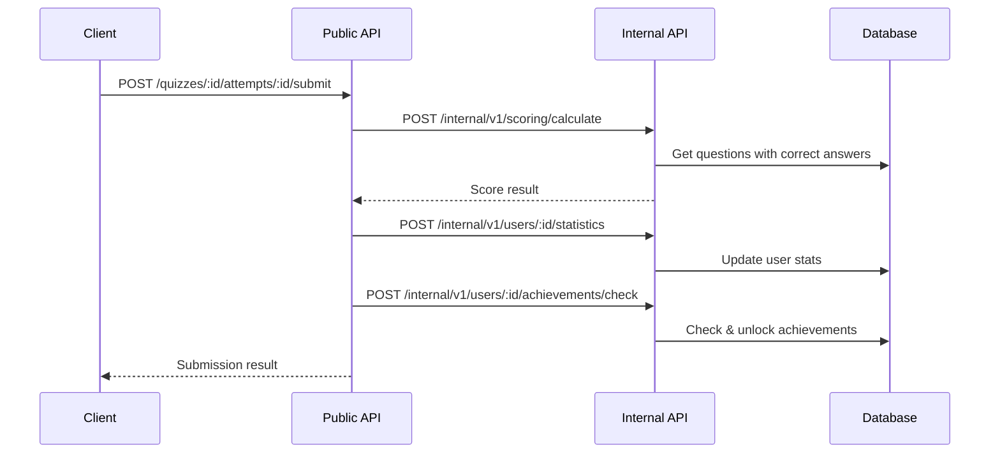

# Internal

> Service-to-service API for internal operations

## What is this?

The `internal` package provides a private API (`/internal/v1/*`) for service-to-service communication. These endpoints are NOT exposed to external clients and handle sensitive operations like:

- **Score calculation** - Computing quiz scores with correct answers
- **Statistics updates** - Updating user statistics after quiz completion
- **Achievement checking** - Checking and unlocking achievements
- **Attempt validation** - Validating quiz attempts before submission

**Problems it solves:**
- Separates sensitive operations from the public API
- Provides secure service-to-service communication
- Allows correct answers to be accessed internally (never exposed to clients)
- Enables microservice-style architecture if needed

## Quick Start

### Internal API authentication

All internal endpoints require the `X-Internal-API-Key` header:

```bash
curl -X POST http://localhost:8080/internal/v1/scoring/calculate \
  -H "X-Internal-API-Key: your-secret-key" \
  -H "Content-Type: application/json" \
  -d '{"quiz_id": "...", "answers": [...]}'
```

### Configuration

Set the shared secret in `.env`:

```bash
INTERNAL_API_SECRET=your-secure-random-string
```

## Architecture Diagram

```mermaid
flowchart TD
    subgraph "External Clients"
        A[Mobile App] --> B[Public API]
        C[Web App] --> B
    end

    subgraph "Public API"
        B[/api/v1/*]
    end

    subgraph "Internal API"
        D[/internal/v1/*]
    end

    subgraph "Internal Services"
        E[Quiz Submission Handler]
    end

    B --> E
    E --> D
    D --> F[(Database)]

    style D fill:#f9f,stroke:#333
```

### Example Flow: Quiz Submission



## Project Structure

```
internal/
├── handlers/           # Internal API handlers
│   ├── attempt_handler.go     # Attempt validation
│   ├── scoring_handler.go     # Score calculation
│   ├── statistics_handler.go  # User stats updates
│   ├── achievement_handler.go # Achievement checking
│   └── quiz_handler.go        # Quiz with correct answers
├── middleware/         # Internal authentication
│   └── auth.go               # API key validation
├── models/             # Internal-only models
│   └── models.go             # Request/response types
├── routes/             # Route setup
│   └── routes.go             # Internal route registration
└── client/             # Client for calling internal API
    └── client.go             # HTTP client helper
```

## Internal Endpoints

| Method | Endpoint | Purpose |
|--------|----------|---------|
| `POST` | `/internal/v1/attempts/:attemptId/validate` | Validate quiz attempt |
| `PUT` | `/internal/v1/attempts/:attemptId` | Update attempt status |
| `GET` | `/internal/v1/quizzes/:quizId/questions` | Get questions **with correct answers** |
| `POST` | `/internal/v1/scoring/calculate` | Calculate score from answers |
| `POST` | `/internal/v1/users/:userId/statistics` | Update user statistics |
| `POST` | `/internal/v1/users/:userId/achievements/check` | Check and unlock achievements |

## Handlers

### AttemptHandler

Validates and updates quiz attempts.

```go
// Validate an attempt before submission
POST /internal/v1/attempts/:attemptId/validate
{
    "quiz_id": "uuid",
    "user_id": "uuid",
    "answers": [...]
}

// Update attempt status
PUT /internal/v1/attempts/:attemptId
{
    "status": "completed",
    "score": 85,
    "time_spent": 300
}
```

### ScoringHandler

Calculates quiz scores with access to correct answers.

```go
// Calculate score
POST /internal/v1/scoring/calculate
{
    "quiz_id": "uuid",
    "answers": [
        {"question_id": "uuid", "selected_option": "A"},
        {"question_id": "uuid", "text_answer": "Paris"}
    ]
}

// Response
{
    "score": 80,
    "total_points": 100,
    "correct_count": 8,
    "total_questions": 10,
    "answers": [
        {"question_id": "uuid", "is_correct": true, "points_earned": 10}
    ]
}
```

### StatisticsHandler

Updates user statistics after quiz completion.

```go
// Update statistics
POST /internal/v1/users/:userId/statistics
{
    "quiz_id": "uuid",
    "score": 85,
    "time_spent": 300,
    "is_completed": true
}
```

### AchievementHandler

Checks and unlocks achievements.

```go
// Check achievements
POST /internal/v1/users/:userId/achievements/check
{
    "trigger": "quiz_completed",
    "context": {
        "quiz_id": "uuid",
        "score": 100,
        "category": "science"
    }
}

// Response
{
    "unlocked": [
        {"key": "perfect_score", "title": "Perfect!", "points": 50}
    ]
}
```

### QuizInternalHandler

Gets quiz questions WITH correct answers (never exposed publicly).

```go
// Get questions with answers
GET /internal/v1/quizzes/:quizId/questions

// Response includes correct_answer field
{
    "questions": [
        {
            "id": "uuid",
            "question_text": "What is 2+2?",
            "options": ["3", "4", "5", "6"],
            "correct_answer": "4"  // Only in internal API!
        }
    ]
}
```

## Authentication

### InternalAuthMiddleware

Located in `internal/middleware/auth.go`:

```go
// Validates X-Internal-API-Key header
func InternalAuthMiddleware() gin.HandlerFunc {
    return func(c *gin.Context) {
        providedSecret := c.GetHeader("X-Internal-API-Key")

        if providedSecret != os.Getenv("INTERNAL_API_SECRET") {
            c.JSON(403, gin.H{"error": "Invalid internal API key"})
            c.Abort()
            return
        }

        c.Next()
    }
}
```

### Error Responses

```json
// Missing key
{
  "error": {
    "code": "MISSING_INTERNAL_KEY",
    "message": "Internal API key is required"
  }
}

// Invalid key
{
  "error": {
    "code": "INVALID_INTERNAL_KEY",
    "message": "Invalid internal API key"
  }
}

// Server not configured
{
  "error": {
    "code": "INTERNAL_CONFIG_ERROR",
    "message": "Internal API secret not configured"
  }
}
```

## Common Tasks

### How to Call Internal API from Public Handler

```go
// In a public handler
func (h *QuizHandler) SubmitQuizAttempt(c *gin.Context) {
    // ... validate submission ...

    // Call internal scoring API
    client := internal.NewClient(h.config)
    scoreResult, err := client.CalculateScore(quizID, answers)
    if err != nil {
        c.JSON(500, gin.H{"error": "Failed to calculate score"})
        return
    }

    // ... continue with result ...
}
```

### How to Add a New Internal Endpoint

1. **Create the handler** in `internal/handlers/`:

```go
// internal/handlers/my_handler.go
package handlers

type MyInternalHandler struct {
    config *config.Config
}

func NewMyInternalHandler(cfg *config.Config) *MyInternalHandler {
    return &MyInternalHandler{config: cfg}
}

func (h *MyInternalHandler) MyOperation(c *gin.Context) {
    // Handle request...
    c.JSON(200, gin.H{"result": "success"})
}
```

2. **Register the route** in `internal/routes/routes.go`:

```go
myHandler := handlers.NewMyInternalHandler(cfg)

my := internal.Group("/my")
{
    my.POST("/operation", myHandler.MyOperation)
}
```

### How to Test Internal Endpoints

```bash
# Set up test environment
export INTERNAL_API_SECRET=test-secret

# Make test request
curl -X POST http://localhost:8080/internal/v1/scoring/calculate \
  -H "X-Internal-API-Key: test-secret" \
  -H "Content-Type: application/json" \
  -d '{"quiz_id": "...", "answers": [...]}'
```

## Security Considerations

1. **Never expose internal endpoints publicly** - They should only be accessible within your infrastructure
2. **Use strong secrets** - `INTERNAL_API_SECRET` should be a long, random string
3. **Rotate secrets periodically** - Change the secret on a regular schedule
4. **Network isolation** - In production, internal endpoints should only be accessible within your VPC
5. **Request tracing** - Use `X-Request-ID` header to correlate internal and public requests

## When to Use Internal vs Public API

| Use Internal API when... | Use Public API when... |
|--------------------------|------------------------|
| Need access to correct answers | Client-facing operations |
| Updating sensitive statistics | User authentication |
| Server-side score calculation | Fetching quiz data |
| Checking achievements | Viewing leaderboards |
| Operations requiring trust | Any client-initiated action |

## Related Documentation

- [Handlers README](../handlers/README.md) - Public API handlers
- [Config README](../config/README.md) - Internal API configuration
- [Middleware README](../middleware/README.md) - Public API middleware