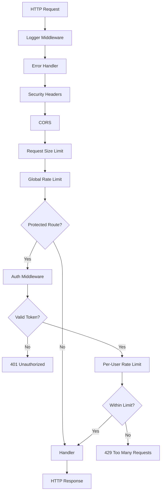

# Middleware

> HTTP middleware for request processing in the QuizNinja API

## What is this?

The `middleware` package contains HTTP middleware functions that process requests before they reach handlers. Middleware handles cross-cutting concerns like:

- **Authentication** - Verify JWT/Supabase tokens
- **Rate Limiting** - Prevent abuse and ensure fair usage
- **CORS** - Handle cross-origin requests
- **Logging** - Request/response logging
- **Security** - Security headers
- **Request Size** - Limit request body sizes

**Problems it solves:**
- Centralizes authentication logic
- Protects against brute force and DoS attacks
- Enables cross-origin requests from frontend
- Provides visibility into API usage
- Enforces security best practices

## Quick Start

### Understanding the middleware pipeline

Middleware executes in order for every request:

```
Request → Logging → CORS → Security → Rate Limit → [Auth] → Handler → Response
```

### Middleware is applied in `main.go`:

```go
// Global middleware (all routes)
r.Use(middleware.Logger(cfg))
r.Use(middleware.ErrorHandler())
r.Use(middleware.SecurityHeaders())
r.Use(middleware.CORS())
r.Use(middleware.DefaultRequestSizeLimit(cfg))
r.Use(middleware.GlobalRateLimit())

// Protected routes (requires auth)
protected := r.Group("/api/v1")
protected.Use(middleware.AuthMiddleware(cfg))
protected.Use(middleware.PerUserRateLimit())
```

## Architecture Diagram



## Contents

| File | Purpose |
|------|---------|
| `auth.go` | JWT/Supabase authentication |
| `rate_limiter.go` | Rate limiting (global, auth, per-user) |
| `cors.go` | Cross-Origin Resource Sharing |
| `logging.go` | Request logging and error handling |
| `security_headers.go` | Security HTTP headers |
| `request_size.go` | Request body size limits |

## Middleware Details

### Authentication (`auth.go`)

Validates Bearer tokens and sets user context.

**Flow:**
1. Extract token from `Authorization: Bearer <token>` header
2. Validate with Supabase (or mock auth in test mode)
3. Look up database user by Supabase ID
4. Set `user_id` in request context

**Context values set:**
| Key | Type | Description |
|-----|------|-------------|
| `user_id` | `uuid.UUID` | Database user ID |
| `auth_method` | `string` | "supabase" or "mock" |
| `supabase_user` | `*SupabaseUser` | Supabase user object |

**Usage in handlers:**
```go
func MyHandler(c *gin.Context) {
    userID := c.MustGet("user_id").(uuid.UUID)
    // Use userID...
}
```

### Rate Limiting (`rate_limiter.go`)

Multiple rate limiters for different scenarios:

| Limiter | Default | Purpose |
|---------|---------|---------|
| `GlobalRateLimit` | 100/min per IP | All requests |
| `AuthRateLimit` | 5/min per IP | Login/register endpoints |
| `StrictRateLimit` | 20/min per IP | Write operations |
| `PerUserRateLimit` | 60/min per user | Authenticated requests |

**Headers added:**
```
X-RateLimit-Limit: 60
X-RateLimit-Remaining: 45
X-RateLimit-Reset: 1699876543
```

**Configuration:**
```bash
RATE_LIMIT_ENABLED=true
RATE_LIMIT_GLOBAL=100
RATE_LIMIT_AUTH=5
RATE_LIMIT_WRITE=20
RATE_LIMIT_PER_USER=60
```

### CORS (`cors.go`)

Handles Cross-Origin Resource Sharing for browser requests.

**Default configuration:**
- All origins allowed (configurable via `ALLOWED_ORIGINS`)
- All standard methods (GET, POST, PUT, DELETE, PATCH, OPTIONS)
- Credentials allowed
- Authorization header allowed

### Logging (`logging.go`)

Two middleware functions:

**`Logger()`** - Logs all requests:
```
INFO Request completed method=GET path=/api/v1/quizzes status=200 latency=45ms
```

**`ErrorHandler()`** - Recovers from panics:
```
ERROR Panic recovered error="nil pointer dereference" stack="..."
```

### Security Headers (`security_headers.go`)

Adds security headers to all responses:

| Header | Value | Purpose |
|--------|-------|---------|
| `X-Frame-Options` | `DENY` | Prevent clickjacking |
| `X-Content-Type-Options` | `nosniff` | Prevent MIME sniffing |
| `X-XSS-Protection` | `1; mode=block` | XSS protection |
| `Content-Security-Policy` | (configured) | CSP rules |
| `Referrer-Policy` | `strict-origin-when-cross-origin` | Referrer control |

### Request Size Limiting (`request_size.go`)

Limits request body sizes to prevent abuse:

| Limit Type | Default | Use Case |
|------------|---------|----------|
| `DefaultRequestSizeLimit` | 10 MB | General requests |
| `AuthRequestSizeLimit` | 1 MB | Auth endpoints |
| `WriteRequestSizeLimit` | 5 MB | Create/update operations |

**Configuration:**
```bash
REQUEST_SIZE_LIMIT_ENABLED=true
REQUEST_SIZE_DEFAULT=10   # MB
REQUEST_SIZE_AUTH=1       # MB
REQUEST_SIZE_WRITE=5      # MB
```

## Common Tasks

### How to Add a New Middleware

1. **Create the middleware function**:

```go
// middleware/my_middleware.go
package middleware

import "github.com/gin-gonic/gin"

func MyMiddleware() gin.HandlerFunc {
    return func(c *gin.Context) {
        // Before handler
        // ...

        c.Next()  // Call the next handler

        // After handler (optional)
        // ...
    }
}
```

2. **Apply it in `main.go`**:

```go
r.Use(middleware.MyMiddleware())
```

### How to Access User ID in Handlers

```go
func MyHandler(c *gin.Context) {
    // Safe way - returns error if not set
    userID, exists := c.Get("user_id")
    if !exists {
        c.JSON(401, gin.H{"error": "Not authenticated"})
        return
    }

    // Or use MustGet if route is definitely protected
    userID := c.MustGet("user_id").(uuid.UUID)
}
```

### How to Skip Rate Limiting for Testing

Set in `.env.test`:
```bash
RATE_LIMIT_ENABLED=false
```

### How to Customize CORS Origins

```bash
# Single origin
ALLOWED_ORIGINS=https://myapp.com

# Multiple origins (comma-separated)
ALLOWED_ORIGINS=https://myapp.com,https://staging.myapp.com
```

### How to Debug Authentication Issues

1. **Check the token format**:
```bash
curl -H "Authorization: Bearer YOUR_TOKEN" http://localhost:8080/api/v1/auth/profile
```

2. **Look at logs**:
```
WARN Supabase authentication failed error="token expired"
```

3. **For testing, use mock auth**:
```bash
USE_MOCK_AUTH=true  # in .env (not release mode)
```

## Middleware Order Matters

The order middleware is applied affects behavior:

```go
// CORRECT: Auth before rate limit
protected.Use(AuthMiddleware(cfg))      // Sets user_id
protected.Use(PerUserRateLimit())       // Uses user_id

// WRONG: Rate limit before auth
protected.Use(PerUserRateLimit())       // user_id not set yet!
protected.Use(AuthMiddleware(cfg))
```

## Error Responses

### 401 Unauthorized
```json
{
  "error": "Authorization header required"
}
```
```json
{
  "error": "Authentication failed - invalid or expired Supabase token"
}
```

### 429 Too Many Requests
```json
{
  "error": "Too many requests from this user",
  "retry_after": 1699876543
}
```

### 413 Payload Too Large
```json
{
  "error": "Request body too large",
  "max_size": "10MB"
}
```

## Testing Middleware

### Test authentication:
```go
func TestAuthMiddleware(t *testing.T) {
    cfg := &config.Config{UseMockAuth: true}
    router := gin.New()
    router.Use(middleware.AuthMiddleware(cfg))

    // Create mock token
    token := utils.CreateMockJWT(...)

    req, _ := http.NewRequest("GET", "/test", nil)
    req.Header.Set("Authorization", "Bearer "+token)

    // Test...
}
```

### Test rate limiting:
```go
func TestRateLimit(t *testing.T) {
    cfg := &config.Config{
        RateLimitEnabled: true,
        RateLimitAuth:    2,  // Very low for testing
    }
    middleware.InitRateLimiters(cfg)

    // Make requests until rate limited
    for i := 0; i < 3; i++ {
        resp := makeRequest()
        if i < 2 {
            assert.Equal(t, 200, resp.Code)
        } else {
            assert.Equal(t, 429, resp.Code)
        }
    }
}
```

## Related Documentation

- [Config README](../config/README.md) - Middleware configuration
- [Routes README](../routes/README.md) - Where middleware is applied
- [Utils README](../utils/README.md) - Authentication utilities