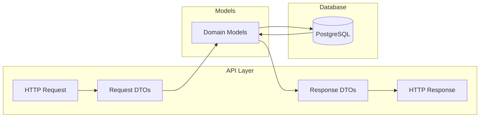
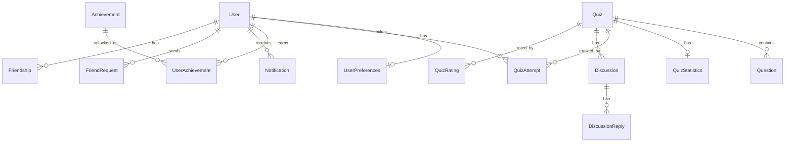

# Models

> Data structures and types for the QuizNinja API

## What is this?

The `models` package defines all the data structures (Go structs) used throughout the application. These models:

- **Map to database tables** - Fields correspond to database columns
- **Define API contracts** - JSON tags control API request/response format
- **Include validation rules** - Binding tags enforce input validation
- **Support DTOs** - Request/Response objects for API operations

**Problems it solves:**
- Type-safe data handling across the application
- Consistent JSON serialization for APIs
- Input validation with clear error messages
- Separation between database models and API DTOs

## Quick Start

### Using a model in your code

```go
import "quizninja-api/models"

// Create a new user
user := &models.User{
    Email: "user@example.com",
    Name:  "John Doe",
}

// Access nested preferences
if user.Preferences != nil {
    categories := user.Preferences.SelectedCategories
}
```

### Handling API requests

```go
// Parse and validate request body
var req models.CreateQuizRequest
if err := c.ShouldBindJSON(&req); err != nil {
    // Validation failed - binding tags enforced
    return
}
```

## Architecture Diagram



## Contents

| File | Purpose |
|------|---------|
| `user.go` | User and UserPreferences models |
| `quiz.go` | Quiz, Question, QuizStatistics, and related DTOs |
| `quiz_attempt.go` | QuizAttempt and answer tracking |
| `achievement.go` | Achievement definitions and user achievements |
| `notification.go` | Unified notification system |
| `friends.go` | FriendRequest and Friendship models |
| `discussion.go` | Discussion threads and replies |
| `leaderboard.go` | Leaderboard entries and rankings |
| `rating.go` | Quiz ratings and reviews |
| `favorites.go` | User favorite quizzes |
| `statistics.go` | User statistics and performance |
| `user_profile.go` | Public user profile responses |
| `settings.go` | Application settings |
| `auth.go` | Authentication request/response |
| `onboarding.go` | Onboarding status tracking |

## Core Models

### User

```go
type User struct {
    ID                    uuid.UUID        // Primary key
    Email                 string           // Unique email address
    PasswordHash          string           // Hashed password (never serialized)
    Name                  string           // Display name
    Level                 string           // User level (Beginner, Intermediate, etc.)
    TotalPoints           int              // Accumulated points
    CurrentStreak         int              // Current daily streak
    BestStreak            int              // Best streak achieved
    TotalQuizzesCompleted int              // Number of completed quizzes
    AverageScore          float64          // Average quiz score
    IsOnline              bool             // Online status
    LastActive            time.Time        // Last activity timestamp
    AvatarURL             *string          // Optional avatar URL
    AuthMethod            string           // "supabase" or "jwt"
    SupabaseID            *string          // Supabase user ID (if using Supabase)
    Preferences           *UserPreferences // Embedded preferences
}
```

### Quiz

```go
type Quiz struct {
    ID            uuid.UUID       // Primary key
    Title         string          // Quiz title
    Description   string          // Quiz description
    Category      string          // Category ID
    Difficulty    string          // beginner, intermediate, advanced
    TimeLimit     int             // Time limit in minutes
    QuestionCount int             // Number of questions
    Points        int             // Total points available
    IsFeatured    bool            // Featured quiz flag
    IsPublic      bool            // Public visibility
    Tags          StringArray     // Quiz tags
    Questions     []Question      // Related questions
    Statistics    *QuizStatistics // Aggregated statistics
}
```

### QuizAttempt

```go
type QuizAttempt struct {
    ID              uuid.UUID       // Primary key
    QuizID          uuid.UUID       // Foreign key to quiz
    UserID          uuid.UUID       // Foreign key to user
    Score           int             // Points earned
    TotalPoints     int             // Maximum points possible
    TimeSpent       int             // Time spent in seconds
    PercentageScore float64         // Score as percentage (0-100)
    Passed          bool            // True if score >= 60%
    Status          string          // started, completed, abandoned
    IsCompleted     bool            // Completion flag
    Answers         []AttemptAnswer // User's answers
    StartedAt       time.Time       // When attempt began
    CompletedAt     *time.Time      // When attempt finished
}
```

### Achievement

```go
type Achievement struct {
    ID           uuid.UUID // Primary key
    Key          string    // Unique identifier (e.g., "first_quiz")
    Title        string    // Display title
    Description  string    // Achievement description
    Icon         string    // Icon identifier
    Color        string    // Color code
    PointsReward int       // Points awarded
    Category     string    // Achievement category
    IsRare       bool      // Rare achievement flag
    IsActive     bool      // Active/inactive status
}
```

### Notification

```go
type Notification struct {
    ID                uuid.UUID              // Primary key
    UserID            uuid.UUID              // Owner user
    Type              string                 // Notification type
    Title             string                 // Notification title
    Message           string                 // Notification body
    Data              map[string]interface{} // Flexible metadata (JSONB)
    RelatedUserID     *uuid.UUID             // Related user (if applicable)
    RelatedEntityID   *uuid.UUID             // Related entity ID
    RelatedEntityType *string                // Type of related entity
    IsRead            bool                   // Read status
    IsDeleted         bool                   // Soft delete flag
    ExpiresAt         *time.Time             // Optional expiration
}
```

### FriendRequest & Friendship

```go
type FriendRequest struct {
    ID          uuid.UUID // Primary key
    RequesterID uuid.UUID // Who sent the request
    RequestedID uuid.UUID // Who received it
    Status      string    // pending, accepted, rejected, cancelled
    Message     *string   // Optional message
}

type Friendship struct {
    ID        uuid.UUID // Primary key
    User1ID   uuid.UUID // First user (User1ID < User2ID)
    User2ID   uuid.UUID // Second user
    CreatedAt time.Time // When friendship was created
}
```

## Request/Response DTOs

### Authentication

```go
// Login/Register requests
type RegisterRequest struct {
    Email    string `json:"email" binding:"required,email"`
    Password string `json:"password" binding:"required,min=8"`
    Name     string `json:"name" binding:"required,min=2,max=100"`
}

type LoginRequest struct {
    Email    string `json:"email" binding:"required,email"`
    Password string `json:"password" binding:"required"`
}
```

### Quiz Operations

```go
// Create a quiz
type CreateQuizRequest struct {
    Title       string `json:"title" binding:"required,min=1,max=200"`
    Description string `json:"description" binding:"required,min=1,max=1000"`
    Category    string `json:"category" binding:"required"`
    Difficulty  string `json:"difficulty" binding:"required,oneof=Easy Medium Hard"`
    TimeLimit   int    `json:"time_limit" binding:"required,min=30,max=3600"`
    // ... more fields
}

// Quiz list response with pagination
type QuizListResponse struct {
    Quizzes    []QuizSummary `json:"quizzes"`
    Total      int           `json:"total"`
    Page       int           `json:"page"`
    PageSize   int           `json:"page_size"`
    TotalPages int           `json:"total_pages"`
}
```

## Validation Tags

The models use Gin's binding tags for validation:

| Tag | Description | Example |
|-----|-------------|---------|
| `required` | Field must be present | `binding:"required"` |
| `email` | Must be valid email | `binding:"email"` |
| `min=N` | Minimum length/value | `binding:"min=8"` |
| `max=N` | Maximum length/value | `binding:"max=200"` |
| `oneof=A B C` | Must be one of values | `binding:"oneof=Easy Medium Hard"` |
| `omitempty` | Skip if empty | `binding:"omitempty"` |

## JSON Tags

| Tag | Effect |
|-----|--------|
| `json:"field_name"` | Sets JSON key name |
| `json:"-"` | Never serialize (e.g., passwords) |
| `json:"field,omitempty"` | Omit if zero value |

## Database Tags

| Tag | Purpose |
|-----|---------|
| `db:"column_name"` | Maps to database column |

## Common Tasks

### How to Add a New Model

1. **Create the model struct** in the appropriate file or a new file:

```go
// models/my_model.go
package models

import (
    "time"
    "github.com/google/uuid"
)

type MyModel struct {
    ID        uuid.UUID `json:"id" db:"id"`
    Name      string    `json:"name" db:"name"`
    CreatedAt time.Time `json:"created_at" db:"created_at"`
}
```

2. **Add request/response DTOs** if needed:

```go
type CreateMyModelRequest struct {
    Name string `json:"name" binding:"required,min=1,max=100"`
}

type MyModelResponse struct {
    MyModel MyModel `json:"my_model"`
}
```

3. **Create the database migration** in `database/migrations/`:

```sql
CREATE TABLE my_models (
    id UUID PRIMARY KEY DEFAULT gen_random_uuid(),
    name VARCHAR(100) NOT NULL,
    created_at TIMESTAMP DEFAULT CURRENT_TIMESTAMP
);
```

### How to Add Validation to a Field

```go
type MyRequest struct {
    // Required email
    Email string `json:"email" binding:"required,email"`

    // Optional, but if present must be 8-50 chars
    Password string `json:"password" binding:"omitempty,min=8,max=50"`

    // Must be one of specific values
    Status string `json:"status" binding:"required,oneof=active inactive pending"`

    // Numeric range
    Age int `json:"age" binding:"required,min=13,max=120"`
}
```

### How to Handle PostgreSQL Arrays

Use the `StringArray` type for PostgreSQL text arrays:

```go
type MyModel struct {
    Tags StringArray `json:"tags" db:"tags"`
}

// StringArray automatically handles pq.Array conversion
```

### How to Handle JSONB Fields

Use `map[string]interface{}` for flexible JSONB:

```go
type MyModel struct {
    Metadata map[string]interface{} `json:"metadata" db:"metadata"`
}
```

### How to Hide Fields from API Responses

Use `json:"-"` to never serialize:

```go
type User struct {
    PasswordHash string `json:"-" db:"password_hash"` // Never sent in API
}
```

## Model Relationships



## Notification Types

| Type | Description |
|------|-------------|
| `friend_request` | New friend request received |
| `friend_accepted` | Friend request was accepted |
| `friend_rejected` | Friend request was rejected |
| `achievement_unlocked` | New achievement earned |
| `general` | General notification |
| `system_announcement` | System-wide announcement |

## Related Documentation

- [Repository README](../repository/README.md) - How models are persisted
- [Handlers README](../handlers/README.md) - How models are used in API handlers
- [Database README](../database/README.md) - Database schema these models map to
