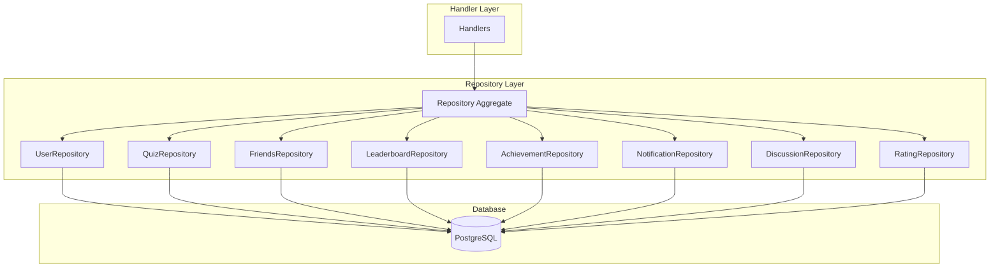
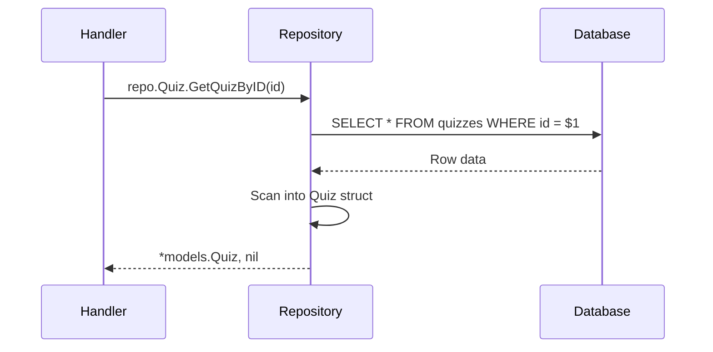

# Repository

> Data access layer for the QuizNinja API

## What is this?

The `repository` package implements the **Repository Pattern** - it provides a clean abstraction between the application's business logic and the database. Each repository handles CRUD operations and queries for a specific domain entity.

**Problems it solves:**
- Separates database logic from business logic
- Provides testable interfaces for data access
- Centralizes query logic in one place
- Makes it easy to change database implementation
- Enables mocking for unit tests

## Quick Start

### Using repositories in your code

```go
import "quizninja-api/repository"

// Create a repository instance (usually done once in handlers)
repo := repository.NewRepository()

// Use specific repositories
user, err := repo.User.GetUserByID(userID)
quiz, err := repo.Quiz.GetQuizByIDWithQuestions(quizID)
friends, err := repo.Friends.GetFriends(userID)
```

### Getting the global database connection

Repositories use the global `database.DB` connection:

```go
import "quizninja-api/database"

// The connection is established in main.go
// Repositories automatically use database.DB
```

## Architecture Diagram



## Contents

| File | Purpose |
|------|---------|
| `interfaces.go` | Repository interfaces and aggregate struct |
| `user_repository.go` | User and preferences data access |
| `quiz_repository.go` | Quiz, questions, attempts, favorites |
| `friends_repository.go` | Friend requests and friendships |
| `leaderboard_repository.go` | Leaderboard and rankings |
| `achievement_repository.go` | Achievements and user achievements |
| `notification_repository.go` | Notification management |
| `discussion_repository.go` | Discussions and replies |
| `rating_repository.go` | Quiz ratings and reviews |
| `preferences_repository.go` | User preferences |
| `categories_repository.go` | Quiz categories |
| `app_settings_repository.go` | Application settings |
| `utils.go` | Helper functions |

## Repository Interfaces

### UserRepository

```go
type UserRepositoryInterface interface {
    // User CRUD
    CreateUser(user *models.User) error
    GetUserByID(id uuid.UUID) (*models.User, error)
    GetUserByEmail(email string) (*models.User, error)
    UpdateUser(user *models.User) error
    DeleteUser(id uuid.UUID) error

    // Preferences
    CreateUserPreferences(preferences *models.UserPreferences) error
    GetUserPreferences(userID uuid.UUID) (*models.UserPreferences, error)
    UpdateUserPreferences(preferences *models.UserPreferences) error

    // Combined operations
    GetUserWithPreferences(userID uuid.UUID) (*models.User, error)

    // Status updates
    UpdateUserOnlineStatus(userID uuid.UUID, isOnline bool) error
    UpdateUserLastActive(userID uuid.UUID) error

    // Statistics
    GetUserStatistics(userID uuid.UUID) (*models.UserStatistics, error)
    UpdateUserStatistics(userID uuid.UUID, newScore float64) error
}
```

### QuizRepository

```go
type QuizRepositoryInterface interface {
    // Read operations with different load levels
    GetQuizByID(id uuid.UUID) (*models.Quiz, error)
    GetQuizByIDWithQuestions(id uuid.UUID) (*models.Quiz, error)
    GetQuizByIDWithStatistics(id uuid.UUID) (*models.Quiz, error)
    GetQuizByIDWithAll(id uuid.UUID) (*models.Quiz, error)

    // List operations
    GetQuizzes(filters *models.QuizFilters) ([]models.Quiz, int, error)
    GetFeaturedQuizzes(limit int) ([]models.Quiz, error)
    GetQuizzesByCategory(category string, limit int) ([]models.Quiz, error)
    GetQuizzesByUser(userID uuid.UUID, offset, limit int) ([]models.Quiz, int, error)

    // Questions
    GetQuestionsByQuizID(quizID uuid.UUID) ([]models.Question, error)

    // Statistics
    GetQuizStatistics(quizID uuid.UUID) (*models.QuizStatistics, error)
    CreateOrUpdateQuizStatistics(quizID uuid.UUID, score float64, timeSpent int) error

    // Attempts
    CreateQuizAttempt(attempt *models.QuizAttempt) error
    UpdateQuizAttempt(attempt *models.QuizAttempt) error
    GetQuizAttempt(id uuid.UUID) (*models.QuizAttempt, error)
    GetActiveQuizAttempt(userID, quizID uuid.UUID) (*models.QuizAttempt, error)
    AbandonQuizAttempt(attemptID uuid.UUID) error

    // Favorites
    AddFavorite(userID, quizID uuid.UUID) error
    RemoveFavorite(userID, quizID uuid.UUID) error
    GetUserFavorites(userID uuid.UUID, page, pageSize int) ([]models.UserQuizFavorite, int, error)
    IsFavorite(userID, quizID uuid.UUID) (bool, error)
}
```

### FriendsRepository

```go
type FriendsRepositoryInterface interface {
    // Friend requests
    SendFriendRequest(requesterID, requestedID uuid.UUID, message *string) (*models.FriendRequest, error)
    GetFriendRequest(id uuid.UUID) (*models.FriendRequest, error)
    RespondToFriendRequest(requestID uuid.UUID, status string) error
    CancelFriendRequest(requestID uuid.UUID, requesterID uuid.UUID) error
    GetPendingFriendRequests(userID uuid.UUID) ([]models.FriendRequest, error)

    // Friendships
    GetFriends(userID uuid.UUID) ([]models.Friend, error)
    CreateFriendship(user1ID, user2ID uuid.UUID) (*models.Friendship, error)
    RemoveFriend(userID, friendID uuid.UUID) error
    AreFriends(user1ID, user2ID uuid.UUID) (bool, error)

    // Search
    SearchUsers(searchQuery string, currentUserID uuid.UUID, limit, offset int) ([]models.UserSearchResult, int, error)
}
```

### LeaderboardRepository

```go
type LeaderboardRepositoryInterface interface {
    GetGlobalLeaderboard(period string, limit, offset int) ([]models.LeaderboardEntry, int, error)
    GetFriendsLeaderboard(userID uuid.UUID, period string, limit, offset int) ([]models.LeaderboardEntry, int, error)
    GetUserRank(userID uuid.UUID, period string) (*models.UserRankInfo, error)
    UpdateUserScore(userID uuid.UUID, points int, quizID uuid.UUID) error
    RecalculateUserLevel(userID uuid.UUID) error
}
```

### AchievementRepository

```go
type AchievementRepositoryInterface interface {
    GetAllAchievements() ([]models.Achievement, error)
    GetAchievementByKey(key string) (*models.Achievement, error)
    GetUserAchievements(userID uuid.UUID) ([]models.UserAchievement, error)
    UnlockAchievement(userID uuid.UUID, achievementKey string) (*models.UserAchievement, error)
    HasUserAchievement(userID, achievementID uuid.UUID) (bool, error)
    GetAchievementProgress(userID uuid.UUID) ([]models.AchievementProgress, error)
}
```

### NotificationRepository

```go
type NotificationRepositoryInterface interface {
    // CRUD
    CreateNotification(notification *models.CreateNotificationRequest) (*models.Notification, error)
    GetNotifications(userID uuid.UUID, filters *models.NotificationFilters) ([]models.Notification, int, error)
    GetNotificationByID(notificationID uuid.UUID, userID uuid.UUID) (*models.Notification, error)
    DeleteNotification(notificationID uuid.UUID, userID uuid.UUID) error  // Soft delete
    RestoreNotification(notificationID uuid.UUID, userID uuid.UUID) error

    // Read status
    MarkNotificationAsRead(notificationID uuid.UUID, userID uuid.UUID) error
    MarkNotificationAsUnread(notificationID uuid.UUID, userID uuid.UUID) error
    MarkAllNotificationsAsRead(userID uuid.UUID) error
    GetUnreadNotificationCount(userID uuid.UUID) (int, error)

    // Management
    GetNotificationStats(userID uuid.UUID) (*models.NotificationStatsResponse, error)
    CleanupExpiredNotifications() error
}
```

## How It Works

### Repository Pattern Flow



### The Aggregate Repository

All repositories are combined into a single `Repository` struct for convenience:

```go
type Repository struct {
    User         UserRepositoryInterface
    Quiz         QuizRepositoryInterface
    Friends      FriendsRepositoryInterface
    Leaderboard  LeaderboardRepositoryInterface
    Achievement  AchievementRepositoryInterface
    Notification NotificationRepositoryInterface
    Discussion   DiscussionRepositoryInterface
    Rating       *RatingRepository
}

// Create with all repositories initialized
repo := repository.NewRepository()
```

## Common Tasks

### How to Add a New Repository

1. **Define the interface** in `interfaces.go`:

```go
type MyRepositoryInterface interface {
    Create(item *models.MyModel) error
    GetByID(id uuid.UUID) (*models.MyModel, error)
    // ... other methods
}
```

2. **Create the implementation** in a new file:

```go
// repository/my_repository.go
package repository

import (
    "quizninja-api/database"
    "quizninja-api/models"
    "github.com/google/uuid"
)

type MyRepository struct{}

func NewMyRepository() *MyRepository {
    return &MyRepository{}
}

func (r *MyRepository) Create(item *models.MyModel) error {
    query := `INSERT INTO my_table (id, name) VALUES ($1, $2)`
    _, err := database.DB.Exec(query, item.ID, item.Name)
    return err
}

func (r *MyRepository) GetByID(id uuid.UUID) (*models.MyModel, error) {
    query := `SELECT id, name, created_at FROM my_table WHERE id = $1`
    row := database.DB.QueryRow(query, id)

    var item models.MyModel
    err := row.Scan(&item.ID, &item.Name, &item.CreatedAt)
    if err != nil {
        return nil, err
    }
    return &item, nil
}
```

3. **Add to the aggregate** in `interfaces.go`:

```go
type Repository struct {
    // ... existing repositories
    My MyRepositoryInterface
}

func NewRepository() *Repository {
    return &Repository{
        // ... existing
        My: NewMyRepository(),
    }
}
```

### How to Write a Query with Pagination

```go
func (r *MyRepository) List(page, pageSize int) ([]models.MyModel, int, error) {
    // Get total count
    var total int
    countQuery := `SELECT COUNT(*) FROM my_table`
    err := database.DB.QueryRow(countQuery).Scan(&total)
    if err != nil {
        return nil, 0, err
    }

    // Get paginated results
    offset := (page - 1) * pageSize
    query := `
        SELECT id, name, created_at
        FROM my_table
        ORDER BY created_at DESC
        LIMIT $1 OFFSET $2
    `
    rows, err := database.DB.Query(query, pageSize, offset)
    if err != nil {
        return nil, 0, err
    }
    defer rows.Close()

    var items []models.MyModel
    for rows.Next() {
        var item models.MyModel
        if err := rows.Scan(&item.ID, &item.Name, &item.CreatedAt); err != nil {
            return nil, 0, err
        }
        items = append(items, item)
    }

    return items, total, nil
}
```

### How to Handle Dynamic Filters

```go
func (r *MyRepository) GetFiltered(filters *MyFilters) ([]models.MyModel, error) {
    query := `SELECT id, name FROM my_table WHERE 1=1`
    args := []interface{}{}
    argCount := 0

    if filters.Name != "" {
        argCount++
        query += fmt.Sprintf(" AND name ILIKE $%d", argCount)
        args = append(args, "%"+filters.Name+"%")
    }

    if filters.Status != "" {
        argCount++
        query += fmt.Sprintf(" AND status = $%d", argCount)
        args = append(args, filters.Status)
    }

    query += " ORDER BY created_at DESC"

    rows, err := database.DB.Query(query, args...)
    // ... rest of implementation
}
```

### How to Use Transactions

```go
func (r *MyRepository) CreateWithRelated(item *models.MyModel, related *models.Related) error {
    tx, err := database.DB.Begin()
    if err != nil {
        return err
    }
    defer tx.Rollback()

    // First insert
    _, err = tx.Exec(`INSERT INTO my_table (id, name) VALUES ($1, $2)`,
        item.ID, item.Name)
    if err != nil {
        return err
    }

    // Second insert
    _, err = tx.Exec(`INSERT INTO related_table (id, my_id) VALUES ($1, $2)`,
        related.ID, item.ID)
    if err != nil {
        return err
    }

    return tx.Commit()
}
```

### How to Handle PostgreSQL Arrays

```go
import "github.com/lib/pq"

// Writing arrays
func (r *MyRepository) Create(item *models.MyModel) error {
    query := `INSERT INTO my_table (id, tags) VALUES ($1, $2)`
    _, err := database.DB.Exec(query, item.ID, pq.Array(item.Tags))
    return err
}

// Reading arrays
func (r *MyRepository) GetByID(id uuid.UUID) (*models.MyModel, error) {
    var item models.MyModel
    var tags pq.StringArray

    err := database.DB.QueryRow(query, id).Scan(&item.ID, &tags)
    item.Tags = models.StringArray(tags)
    return &item, err
}
```

## Query Patterns

### Checking Existence

```go
func (r *MyRepository) Exists(id uuid.UUID) (bool, error) {
    var exists bool
    query := `SELECT EXISTS(SELECT 1 FROM my_table WHERE id = $1)`
    err := database.DB.QueryRow(query, id).Scan(&exists)
    return exists, err
}
```

### Soft Delete

```go
func (r *MyRepository) Delete(id uuid.UUID) error {
    query := `UPDATE my_table SET is_deleted = true, deleted_at = NOW() WHERE id = $1`
    _, err := database.DB.Exec(query, id)
    return err
}
```

### Upsert (Insert or Update)

```go
func (r *MyRepository) Upsert(item *models.MyModel) error {
    query := `
        INSERT INTO my_table (id, name, value)
        VALUES ($1, $2, $3)
        ON CONFLICT (id) DO UPDATE SET
            name = EXCLUDED.name,
            value = EXCLUDED.value,
            updated_at = NOW()
    `
    _, err := database.DB.Exec(query, item.ID, item.Name, item.Value)
    return err
}
```

## Error Handling

Repositories return errors that handlers can interpret:

```go
import "database/sql"

user, err := repo.User.GetUserByID(id)
if err == sql.ErrNoRows {
    // Not found - return 404
    return
}
if err != nil {
    // Other error - return 500
    return
}
```

## Related Documentation

- [Models README](../models/README.md) - Data structures used by repositories
- [Database README](../database/README.md) - Database connection details
- [Handlers README](../handlers/README.md) - How handlers use repositories