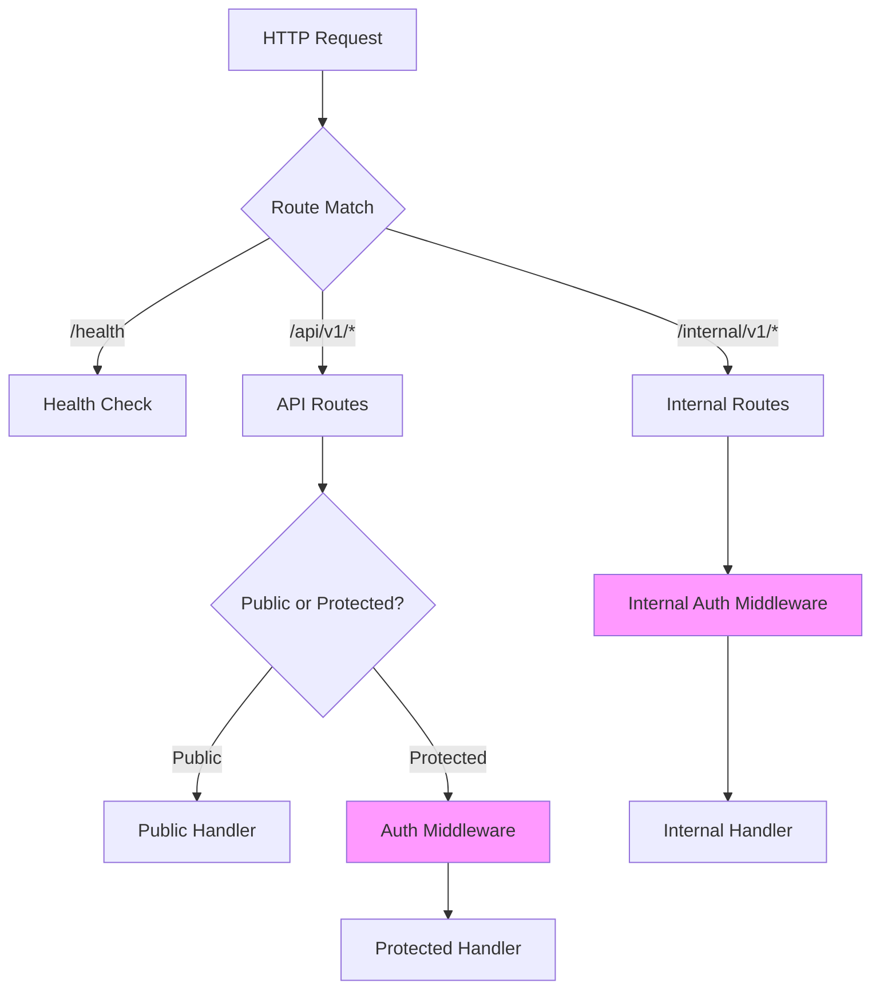

# Routes

> API routing configuration for the QuizNinja API

## What is this?

The `routes` package configures all HTTP routes for the application. It:

- Registers all API endpoints
- Groups routes by domain (quizzes, users, friends, etc.)
- Applies middleware to route groups
- Sets up both public and protected routes

**Problems it solves:**
- Centralizes all route definitions in one place
- Makes it easy to see the full API structure
- Controls which routes require authentication
- Applies appropriate rate limiting to different endpoints

## Quick Start

### How routes are set up

In `main.go`:
```go
r := gin.Default()
routes.SetupRoutes(r, cfg)
```

### Route structure

```
/health                    - Health check
/api/v1/
  ├── /ping               - API ping (public)
  ├── /quizzes/*          - Quiz endpoints (public + protected)
  ├── /categories         - Categories (public)
  ├── /config/*           - App configuration (public)
  ├── /preferences/*      - Preference options (public)
  ├── /auth/*             - Authentication (rate limited)
  └── Protected routes (require auth):
      ├── /users/*        - User operations
      ├── /friends/*      - Social features
      ├── /leaderboard/*  - Rankings
      ├── /achievements/* - Achievements
      ├── /favorites/*    - Favorite quizzes
      ├── /discussions/*  - Quiz discussions
      ├── /notifications/*- User notifications
      └── /admin/*        - Admin operations
/internal/v1/*            - Internal API (separate auth)
```

## Architecture Diagram



## Contents

| File | Purpose |
|------|---------|
| `routes.go` | All route definitions and middleware application |

## Route Groups

### Health & Utility

```
GET  /health              - Health check
GET  /api/v1/ping         - API ping
```

### Public Routes (No Auth Required)

```
GET  /api/v1/quizzes                     - List quizzes with filters
GET  /api/v1/quizzes/featured            - Get featured quizzes
GET  /api/v1/quizzes/category/:category  - Get quizzes by category
GET  /api/v1/quizzes/categories          - Get category groups

GET  /api/v1/categories                  - Get flat category list

GET  /api/v1/config/app-settings         - Get application settings

GET  /api/v1/preferences/categories              - Get preference categories
GET  /api/v1/preferences/difficulty-levels       - Get difficulty options
GET  /api/v1/preferences/notification-frequencies- Get notification options
```

### Auth Routes (Rate Limited)

```
POST /api/v1/auth/register  - Create account (5 req/min per IP)
POST /api/v1/auth/login     - Login (5 req/min per IP)
```

### Protected Routes (Auth Required)

All routes below require `Authorization: Bearer <token>` header.

#### Profile & User

```
POST /api/v1/auth/logout               - Logout
GET  /api/v1/profile                   - Get current user profile
PUT  /api/v1/profile                   - Update profile

GET  /api/v1/users/:userId             - Get another user's profile
PUT  /api/v1/users/preferences         - Update preferences
GET  /api/v1/users/preferences         - Get preferences
POST /api/v1/users/onboarding/complete - Complete onboarding
GET  /api/v1/users/onboarding/status   - Get onboarding status
GET  /api/v1/users/quizzes             - Get user's quizzes
GET  /api/v1/users/stats               - Get user statistics
GET  /api/v1/users/attempts            - Get all attempts
GET  /api/v1/users/attempts/:attemptId - Get attempt details
GET  /api/v1/users/achievements        - Get user's achievements
GET  /api/v1/users/:userId/achievements- Get another user's achievements
```

#### Quiz Operations

```
GET    /api/v1/quizzes/:id                              - Get quiz details
GET    /api/v1/quizzes/:id/questions                    - Get questions
POST   /api/v1/quizzes/:id/attempts                     - Start attempt
POST   /api/v1/quizzes/:id/attempts/:attemptId/submit   - Submit attempt
PUT    /api/v1/quizzes/:id/attempts/:attemptId          - Update attempt
DELETE /api/v1/quizzes/:id/attempts/:attemptId/abandon  - Abandon attempt
GET    /api/v1/users/quizzes/:quizId/attempt            - Get active attempt
GET    /api/v1/users/quizzes/:quizId/completed-attempt  - Get last completed
```

#### Ratings

```
POST   /api/v1/quizzes/:id/ratings             - Create rating
GET    /api/v1/quizzes/:id/ratings             - Get quiz ratings
GET    /api/v1/quizzes/:id/ratings/average     - Get average rating
GET    /api/v1/quizzes/:id/ratings/user        - Get user's rating
PUT    /api/v1/quizzes/:id/ratings/:ratingId   - Update rating
DELETE /api/v1/quizzes/:id/ratings/:ratingId   - Delete rating
```

#### Friends

```
POST   /api/v1/friends/requests       - Send friend request
GET    /api/v1/friends/requests       - Get pending requests
PUT    /api/v1/friends/requests/:id   - Respond to request
DELETE /api/v1/friends/requests/:id   - Cancel request
GET    /api/v1/friends                - Get friends list
DELETE /api/v1/friends/:id            - Remove friend
GET    /api/v1/friends/search         - Search users

GET    /api/v1/friends/notifications           - Get friend notifications (legacy)
PUT    /api/v1/friends/notifications/:id/read  - Mark read (legacy)
PUT    /api/v1/friends/notifications/read-all  - Mark all read (legacy)
```

#### Notifications

```
GET    /api/v1/notifications              - Get notifications
GET    /api/v1/notifications/stats        - Get notification stats
GET    /api/v1/notifications/:id          - Get notification
PUT    /api/v1/notifications/:id/read     - Mark as read
PUT    /api/v1/notifications/:id/unread   - Mark as unread
PUT    /api/v1/notifications/read-all     - Mark all as read
DELETE /api/v1/notifications/:id          - Delete notification
POST   /api/v1/notifications              - Create notification (admin)
POST   /api/v1/notifications/cleanup      - Cleanup expired (admin)
```

#### Leaderboard

```
GET  /api/v1/leaderboard              - Get leaderboard
GET  /api/v1/leaderboard/stats        - Get stats
GET  /api/v1/leaderboard/rank         - Get user rank
POST /api/v1/leaderboard/score        - Update score
GET  /api/v1/leaderboard/achievements - Get with achievements
```

#### Achievements

```
GET  /api/v1/achievements                    - Get all achievements
GET  /api/v1/achievements/progress           - Get progress
GET  /api/v1/achievements/stats              - Get stats
POST /api/v1/achievements/check              - Check for unlocks
GET  /api/v1/achievements/category/:category - Get by category
POST /api/v1/achievements/unlock/:key        - Unlock (admin/testing)
```

#### Favorites

```
POST   /api/v1/favorites                - Add to favorites
DELETE /api/v1/favorites/:quizId        - Remove from favorites
GET    /api/v1/favorites                - Get favorites
GET    /api/v1/favorites/check/:quizId  - Check if favorited
```

#### Discussions

```
GET    /api/v1/discussions                     - Get discussions
POST   /api/v1/discussions                     - Create discussion
GET    /api/v1/discussions/stats               - Get stats
GET    /api/v1/discussions/:id                 - Get discussion
PUT    /api/v1/discussions/:id                 - Update discussion
DELETE /api/v1/discussions/:id                 - Delete discussion
PUT    /api/v1/discussions/:id/like            - Like discussion
GET    /api/v1/discussions/:id/replies         - Get replies
POST   /api/v1/discussions/:id/replies         - Create reply
PUT    /api/v1/discussions/replies/:replyId    - Update reply
DELETE /api/v1/discussions/replies/:replyId    - Delete reply
PUT    /api/v1/discussions/replies/:replyId/like - Like reply
```

#### Admin

```
DELETE /api/v1/admin/cache/app-settings  - Clear settings cache
```

## Common Tasks

### How to Add a New Route

1. **Create the handler** (see [handlers/README.md](../handlers/README.md))

2. **Register the route** in `routes.go`:

```go
// In SetupRoutes function

// For public routes
api.GET("/my-endpoint", myHandler.MyMethod)

// For protected routes
protected.GET("/my-protected-endpoint", myHandler.MyProtectedMethod)

// For a new route group
myGroup := protected.Group("/my-feature")
{
    myGroup.GET("", myHandler.List)
    myGroup.POST("", myHandler.Create)
    myGroup.GET("/:id", myHandler.Get)
}
```

### How to Add Rate Limiting to a Route

```go
// Apply auth rate limiting (stricter)
myGroup := api.Group("/sensitive")
if cfg.RateLimitEnabled {
    myGroup.Use(middleware.AuthRateLimit())
}
{
    myGroup.POST("/action", handler.Action)
}

// Apply per-user rate limiting
protected.Use(middleware.PerUserRateLimit())
```

### How to Make a Route Public vs Protected

**Public route** (no auth):
```go
api := r.Group("/api/v1")
api.GET("/public-data", handler.GetPublicData)
```

**Protected route** (auth required):
```go
protected := api.Group("/")
protected.Use(middleware.AuthMiddleware(cfg))
protected.GET("/private-data", handler.GetPrivateData)
```

### Understanding Route Parameters

```go
// Path parameter
r.GET("/users/:userId", handler.GetUser)
// Access in handler: c.Param("userId")

// Query parameter
// /users?page=1&limit=10
// Access in handler: c.Query("page"), c.DefaultQuery("limit", "10")
```

## Middleware Application

| Route Group | Middleware Applied |
|-------------|-------------------|
| `/health` | None |
| `/api/v1/auth/*` | Auth Rate Limit |
| `/api/v1/*` (protected) | Auth Middleware, Per-User Rate Limit |
| `/internal/v1/*` | Internal Auth Middleware |

## Related Documentation

- [Handlers README](../handlers/README.md) - Handler implementations
- [Middleware README](../middleware/README.md) - Middleware details
- [Internal README](../internal/README.md) - Internal API routes
- [Root README](../README.md) - API overview