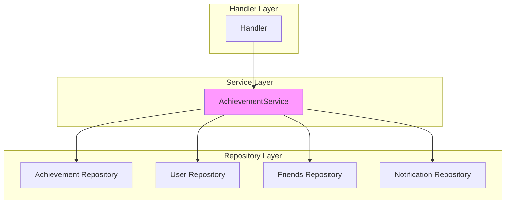

# Services

> Business logic layer for the QuizNinja API

## What is this?

The `services` package contains business logic that goes beyond simple CRUD operations. Services encapsulate complex business rules and workflows that span multiple entities.

Currently, this package contains:
- **AchievementService** - Handles achievement checking, unlocking, and notifications

**Problems it solves:**
- Separates complex business logic from handlers
- Centralizes achievement rules in one place
- Provides reusable business operations across different handlers
- Makes business logic testable independently

## Quick Start

### Using the AchievementService

```go
import "quizninja-api/services"

// Create the service
repo := repository.NewRepository()
achievementService := services.NewAchievementService(repo)

// Check achievements after a user completes a quiz
result, err := achievementService.CheckAchievementsForUser(
    userID,
    services.TriggerQuizCompleted,
)

if err != nil {
    // Handle error
}

// Process newly unlocked achievements
for _, achievement := range result.NewAchievements {
    fmt.Printf("Unlocked: %s\n", achievement.Achievement.Title)
}
```

## Architecture Diagram



## Contents

| File | Purpose |
|------|---------|
| `achievement_service.go` | Achievement checking and unlocking logic |

## AchievementService

### Overview

The AchievementService handles all achievement-related business logic:

1. **Checking achievements** - Determines which achievements a user qualifies for
2. **Unlocking achievements** - Awards achievements to users
3. **Creating notifications** - Generates notifications for unlocked achievements

### Triggers

Achievements are checked based on specific triggers:

| Trigger | When Used | Achievements Checked |
|---------|-----------|---------------------|
| `TriggerQuizCompleted` | After quiz submission | first_win, quiz_master |
| `TriggerStreakUpdated` | When streak changes | week_warrior, streak_legend |
| `TriggerFriendAdded` | When friend added | social_butterfly |
| `TriggerPerfectScore` | On 100% score | perfect_score |
| `TriggerLevelUp` | On level change | rising_star, tech_genius, etc. |
| `TriggerLeaderboardRank` | On rank change | rising_star, tech_genius, etc. |

### Available Achievements

| Key | Title | Condition |
|-----|-------|-----------|
| `first_win` | First Win | Complete 1 quiz |
| `quiz_master` | Quiz Master | Complete 100 quizzes |
| `week_warrior` | Week Warrior | 7-day streak |
| `streak_legend` | Streak Legend | 30-day best streak |
| `social_butterfly` | Social Butterfly | Have 5 friends |
| `perfect_score` | Perfect Score | Achieve 100% on a quiz |
| `tech_genius` | Tech Genius | 90%+ on 10 Technology quizzes |
| `sports_expert` | Sports Expert | 90%+ on 10 Sports quizzes |
| `rising_star` | Rising Star | Earn 1000+ points |
| `speed_demon` | Speed Demon | Complete quizzes under 2 minutes |

### Key Methods

#### CheckAchievementsForUser

```go
func (as *AchievementService) CheckAchievementsForUser(
    userID uuid.UUID,
    trigger AchievementTrigger,
) (*CheckResult, error)
```

Checks and unlocks all applicable achievements for a user.

**Parameters:**
- `userID` - The user to check achievements for
- `trigger` - The event that triggered the check

**Returns:**
- `CheckResult` containing:
  - `NewAchievements` - List of newly unlocked achievements
  - `Notifications` - Notification objects for the UI
  - `TotalChecked` - Number of achievements checked
  - `TotalUnlocked` - Number of achievements unlocked

**Example:**
```go
result, err := achievementService.CheckAchievementsForUser(
    userID,
    services.TriggerQuizCompleted,
)

if result.TotalUnlocked > 0 {
    // Show achievement notification to user
    for _, notif := range result.Notifications {
        fmt.Printf("🏆 %s - %s\n", notif.Title, notif.Description)
    }
}
```

#### CheckSingleAchievement

```go
func (as *AchievementService) CheckSingleAchievement(
    userID uuid.UUID,
    achievementKey string,
) (*models.UserAchievement, error)
```

Checks and unlocks a specific achievement.

**Example:**
```go
achievement, err := achievementService.CheckSingleAchievement(
    userID,
    "first_win",
)

if err != nil {
    // Achievement not earned or already unlocked
}
```

### Data Structures

#### CheckResult

```go
type CheckResult struct {
    NewAchievements []models.UserAchievement         // Newly unlocked
    Notifications   []models.AchievementNotification // For UI display
    TotalChecked    int                              // Achievements checked
    TotalUnlocked   int                              // Achievements unlocked
}
```

#### AchievementTrigger

```go
type AchievementTrigger string

const (
    TriggerQuizCompleted   AchievementTrigger = "quiz_completed"
    TriggerStreakUpdated   AchievementTrigger = "streak_updated"
    TriggerFriendAdded     AchievementTrigger = "friend_added"
    TriggerPerfectScore    AchievementTrigger = "perfect_score"
    TriggerLevelUp         AchievementTrigger = "level_up"
    TriggerLeaderboardRank AchievementTrigger = "leaderboard_rank"
)
```

## Common Tasks

### How to Add a New Achievement

1. **Add the achievement to the database** via migration:

```sql
INSERT INTO achievements (key, title, description, icon, color, points_reward, category, is_rare)
VALUES ('my_achievement', 'My Achievement', 'Description here', 'trophy', '#FFD700', 50, 'general', false);
```

2. **Add the check logic** in `shouldUnlockAchievement`:

```go
case "my_achievement":
    // Your condition logic here
    return userStats.SomeValue >= 10, nil
```

3. **Add to trigger mapping** if needed in `getAchievementsToCheck`:

```go
case TriggerMyEvent:
    keys := []string{"my_achievement"}
    achievementsToCheck = as.filterAchievementsByKeys(allAchievements, keys)
```

### How to Create a New Service

1. **Create the service file**:

```go
// services/my_service.go
package services

import "quizninja-api/repository"

type MyService struct {
    repo *repository.Repository
}

func NewMyService(repo *repository.Repository) *MyService {
    return &MyService{repo: repo}
}

func (s *MyService) MyBusinessLogic(params ...) (result, error) {
    // Complex business logic here
}
```

2. **Use in handlers**:

```go
// In handler
myService := services.NewMyService(h.repo)
result, err := myService.MyBusinessLogic(params...)
```

### How to Add a New Trigger

1. **Define the trigger constant**:

```go
const (
    // ... existing triggers
    TriggerMyNewEvent AchievementTrigger = "my_new_event"
)
```

2. **Add trigger handling** in `getAchievementsToCheck`:

```go
case TriggerMyNewEvent:
    keys := []string{"achievement1", "achievement2"}
    achievementsToCheck = as.filterAchievementsByKeys(allAchievements, keys)
```

3. **Call from appropriate handler**:

```go
result, _ := achievementService.CheckAchievementsForUser(
    userID,
    services.TriggerMyNewEvent,
)
```

## Handler vs Service Responsibilities

| Responsibility | Handler | Service |
|---------------|---------|---------|
| Parse HTTP request | ✅ | ❌ |
| Validate input | ✅ | ❌ |
| Simple CRUD | ✅ | ❌ |
| Complex business logic | ❌ | ✅ |
| Multi-entity operations | ❌ | ✅ |
| Format HTTP response | ✅ | ❌ |
| Achievement rules | ❌ | ✅ |
| Notification creation | ❌ | ✅ |

## Testing Services

```go
func TestCheckAchievements(t *testing.T) {
    // Setup mock repository
    repo := &repository.Repository{
        Achievement: mockAchievementRepo,
        User:        mockUserRepo,
        Friends:     mockFriendsRepo,
    }

    service := services.NewAchievementService(repo)

    // Test achievement checking
    result, err := service.CheckAchievementsForUser(
        testUserID,
        services.TriggerQuizCompleted,
    )

    assert.NoError(t, err)
    assert.Equal(t, 1, result.TotalUnlocked)
}
```

## Related Documentation

- [Handlers README](../handlers/README.md) - How services are used in handlers
- [Repository README](../repository/README.md) - Data access used by services
- [Models README](../models/README.md) - Achievement models