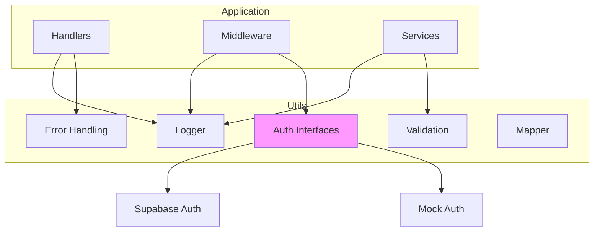

# Utils

> Utility functions and helpers for the QuizNinja API

## What is this?

The `utils` package contains shared utility functions used across the application:

- **Logging** - Structured logging with logrus
- **Authentication** - Supabase and mock auth utilities
- **Error handling** - Standardized error responses
- **Validation** - Input validation helpers
- **Mapping** - Data structure conversions
- **Idempotency** - Request deduplication

**Problems it solves:**
- Provides consistent logging across the application
- Abstracts authentication providers (Supabase, mock)
- Standardizes error handling and responses
- Enables testing with mock authentication

## Quick Start

### Using the logger

```go
import "quizninja-api/utils"

// Simple logging
utils.Info("Server started")
utils.Error("Something went wrong")

// Structured logging with fields
utils.WithFields(logrus.Fields{
    "user_id": userID,
    "quiz_id": quizID,
}).Info("Quiz completed")
```

### Handling errors

```go
// Standard error response
func MyHandler(c *gin.Context) {
    data, err := fetchData()
    if err != nil {
        utils.ErrorResponse(c, 500, "Failed to fetch data")
        return
    }
    utils.SuccessResponse(c, 200, data)
}
```

## Architecture Diagram



## Contents

| File | Purpose |
|------|---------|
| `logger.go` | Structured logging with logrus |
| `auth_interfaces.go` | Authentication provider interfaces |
| `supabase_auth.go` | Supabase token validation |
| `mock_auth_manager.go` | Mock authentication for testing |
| `mock_jwt.go` | Mock JWT token generation/validation |
| `supabase_test_auth.go` | Supabase test utilities |
| `errors.go` | Error response helpers |
| `validation.go` | Input validation utilities |
| `mapper.go` | Data structure mapping |
| `password.go` | Password hashing utilities |
| `authorization.go` | Authorization helpers |
| `idempotency.go` | Request idempotency handling |

## Utilities Reference

### Logger (`logger.go`)

Structured logging using logrus with configurable format and level.

**Functions:**

```go
// Initialize logger with config
utils.InitLogger(cfg)

// Log levels
utils.Debug("Debug message")
utils.Info("Info message")
utils.Warn("Warning message")
utils.Error("Error message")
utils.Fatal("Fatal message")  // Exits application

// Structured logging with fields
utils.WithFields(logrus.Fields{
    "user_id": "123",
    "action":  "login",
}).Info("User logged in")
```

**Configuration:**

```bash
LOG_LEVEL=INFO      # DEBUG, INFO, WARN, ERROR, FATAL
LOG_FORMAT=json     # json or text
LOG_OUTPUT=stdout   # stdout, file, or both
```

### Auth Interfaces (`auth_interfaces.go`)

Defines interfaces for authentication providers.

```go
// SupabaseUser represents an authenticated user
type SupabaseUser struct {
    ID            string
    Email         string
    EmailVerified bool
    // ... other fields
}

// ConvertSupabaseIDToUUID converts Supabase ID to UUID
func ConvertSupabaseIDToUUID(supabaseID string) (uuid.UUID, error)
```

### Supabase Auth (`supabase_auth.go`)

Validates Supabase JWT tokens.

```go
// Validate a Supabase token
user, err := utils.ValidateSupabaseTokenHTTP(
    token,
    supabaseURL,
    supabaseAnonKey,
)

if err != nil {
    // Token invalid or expired
}

// user.ID contains the Supabase user ID
// user.Email contains the user's email
```

**Error handling:**

```go
// Check if error is retryable
if utils.IsSupabaseErrorRetryable(err) {
    // Retry the request
}
```

### Mock Auth (`mock_auth_manager.go`, `mock_jwt.go`)

For testing without real Supabase.

```go
// Create a mock JWT token
token := utils.CreateMockJWT(utils.MockJWTClaims{
    UserID: "user-uuid",
    Email:  "test@example.com",
})

// Validate mock token
user, err := utils.ValidateMockJWT(token, utils.DefaultMockJWTConfig)
```

**Enable mock auth:**

```bash
USE_MOCK_AUTH=true  # Only works in debug mode
```

### Error Handling (`errors.go`)

Standardized error responses.

```go
// Return error response
utils.ErrorResponse(c, 400, "Invalid input")
utils.ErrorResponse(c, 404, "Not found")
utils.ErrorResponse(c, 500, "Internal server error")

// Return success response
utils.SuccessResponse(c, 200, data)

// Handle errors with logging
utils.HandleError(c, err, "Failed to process request")
```

**Response format:**

```json
// Error
{"error": "Error message"}

// Success
{"data": {...}}
```

### Validation (`validation.go`)

Input validation helpers.

```go
// Validate email format
if !utils.IsValidEmail(email) {
    // Invalid email
}

// Validate UUID
if !utils.IsValidUUID(id) {
    // Invalid UUID
}
```

### Mapper (`mapper.go`)

Data structure conversions.

```go
// Map database model to response
response := utils.MapUserToResponse(user)

// Map quiz with statistics
quizResponse := utils.MapQuizWithStats(quiz, stats)
```

### Password (`password.go`)

Password hashing using bcrypt.

```go
// Hash a password
hash, err := utils.HashPassword(password)

// Verify password
if utils.CheckPassword(hash, password) {
    // Password matches
}
```

### Authorization (`authorization.go`)

Authorization helper functions.

```go
// Check if user owns resource
if utils.IsOwner(resourceUserID, currentUserID) {
    // Allow action
}

// Check permissions
if utils.CanEdit(user, resource) {
    // Allow edit
}
```

### Idempotency (`idempotency.go`)

Prevents duplicate requests.

```go
// Check idempotency key
key := c.GetHeader("X-Idempotency-Key")
if key != "" {
    if result, exists := utils.GetIdempotentResult(key); exists {
        // Return cached result
        return result
    }
}

// Process request and cache result
utils.SetIdempotentResult(key, result)
```

## Common Tasks

### How to Add a New Utility Function

1. **Identify the appropriate file** or create a new one:

```go
// utils/my_utils.go
package utils

// MyUtilityFunction does something useful
func MyUtilityFunction(input string) string {
    // Implementation
    return result
}
```

2. **Add tests** in the corresponding test file:

```go
// utils/my_utils_test.go
func TestMyUtilityFunction(t *testing.T) {
    result := MyUtilityFunction("input")
    assert.Equal(t, "expected", result)
}
```

### How to Configure Logging

In `main.go`:

```go
cfg := config.Load()
utils.InitLogger(cfg)
```

Available log levels:
- `DEBUG` - Detailed debugging information
- `INFO` - General operational information
- `WARN` - Warning messages
- `ERROR` - Error conditions
- `FATAL` - Critical errors (exits application)

### How to Use Mock Auth for Testing

1. **Set environment variable**:

```bash
USE_MOCK_AUTH=true
GIN_MODE=debug  # Required - mock auth disabled in release
```

2. **Generate a test token**:

```go
token := utils.CreateMockJWT(utils.MockJWTClaims{
    UserID: testUserID.String(),
    Email:  "test@example.com",
})
```

3. **Use in tests**:

```go
req.Header.Set("Authorization", "Bearer "+token)
```

### How to Add a New Auth Provider

1. **Implement the auth interface** (if defined):

```go
// utils/my_auth_provider.go
package utils

func ValidateMyProviderToken(token string) (*SupabaseUser, error) {
    // Validate token with your provider
    // Return SupabaseUser structure for compatibility
}
```

2. **Update middleware** to use the new provider.

## Testing Utilities

```go
// Test logger
func TestWithFields(t *testing.T) {
    // Logger output can be captured for testing
}

// Test mock JWT
func TestMockJWT(t *testing.T) {
    token := utils.CreateMockJWT(utils.MockJWTClaims{
        UserID: "test-id",
        Email:  "test@example.com",
    })

    user, err := utils.ValidateMockJWT(token, utils.DefaultMockJWTConfig)

    assert.NoError(t, err)
    assert.Equal(t, "test-id", user.ID)
}

// Test password hashing
func TestPasswordHashing(t *testing.T) {
    password := "secure-password"
    hash, err := utils.HashPassword(password)

    assert.NoError(t, err)
    assert.True(t, utils.CheckPassword(hash, password))
}
```

## Related Documentation

- [Config README](../config/README.md) - Logger configuration
- [Middleware README](../middleware/README.md) - How auth utils are used
- [Handlers README](../handlers/README.md) - Error handling patterns