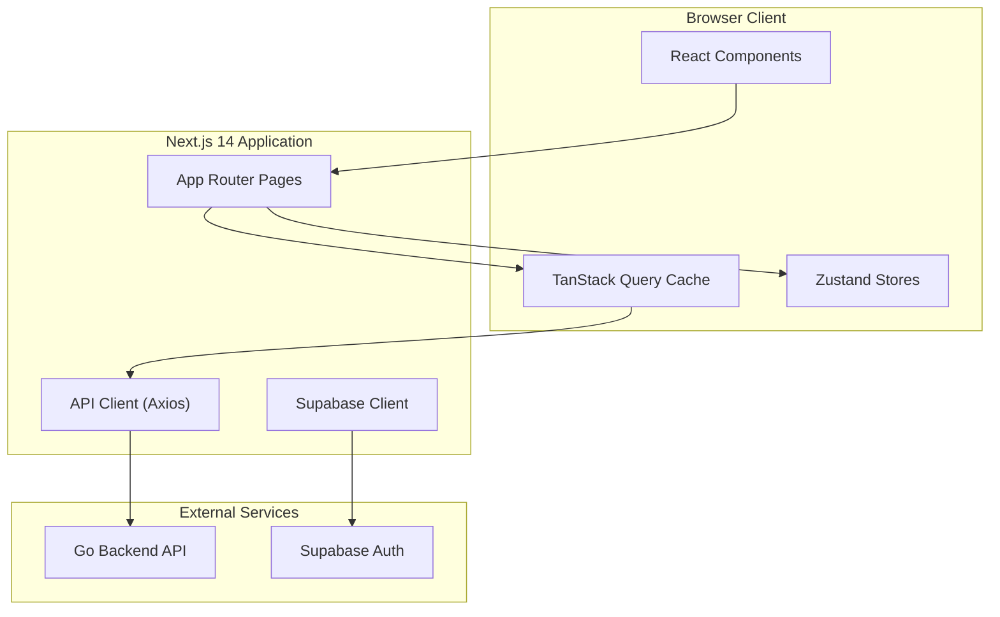
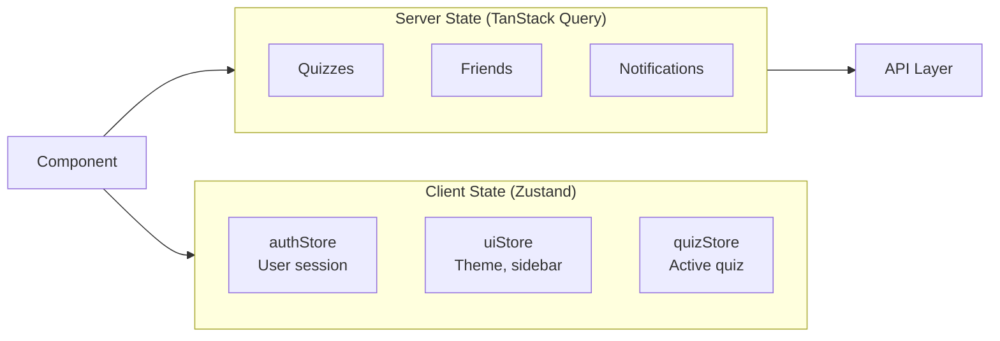
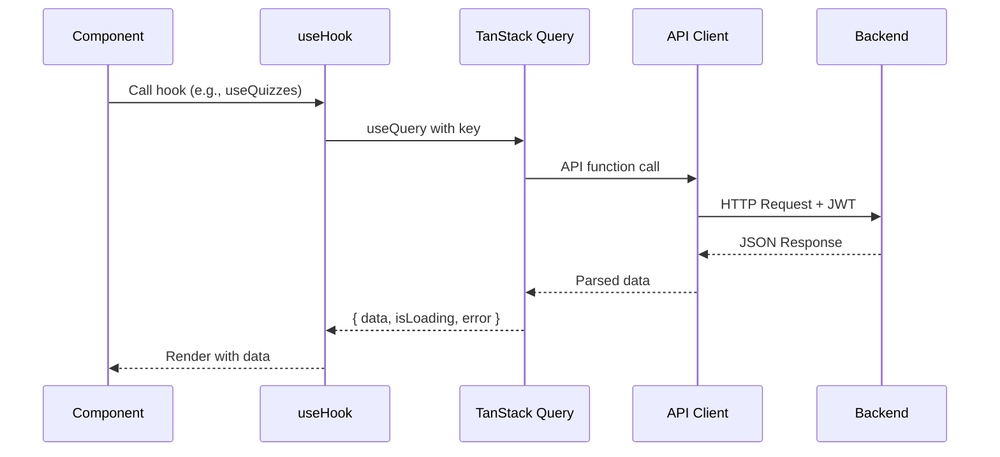

# QuizNinja UI - Source Code Documentation

## Overview

QuizNinja UI is a modern quiz platform frontend built with Next.js 14, enabling users to take quizzes, track achievements, compete on leaderboards, and engage in community discussions. This document serves as the main entry point for understanding the codebase architecture.

## Architecture Diagram



## Tech Stack

| Technology | Version | Purpose |
|------------|---------|---------|
| **Next.js** | 14.2.16 | React framework with App Router |
| **React** | 18.3.1 | UI library |
| **TypeScript** | 5.x | Type safety |
| **Zustand** | 4.4.7 | Client state management |
| **TanStack Query** | 5.17.0 | Server state & caching |
| **Supabase** | 2.39.0 | Authentication |
| **Axios** | 1.6.2 | HTTP client |
| **Tailwind CSS** | 3.4.1 | Styling |
| **Shadcn/ui** | - | Component library (Radix UI) |
| **Zod** | 3.22.4 | Schema validation |
| **Framer Motion** | 12.23.24 | Animations |

### Why This Stack?

- **Next.js 14 App Router**: Server components, streaming, parallel routes, and improved performance
- **Zustand + TanStack Query**: Clean separation of client state (UI) vs server state (API data)
- **Supabase**: Simplified auth with JWT, real-time capabilities
- **Tailwind + Shadcn/ui**: Rapid UI development with accessible, customizable components

## Directory Structure

```
src/
├── app/                    # Next.js App Router (pages & routes)
│   ├── (auth)/            # Auth route group (login, register)
│   ├── (dashboard)/       # Protected dashboard routes
│   ├── layout.tsx         # Root layout with providers
│   └── globals.css        # Global styles
│
├── components/            # React components (~90 files)
│   ├── ui/               # Shadcn/ui primitives (26 components)
│   ├── auth/             # Authentication (AuthGuard, LoginForm, etc.)
│   ├── layout/           # Layout (Header, Sidebar, MobileNav)
│   ├── quiz/             # Quiz feature components
│   ├── dashboard/        # Dashboard widgets
│   ├── profile/          # User profile components
│   ├── achievement/      # Achievement/gamification
│   ├── notification/     # Notification system
│   ├── discussion/       # Discussion forum
│   ├── social/           # Friends & social features
│   ├── leaderboard/      # Leaderboard display
│   ├── categories/       # Category browsing
│   ├── search/           # Global search
│   ├── settings/         # User settings
│   ├── common/           # Shared utility components
│   └── providers/        # Context providers
│
├── hooks/                 # Custom React hooks (28 files)
│   ├── useAuth.ts        # Authentication state
│   ├── useQuiz.ts        # Quiz data fetching
│   ├── useNotifications.ts # Real-time notifications
│   └── ...               # Data fetching & utility hooks
│
├── lib/                   # Utilities and clients
│   ├── api/              # API layer (Axios client & services)
│   ├── supabase/         # Supabase client setup
│   ├── utils.ts          # Utility functions (cn, etc.)
│   └── logger.ts         # Logging utility
│
├── store/                 # Zustand state stores
│   ├── authStore.ts      # Authentication state
│   ├── quizStore.ts      # Quiz session state
│   └── uiStore.ts        # UI preferences
│
├── types/                 # TypeScript type definitions
│   ├── quiz.ts           # Quiz, Question, Answer types
│   ├── auth.ts           # User, Session types
│   └── ...               # Domain-specific types
│
├── schemas/               # Zod validation schemas
│   ├── auth.ts           # Login/register validation
│   └── ...               # Form validation schemas
│
├── constants/             # Application constants
│   ├── enums/            # Type-safe enum objects
│   ├── labels.ts         # UI display labels
│   └── index.ts          # Barrel export
│
├── config/                # Configuration
│   ├── env.ts            # Environment variables
│   └── site.ts           # Site metadata
│
└── middleware.ts          # Next.js middleware (route protection)
```

## Key Concepts

### State Management Pattern



- **Zustand**: For UI state that doesn't come from the server (sidebar open, theme, quiz session)
- **TanStack Query**: For all server data with automatic caching, refetching, and invalidation

### Data Flow



### Authentication Flow

1. User logs in via Supabase Auth
2. JWT stored in cookies (SSR compatible)
3. `AuthGuard` component protects dashboard routes
4. API client attaches JWT to all requests via interceptor
5. Backend validates JWT and returns data

## Quick Start

### Prerequisites

- Node.js 18+
- npm or yarn
- Supabase account (for auth)
- Running Go backend API

### Setup

```bash
# Install dependencies
npm install

# Copy environment file
cp .env.example .env.local

# Configure environment variables
# NEXT_PUBLIC_SUPABASE_URL=your-supabase-url
# NEXT_PUBLIC_SUPABASE_ANON_KEY=your-anon-key
# NEXT_PUBLIC_API_BASE_URL=http://localhost:8080
# NEXT_PUBLIC_APP_URL=http://localhost:3001

# Start development server
npm run dev
```

### Available Scripts

| Script | Description |
|--------|-------------|
| `npm run dev` | Start dev server (port 3001) |
| `npm run build` | Production build |
| `npm run start` | Start production server |
| `npm run lint` | Run ESLint |
| `npm run type-check` | TypeScript type checking |
| `npm run format` | Format with Prettier |

## Common Developer Tasks

### Adding a New Page

1. Create file in `src/app/(dashboard)/your-feature/page.tsx`
2. Add "use client" if using hooks/state
3. Dashboard layout already wraps with AuthGuard

```tsx
// src/app/(dashboard)/my-feature/page.tsx
"use client";

export default function MyFeaturePage() {
  return (
    <div className="space-y-6">
      <h1 className="text-2xl font-bold">My Feature</h1>
      {/* Content */}
    </div>
  );
}
```

### Adding a New Hook

1. Create file in `src/hooks/useMyHook.ts`
2. Use TanStack Query for data fetching
3. Export from the file

```tsx
// src/hooks/useMyFeature.ts
import { useQuery } from "@tanstack/react-query";
import { getMyFeature } from "@/lib/api/myFeature";

export function useMyFeature(id: string) {
  return useQuery({
    queryKey: ["myFeature", id],
    queryFn: () => getMyFeature(id),
    enabled: !!id,
  });
}
```

### Adding a New Component

1. Create in appropriate feature folder under `src/components/`
2. Follow existing patterns for props and styling
3. Use Shadcn/ui primitives where possible

```tsx
// src/components/my-feature/MyCard.tsx
"use client";

import { Card } from "@/components/ui/card";

interface MyCardProps {
  title: string;
  children: React.ReactNode;
}

export function MyCard({ title, children }: MyCardProps) {
  return (
    <Card className="p-6">
      <h3 className="font-semibold">{title}</h3>
      {children}
    </Card>
  );
}
```

## Code Conventions

### File Naming

- Components: `PascalCase.tsx` (e.g., `QuizCard.tsx`)
- Hooks: `camelCase.ts` with `use` prefix (e.g., `useQuiz.ts`)
- Types: `camelCase.ts` (e.g., `quiz.ts`)
- Constants: `camelCase.ts` (e.g., `labels.ts`)

### Import Aliases

Use `@/` alias for absolute imports:

```tsx
import { Button } from "@/components/ui/button";
import { useAuth } from "@/hooks/useAuth";
import type { Quiz } from "@/types/quiz";
```

### Component Structure

```tsx
"use client"; // Only if needed

// 1. External imports
import { useState } from "react";

// 2. Internal imports (components, hooks, types)
import { Card } from "@/components/ui/card";
import { useQuiz } from "@/hooks/useQuiz";
import type { Quiz } from "@/types/quiz";

// 3. Props interface
interface MyComponentProps {
  quiz: Quiz;
}

// 4. Component
export function MyComponent({ quiz }: MyComponentProps) {
  // Hooks first
  const [state, setState] = useState(false);

  // Event handlers
  const handleClick = () => {};

  // Render
  return <div>...</div>;
}
```

## Related Documentation

### Core Modules
- [App Router](./app/README.md) - Routing and pages
- [Components](./components/README.md) - Component library
- [Hooks](./hooks/README.md) - Custom React hooks
- [Store](./store/README.md) - State management

### Infrastructure
- [API Layer](./lib/api/README.md) - Backend integration
- [Types](./types/README.md) - TypeScript definitions
- [Constants](./constants/README.md) - Enums and labels
- [Config](./config/README.md) - Environment setup

## Features Overview

| Feature | Components | Hooks | API |
|---------|------------|-------|-----|
| **Quizzes** | quiz/* | useQuiz, useQuizzes | quiz.ts |
| **Auth** | auth/* | useAuth | auth.ts |
| **Achievements** | achievement/* | useAchievements | achievements.ts |
| **Notifications** | notification/* | useNotifications | notifications.ts |
| **Friends** | social/* | useFriends | friends.ts |
| **Discussions** | discussion/* | useDiscussions | discussions.ts |
| **Leaderboard** | leaderboard/* | useLeaderboard | leaderboard.ts |
