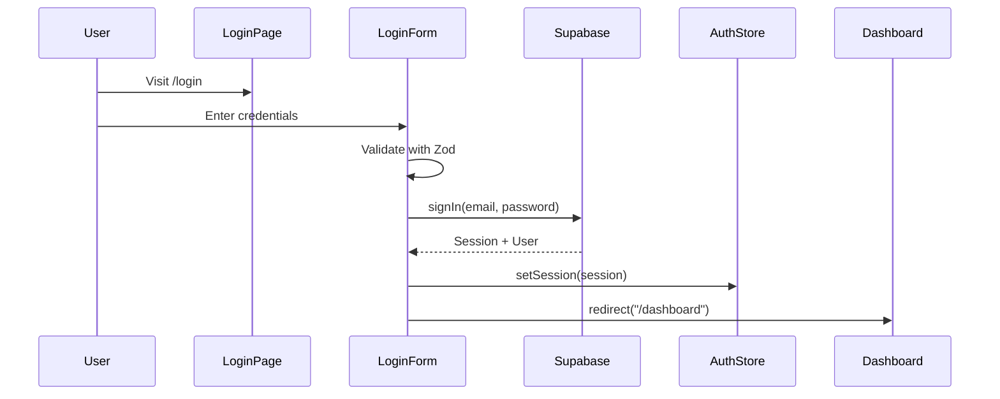

# Auth Routes

## Overview

The `(auth)` route group contains authentication-related pages for unauthenticated users. These pages use a simplified layout without the dashboard navigation.

## Routes

| Route | File | Purpose |
|-------|------|---------|
| `/login` | `login/page.tsx` | User login |
| `/register` | `register/page.tsx` | User registration |
| `/welcome` | `welcome/page.tsx` | Post-registration welcome |
| `/preferences` | `preferences/page.tsx` | Onboarding preferences |

## Route Group Explained

The `(auth)` folder name with parentheses creates a **route group**:

- Does NOT affect the URL (no `/auth` prefix)
- Allows shared layout for auth pages
- Organizes related routes together

```
URL: /login (not /auth/login)
```

## Layout

Auth pages use a simple centered layout:

```tsx
// (auth)/layout.tsx
export default function AuthLayout({ children }: { children: ReactNode }) {
  return (
    <div className="min-h-screen flex items-center justify-center bg-gradient-to-b from-background to-muted">
      <div className="w-full max-w-md p-6">
        {children}
      </div>
    </div>
  );
}
```

**Features:**
- No header/sidebar
- Centered content
- Max width container
- Gradient background

## Pages

### Login (`/login`)

User login with email and password.

```tsx
// login/page.tsx
import { LoginForm } from "@/components/auth/LoginForm";

export const metadata = {
  title: "Login | QuizNinja",
};

export default function LoginPage() {
  return (
    <div className="space-y-6">
      <div className="text-center">
        <h1 className="text-2xl font-bold">Welcome Back</h1>
        <p className="text-muted-foreground">
          Sign in to continue to QuizNinja
        </p>
      </div>
      <LoginForm />
      <p className="text-center text-sm">
        Don't have an account?{" "}
        <Link href="/register" className="text-primary">
          Register
        </Link>
      </p>
    </div>
  );
}
```

**Flow:**
1. User enters email/password
2. Validates with Zod schema
3. Calls Supabase `signIn()`
4. On success, redirects to `/dashboard`

### Register (`/register`)

New user registration.

```tsx
// register/page.tsx
import { RegisterForm } from "@/components/auth/RegisterForm";

export const metadata = {
  title: "Register | QuizNinja",
};

export default function RegisterPage() {
  return (
    <div className="space-y-6">
      <div className="text-center">
        <h1 className="text-2xl font-bold">Create Account</h1>
        <p className="text-muted-foreground">
          Join QuizNinja and start learning
        </p>
      </div>
      <RegisterForm />
      <p className="text-center text-sm">
        Already have an account?{" "}
        <Link href="/login" className="text-primary">
          Login
        </Link>
      </p>
    </div>
  );
}
```

**Flow:**
1. User enters name, email, password, confirm password
2. Validates with Zod schema (password strength, match)
3. Calls Supabase `signUp()`
4. Creates user profile in backend
5. Redirects to `/welcome` or `/preferences`

### Welcome (`/welcome`)

Post-registration welcome screen.

```tsx
// welcome/page.tsx
export default function WelcomePage() {
  return (
    <div className="text-center space-y-6">
      <Confetti /> {/* Celebration animation */}
      <h1 className="text-3xl font-bold">Welcome to QuizNinja!</h1>
      <p className="text-muted-foreground">
        Your account has been created successfully.
      </p>
      <Button asChild>
        <Link href="/preferences">Set Your Preferences</Link>
      </Button>
    </div>
  );
}
```

### Preferences (`/preferences`)

Onboarding quiz preferences selection.

```tsx
// preferences/page.tsx
"use client";

import { useOnboarding } from "@/hooks/useOnboarding";

export default function PreferencesPage() {
  const { savePreferences, isLoading } = useOnboarding();

  const handleSubmit = async (data: PreferencesData) => {
    await savePreferences(data);
    router.push("/dashboard");
  };

  return (
    <div className="space-y-6">
      <h1 className="text-2xl font-bold">Customize Your Experience</h1>
      <PreferencesForm onSubmit={handleSubmit} isLoading={isLoading} />
    </div>
  );
}
```

**Collects:**
- Preferred categories
- Difficulty level preference
- Notification settings

## Authentication Flow



## Form Validation

Auth forms use Zod schemas from `@/schemas/auth`:

```tsx
// Login validation
const loginSchema = z.object({
  email: z.string().email("Invalid email"),
  password: z.string().min(6, "Min 6 characters"),
});

// Registration validation
const registerSchema = z.object({
  name: z.string().min(2, "Min 2 characters"),
  email: z.string().email("Invalid email"),
  password: z.string()
    .min(8, "Min 8 characters")
    .regex(/[a-z]/, "Needs lowercase")
    .regex(/[A-Z]/, "Needs uppercase")
    .regex(/[0-9]/, "Needs number"),
  confirmPassword: z.string(),
}).refine(data => data.password === data.confirmPassword, {
  message: "Passwords don't match",
  path: ["confirmPassword"],
});
```

## Redirect Logic

### Authenticated Users

Authenticated users visiting auth pages are redirected to dashboard:

```tsx
// In LoginForm/RegisterForm
const { isAuthenticated } = useAuth();

useEffect(() => {
  if (isAuthenticated) {
    router.push("/dashboard");
  }
}, [isAuthenticated]);
```

### After Login

```tsx
const handleLogin = async (data: LoginFormData) => {
  await signIn(data.email, data.password);
  // Redirect is handled by auth state change listener
};
```

## Error Handling

```tsx
try {
  await signIn(email, password);
} catch (error) {
  if (error.message.includes("Invalid login")) {
    toast.error("Invalid email or password");
  } else {
    toast.error("Login failed. Please try again.");
  }
}
```

## Related Documentation

- [Parent: App Router](../README.md)
- [Dashboard Routes](../\(dashboard\)/README.md)
- [Auth Components](../../components/auth/README.md)
- [Auth Schemas](../../schemas/README.md)
- [Supabase Client](../../lib/supabase/README.md)
