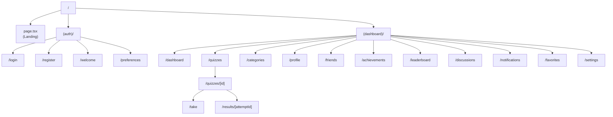

# App Router

## Overview

This folder contains the Next.js 14 App Router structure for QuizNinja. Pages are organized using route groups for different authentication contexts, with file-based routing for all pages.

## Route Structure



## Directory Structure

```
app/
├── layout.tsx              # Root layout (providers)
├── page.tsx                # Landing page (/)
├── globals.css             # Global styles
│
├── (auth)/                 # Auth route group
│   ├── layout.tsx         # Auth layout (no sidebar)
│   ├── login/
│   │   └── page.tsx       # /login
│   ├── register/
│   │   └── page.tsx       # /register
│   ├── welcome/
│   │   └── page.tsx       # /welcome
│   └── preferences/
│       └── page.tsx       # /preferences (onboarding)
│
└── (dashboard)/            # Dashboard route group
    ├── layout.tsx         # Dashboard layout (AuthGuard, Sidebar)
    ├── dashboard/
    │   └── page.tsx       # /dashboard
    ├── quizzes/
    │   ├── page.tsx       # /quizzes
    │   ├── [id]/
    │   │   ├── page.tsx   # /quizzes/[id]
    │   │   ├── take/
    │   │   │   └── page.tsx   # /quizzes/[id]/take
    │   │   └── results/
    │   │       └── [attemptId]/
    │   │           └── page.tsx   # /quizzes/[id]/results/[attemptId]
    │   └── category/
    │       └── [categoryId]/
    │           └── page.tsx   # /quizzes/category/[categoryId]
    ├── categories/
    │   └── page.tsx       # /categories
    ├── profile/
    │   ├── page.tsx       # /profile (own profile)
    │   ├── edit/
    │   │   └── page.tsx   # /profile/edit
    │   └── [userId]/
    │       └── page.tsx   # /profile/[userId] (view others)
    ├── achievements/
    │   └── page.tsx       # /achievements
    ├── leaderboard/
    │   └── page.tsx       # /leaderboard
    ├── friends/
    │   ├── page.tsx       # /friends
    │   └── requests/
    │       └── page.tsx   # /friends/requests
    ├── discussions/
    │   ├── page.tsx       # /discussions
    │   └── [id]/
    │       └── page.tsx   # /discussions/[id]
    ├── notifications/
    │   └── page.tsx       # /notifications
    ├── favorites/
    │   └── page.tsx       # /favorites
    └── settings/
        └── page.tsx       # /settings
```

## Route Groups

### `(auth)` - Authentication Routes

Routes for unauthenticated users. No sidebar, centered layout.

| Route | Purpose |
|-------|---------|
| `/login` | User login |
| `/register` | User registration |
| `/welcome` | Post-registration welcome |
| `/preferences` | Onboarding preferences |

**Layout:** Simple centered layout without navigation

### `(dashboard)` - Protected Routes

Routes requiring authentication. Includes sidebar and header.

| Route | Purpose |
|-------|---------|
| `/dashboard` | Main dashboard |
| `/quizzes` | Quiz browser |
| `/quizzes/[id]` | Quiz details |
| `/quizzes/[id]/take` | Quiz taking |
| `/quizzes/[id]/results/[attemptId]` | Quiz results |
| `/categories` | Browse by category |
| `/profile` | User profile |
| `/profile/[userId]` | View other user |
| `/achievements` | Achievements page |
| `/leaderboard` | Rankings |
| `/friends` | Friends list |
| `/discussions` | Discussion forum |
| `/notifications` | Notifications |
| `/favorites` | Favorite quizzes |
| `/settings` | User settings |

**Layout:** AuthGuard + Header + Sidebar + Main content

## Layouts

### Root Layout (`layout.tsx`)

Wraps entire app with providers:

```tsx
export default function RootLayout({ children }: { children: ReactNode }) {
  return (
    <html lang="en" suppressHydrationWarning>
      <body>
        <ThemeProvider attribute="class" defaultTheme="system" enableSystem>
          <QueryProvider>
            {children}
            <ToastProvider />
          </QueryProvider>
        </ThemeProvider>
      </body>
    </html>
  );
}
```

### Auth Layout (`(auth)/layout.tsx`)

Simple layout for auth pages:

```tsx
export default function AuthLayout({ children }: { children: ReactNode }) {
  return (
    <div className="min-h-screen flex items-center justify-center">
      <div className="w-full max-w-md p-6">
        {children}
      </div>
    </div>
  );
}
```

### Dashboard Layout (`(dashboard)/layout.tsx`)

Protected layout with navigation:

```tsx
export default function DashboardLayout({ children }: { children: ReactNode }) {
  return (
    <AuthGuard requireAuth={true}>
      <DashboardNotificationListener />
      <div className="flex h-screen">
        <Header />
        <Sidebar />
        <MobileNav />
        <main className="flex-1 overflow-y-auto">
          {children}
        </main>
      </div>
    </AuthGuard>
  );
}
```

## Page Patterns

### Static Page

```tsx
// No "use client" needed
export const metadata = {
  title: "Categories | QuizNinja",
};

export default function CategoriesPage() {
  return (
    <div>
      <h1>Categories</h1>
      <CategoryGrid />
    </div>
  );
}
```

### Client Page with Data

```tsx
"use client";

import { useQuizzes } from "@/hooks/useQuizzes";

export default function QuizzesPage() {
  const { data, isLoading } = useQuizzes();

  if (isLoading) return <Skeleton />;

  return <QuizList quizzes={data?.quizzes} />;
}
```

### Dynamic Route Page

```tsx
// app/(dashboard)/quizzes/[id]/page.tsx
"use client";

import { useParams } from "next/navigation";
import { useQuiz } from "@/hooks/useQuiz";

export default function QuizPage() {
  const { id } = useParams<{ id: string }>();
  const { data: quiz, isLoading } = useQuiz(id);

  if (isLoading) return <Skeleton />;

  return <QuizDetail quiz={quiz} />;
}
```

### Nested Dynamic Routes

```tsx
// app/(dashboard)/quizzes/[id]/results/[attemptId]/page.tsx
"use client";

import { useParams } from "next/navigation";

export default function ResultsPage() {
  const { id, attemptId } = useParams<{ id: string; attemptId: string }>();

  return <QuizResults quizId={id} attemptId={attemptId} />;
}
```

## Metadata

### Static Metadata

```tsx
export const metadata = {
  title: "Dashboard | QuizNinja",
  description: "Your quiz dashboard",
};
```

### Dynamic Metadata

```tsx
// For dynamic routes, use generateMetadata
export async function generateMetadata({ params }: Props): Promise<Metadata> {
  const quiz = await getQuiz(params.id);

  return {
    title: `${quiz.title} | QuizNinja`,
    description: quiz.description,
  };
}
```

## Navigation

### Using Link

```tsx
import Link from "next/link";

<Link href="/quizzes">Browse Quizzes</Link>
<Link href={`/quizzes/${quiz.id}`}>View Quiz</Link>
```

### Programmatic Navigation

```tsx
"use client";

import { useRouter } from "next/navigation";

function QuizCard({ quiz }: Props) {
  const router = useRouter();

  const handleClick = () => {
    router.push(`/quizzes/${quiz.id}`);
  };

  return <button onClick={handleClick}>Start Quiz</button>;
}
```

### Getting Current Route

```tsx
import { usePathname, useParams, useSearchParams } from "next/navigation";

function MyComponent() {
  const pathname = usePathname();        // "/quizzes/123"
  const params = useParams();            // { id: "123" }
  const searchParams = useSearchParams(); // URLSearchParams

  const category = searchParams.get("category");
}
```

## Common Patterns

### Protected Route Check

AuthGuard handles this in layout, but for page-level checks:

```tsx
"use client";

import { useAuth } from "@/hooks/useAuth";
import { redirect } from "next/navigation";

export default function ProtectedPage() {
  const { isAuthenticated, isLoading } = useAuth();

  if (isLoading) return <Spinner />;
  if (!isAuthenticated) redirect("/login");

  return <Content />;
}
```

### Loading States

```tsx
// loading.tsx (automatic loading UI)
export default function Loading() {
  return <Skeleton />;
}

// Or handle in component
if (isLoading) return <Skeleton />;
```

### Error Handling

```tsx
// error.tsx (automatic error UI)
"use client";

export default function Error({
  error,
  reset,
}: {
  error: Error;
  reset: () => void;
}) {
  return (
    <div>
      <h2>Something went wrong</h2>
      <button onClick={reset}>Try again</button>
    </div>
  );
}
```

## Related Documentation

- [Parent: Source Overview](../README.md)
- [Auth Routes](./(auth)/README.md) - Auth route group details
- [Dashboard Routes](./(dashboard)/README.md) - Dashboard route group details
- [Layout Components](../components/layout/README.md) - Header, Sidebar, etc.
