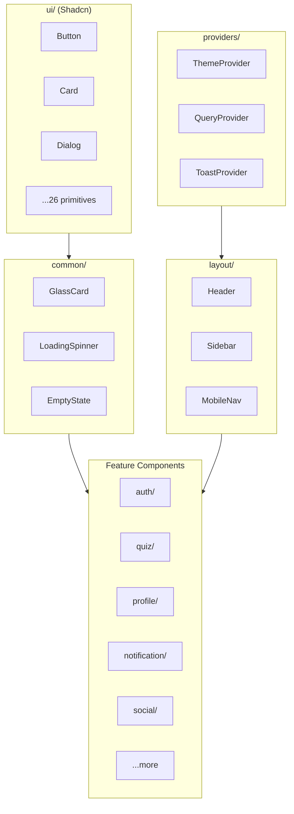

# Components

## Overview

This folder contains all React components for the QuizNinja UI, organized by feature domain. Components are built with React 18, TypeScript, Tailwind CSS, and Shadcn/ui primitives.

## Architecture



## Directory Structure

```
components/
├── ui/                  # Shadcn/ui primitives (26 components)
├── common/              # Shared utility components (6)
├── providers/           # Context providers (3)
├── layout/              # Layout components (4)
├── auth/                # Authentication (4)
├── quiz/                # Quiz features (10)
├── dashboard/           # Dashboard widgets (3)
├── profile/             # User profiles (6)
├── achievement/         # Achievements (4)
├── notification/        # Notifications (6)
├── discussion/          # Discussions (5)
├── social/              # Friends & social (4)
├── leaderboard/         # Leaderboard (2)
├── categories/          # Categories (2)
├── search/              # Search (1)
└── settings/            # Settings (2)
```

## Component Categories

### Primitive Components (`ui/`)

Base UI components from Shadcn/ui built on Radix UI. See [ui/README.md](./ui/README.md).

| Component | Purpose |
|-----------|---------|
| Button | Clickable actions |
| Card | Content containers |
| Dialog | Modal dialogs |
| Input | Text input fields |
| Select | Dropdown selection |
| Tabs | Tab navigation |
| Table | Data tables |
| Badge | Status indicators |
| Avatar | User images |
| Toast | Notifications |
| ... | 16 more |

### Common Components (`common/`)

Shared utility components. See [common/README.md](./common/README.md).

| Component | Purpose |
|-----------|---------|
| GlassCard | Glassmorphic card container |
| LoadingSpinner | Loading indicator |
| EmptyState | Empty content placeholder |
| ErrorBoundary | Error handling wrapper |
| StatsCard | Statistics display |
| StatsGrid | Statistics grid layout |

### Provider Components (`providers/`)

Context providers for app-wide state. See [providers/README.md](./providers/README.md).

| Provider | Purpose |
|----------|---------|
| ThemeProvider | Dark/light mode |
| QueryProvider | TanStack Query client |
| ToastProvider | Toast notifications |

### Layout Components (`layout/`)

Application layout structure. See [layout/README.md](./layout/README.md).

| Component | Purpose |
|-----------|---------|
| Header | Top navigation bar |
| Sidebar | Side navigation |
| MobileNav | Mobile menu |
| UserMenu | User dropdown |

### Feature Components

Organized by domain:

| Folder | Feature | Components |
|--------|---------|------------|
| `auth/` | Authentication | LoginForm, RegisterForm, AuthGuard, SessionValidator |
| `quiz/` | Quizzes | QuizCard, QuizList, QuestionCard, QuizTimer, etc. |
| `dashboard/` | Dashboard | FeaturedQuizzes, DashboardStats, RecentActivity |
| `profile/` | Profiles | ProfileCard, ProfileEditForm, DetailedStatistics |
| `achievement/` | Achievements | AchievementCard, AchievementGrid, AchievementBadge |
| `notification/` | Notifications | NotificationBell, NotificationList, NotificationCard |
| `discussion/` | Discussions | DiscussionList, DiscussionCard, ReplyForm |
| `social/` | Friends | FriendCard, FriendList, FriendRequestCard |
| `leaderboard/` | Rankings | LeaderboardTable, UserRankCard |
| `categories/` | Categories | CategoryCard, CategoryGrid |
| `search/` | Search | GlobalSearch |
| `settings/` | Settings | PreferencesForm, AccountSettingsForm |

## Component Patterns

### File Structure

```tsx
// ComponentName.tsx
"use client"; // Only if using hooks/state

// 1. External imports
import { useState } from "react";

// 2. UI components
import { Button } from "@/components/ui/button";
import { Card } from "@/components/ui/card";

// 3. Hooks
import { useQuiz } from "@/hooks/useQuiz";

// 4. Types
import type { Quiz } from "@/types/quiz";

// 5. Utils
import { cn } from "@/lib/utils";

// 6. Props interface
interface ComponentNameProps {
  quiz: Quiz;
  className?: string;
  onAction?: () => void;
}

// 7. Component
export function ComponentName({ quiz, className, onAction }: ComponentNameProps) {
  // Hooks first
  const [state, setState] = useState(false);

  // Event handlers
  const handleClick = () => {
    // ...
    onAction?.();
  };

  // Render
  return (
    <Card className={cn("p-4", className)}>
      <h3>{quiz.title}</h3>
      <Button onClick={handleClick}>Action</Button>
    </Card>
  );
}
```

### Props Conventions

```tsx
interface MyComponentProps {
  // Required data props
  item: Item;

  // Optional data props
  items?: Item[];

  // Styling
  className?: string;
  variant?: "default" | "primary" | "secondary";
  size?: "sm" | "md" | "lg";

  // Event handlers (on* prefix)
  onClick?: () => void;
  onSelect?: (item: Item) => void;

  // Render props
  renderItem?: (item: Item) => React.ReactNode;

  // Children
  children?: React.ReactNode;
}
```

### Client vs Server Components

```tsx
// Server Component (default) - no directive needed
// Use for: static content, data fetching
export function StaticCard({ title }: { title: string }) {
  return <Card>{title}</Card>;
}

// Client Component - requires directive
// Use for: hooks, state, event handlers, browser APIs
"use client";
export function InteractiveCard({ title }: { title: string }) {
  const [expanded, setExpanded] = useState(false);
  return (
    <Card onClick={() => setExpanded(!expanded)}>
      {title}
    </Card>
  );
}
```

### Using `cn()` for Classes

```tsx
import { cn } from "@/lib/utils";

function MyComponent({ active, className }: Props) {
  return (
    <div
      className={cn(
        // Base styles
        "rounded-lg p-4 border",
        // Conditional styles
        active && "border-primary bg-primary/10",
        !active && "border-gray-200",
        // Allow override
        className
      )}
    >
      Content
    </div>
  );
}
```

### Composition Pattern

Build complex UIs from smaller components:

```tsx
// Card building blocks
<Card>
  <CardHeader>
    <CardTitle>Title</CardTitle>
    <CardDescription>Description</CardDescription>
  </CardHeader>
  <CardContent>
    {/* Main content */}
  </CardContent>
  <CardFooter>
    <Button>Action</Button>
  </CardFooter>
</Card>
```

## Styling

### Tailwind CSS

All styling uses Tailwind utility classes:

```tsx
<div className="flex items-center gap-4 p-6 bg-white dark:bg-gray-900 rounded-lg shadow-md">
  <Avatar className="h-12 w-12" />
  <div className="flex-1">
    <h3 className="text-lg font-semibold">{name}</h3>
    <p className="text-sm text-muted-foreground">{email}</p>
  </div>
</div>
```

### Theme Colors

Use semantic color classes:

```tsx
// Backgrounds
bg-background        // Page background
bg-card             // Card background
bg-muted            // Muted sections

// Text
text-foreground     // Primary text
text-muted-foreground // Secondary text

// Borders
border-border       // Default border
border-input        // Input borders

// Accent
bg-primary          // Primary actions
bg-secondary        // Secondary actions
bg-destructive      // Dangerous actions
```

### Dark Mode

Components automatically support dark mode via Tailwind's `dark:` prefix:

```tsx
<Card className="bg-white dark:bg-gray-900 border dark:border-gray-800">
  <p className="text-gray-900 dark:text-gray-100">
    Content that adapts to theme
  </p>
</Card>
```

## Adding New Components

### 1. Create Component File

```tsx
// components/my-feature/MyComponent.tsx
"use client";

import { Card } from "@/components/ui/card";

interface MyComponentProps {
  title: string;
}

export function MyComponent({ title }: MyComponentProps) {
  return <Card>{title}</Card>;
}
```

### 2. Create Folder README

```markdown
# My Feature Components

## Overview
Components for the my-feature functionality.

## Components
| Component | File | Purpose |
|-----------|------|---------|
| MyComponent | MyComponent.tsx | Description |
```

### 3. Use in Page

```tsx
// app/(dashboard)/my-feature/page.tsx
import { MyComponent } from "@/components/my-feature/MyComponent";

export default function MyFeaturePage() {
  return <MyComponent title="Hello" />;
}
```

## Related Documentation

- [Parent: Source Overview](../README.md)
- [UI Primitives](./ui/README.md)
- [Common Components](./common/README.md)
- [Providers](./providers/README.md)
- [Layout](./layout/README.md)
- [Hooks](../hooks/README.md) - Custom hooks used in components
- [Types](../types/README.md) - Props types
