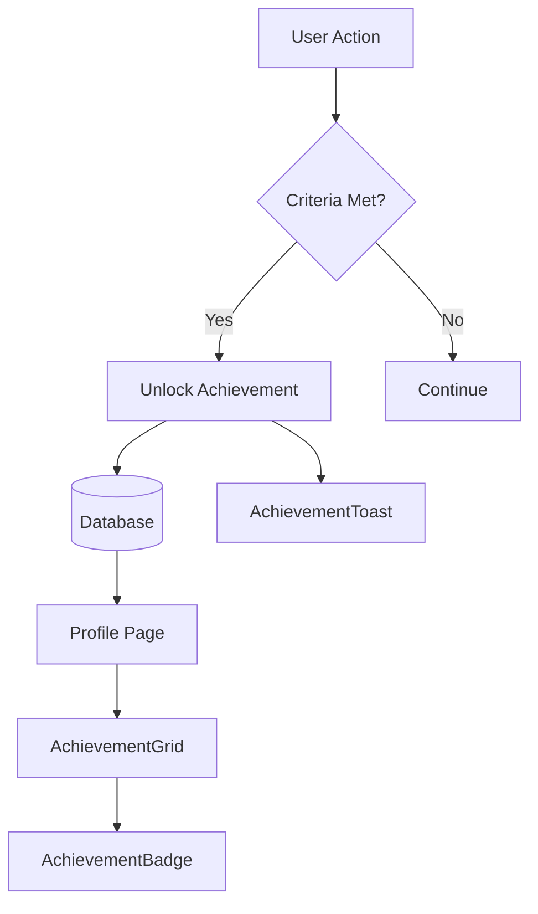

# Achievement Components

## Overview

Components for displaying user achievements, badges, and progress tracking. These gamification elements encourage engagement and reward quiz performance.

## Components

| Component | File | Purpose |
|-----------|------|---------|
| AchievementBadge | `AchievementBadge.tsx` | Single achievement display |
| AchievementCard | `AchievementCard.tsx` | Detailed achievement view |
| AchievementGrid | `AchievementGrid.tsx` | Grid layout for achievements |
| AchievementToast | `AchievementToast.tsx` | Achievement unlock notification |

## Achievement System Flow



## AchievementBadge

Displays a single achievement with unlocked/locked state.

### Props

| Prop | Type | Description |
|------|------|-------------|
| `achievement` | `UserAchievement \| AchievementProgress` | Achievement data |
| `variant` | `"compact" \| "detailed"` | Display style |

### Variants

**Compact:**
- Icon with locked/unlocked state
- Name and description
- Points badge

**Detailed:**
- Larger icon display
- Full description
- Progress bar (if not unlocked)
- Unlock date (if unlocked)

### Visual States

```tsx
// Unlocked state
<div className="bg-gradient-to-br from-yellow-50 to-amber-50">
  <Trophy className="text-yellow-500" />
  <Badge>{achievementData.points} pts</Badge>
</div>

// Locked state
<div className="bg-muted opacity-60">
  <Lock className="text-muted-foreground" />
  <Progress value={progress} />
</div>
```

### Usage

```tsx
import { AchievementBadge } from "@/components/achievement/AchievementBadge";

// Unlocked achievement
<AchievementBadge
  achievement={unlockedAchievement}
  variant="detailed"
/>

// Progress achievement (locked)
<AchievementBadge
  achievement={progressAchievement}
  variant="compact"
/>
```

---

## AchievementGrid

Grid layout for displaying multiple achievements.

### Props

| Prop | Type | Description |
|------|------|-------------|
| `achievements` | `Achievement[]` | List of achievements |
| `userProgress` | `AchievementProgress[]` | User's progress data |
| `columns` | `number` | Grid columns |

### Usage

```tsx
<AchievementGrid
  achievements={allAchievements}
  userProgress={userProgress}
  columns={3}
/>
```

---

## AchievementToast

Toast notification when achievement is unlocked.

### Props

| Prop | Type | Description |
|------|------|-------------|
| `achievement` | `Achievement` | Newly unlocked achievement |
| `onDismiss` | `() => void` | Dismiss handler |

### Features

- Animated entrance
- Trophy icon with confetti effect
- Points earned display
- Auto-dismiss after timeout

### Usage

```tsx
// Typically triggered by notification system
<AchievementToast
  achievement={newAchievement}
  onDismiss={() => setShowToast(false)}
/>
```

---

## Achievement Types

Common achievements in QuizNinja:

| Achievement | Criteria | Points |
|-------------|----------|--------|
| First Steps | Complete first quiz | 10 |
| Perfect Score | Score 100% on any quiz | 25 |
| Quiz Master | Complete 10 quizzes | 50 |
| Streak Keeper | 7-day streak | 75 |
| Category Expert | Complete all quizzes in a category | 100 |

## Data Types

```typescript
interface Achievement {
  id: string;
  name: string;
  description: string;
  icon: string;
  points: number;
  criteria: string;
}

interface UserAchievement {
  id: string;
  achievement: Achievement;
  unlocked_at: string;
}

interface AchievementProgress {
  achievement: Achievement;
  progress_percentage: number;
  current_value: number;
  target_value: number;
}
```

## Related Documentation

- [Parent: Components Overview](../README.md)
- [Profile Components](../profile/README.md)
- [Achievement Types](../../types/README.md)
- [useAchievements Hook](../../hooks/README.md)

