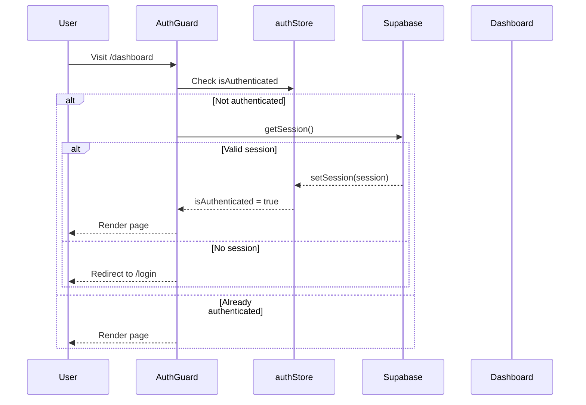

# Auth Components

## Overview

Components for user authentication including login, registration, and route protection.

## Authentication Flow



## Components

| Component | File | Purpose |
|-----------|------|---------|
| LoginForm | `LoginForm.tsx` | Email/password login form |
| RegisterForm | `RegisterForm.tsx` | User registration form |
| AuthGuard | `AuthGuard.tsx` | Route protection wrapper |
| SessionValidator | `SessionValidator.tsx` | Session validation component |

## AuthGuard

Protects routes requiring authentication.

### Props

| Prop | Type | Default | Description |
|------|------|---------|-------------|
| `children` | `ReactNode` | - | Protected content |
| `requireAuth` | `boolean` | `true` | Require authentication |
| `redirectTo` | `string` | `"/login"` | Redirect destination |

### Usage

```tsx
// In dashboard layout
<AuthGuard requireAuth={true}>
  {children}
</AuthGuard>

// Custom redirect
<AuthGuard requireAuth={true} redirectTo="/login?from=quiz">
  <QuizContent />
</AuthGuard>
```

### Behavior

1. Checks `authStore.isAuthenticated`
2. If not authenticated, checks Supabase session
3. If valid session found, updates store
4. If no session, redirects to login
5. Shows loading spinner during check

---

## LoginForm

Email and password login with validation.

### Features

- Zod schema validation
- "Remember me" option
- Error message display
- Loading state
- Link to registration

### Usage

```tsx
import { LoginForm } from "@/components/auth/LoginForm";

<LoginForm />
```

### Validation (from `schemas/auth.ts`)

```tsx
const loginSchema = z.object({
  email: z.string().email("Invalid email"),
  password: z.string().min(6, "Min 6 characters"),
  rememberMe: z.boolean().optional(),
});
```

### Form Fields

| Field | Type | Validation |
|-------|------|------------|
| Email | `input[email]` | Required, valid email |
| Password | `input[password]` | Required, min 6 chars |
| Remember Me | `checkbox` | Optional |

---

## RegisterForm

New user registration with password confirmation.

### Features

- Name, email, password fields
- Password strength requirements
- Confirm password matching
- Terms acceptance (optional)

### Usage

```tsx
import { RegisterForm } from "@/components/auth/RegisterForm";

<RegisterForm />
```

### Validation

```tsx
const registerSchema = z.object({
  name: z.string().min(2).max(50),
  email: z.string().email(),
  password: z.string()
    .min(8)
    .regex(/[a-z]/, "Lowercase required")
    .regex(/[A-Z]/, "Uppercase required")
    .regex(/[0-9]/, "Number required"),
  confirmPassword: z.string(),
}).refine(data => data.password === data.confirmPassword, {
  message: "Passwords don't match",
  path: ["confirmPassword"],
});
```

### Password Requirements

- Minimum 8 characters
- At least one lowercase letter
- At least one uppercase letter
- At least one number

---

## SessionValidator

Validates and refreshes session periodically.

### Usage

```tsx
// Typically in dashboard layout
<SessionValidator />
```

### Behavior

- Runs on mount and periodically
- Checks session validity
- Refreshes token if needed
- Clears auth on invalid session

---

## Integration with Supabase

```tsx
// Login
const { signIn } = useSupabase();
await signIn(email, password);

// Register
const { signUp } = useSupabase();
await signUp(email, password, fullName);

// Logout
const { signOut } = useSupabase();
await signOut();
```

## Error Handling

```tsx
try {
  await signIn(email, password);
  toast.success("Welcome back!");
  router.push("/dashboard");
} catch (error) {
  if (error.message.includes("Invalid")) {
    toast.error("Invalid email or password");
  } else {
    toast.error("Login failed. Please try again.");
  }
}
```

## Related Documentation

- [Parent: Components Overview](../README.md)
- [Auth Routes](../../app/(auth)/README.md)
- [Auth Schemas](../../schemas/README.md)
- [Supabase Client](../../lib/supabase/README.md)
- [Auth Store](../../store/README.md)
