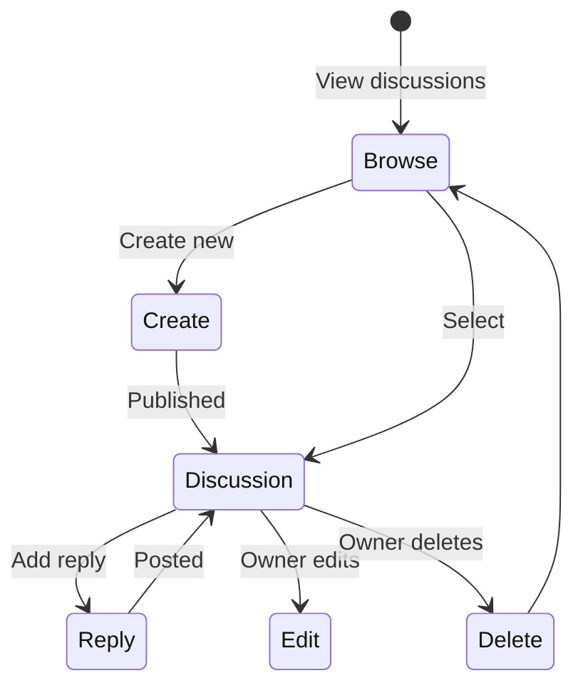

# Discussion Components

## Overview

Components for quiz-related discussions and community interaction. Users can ask questions, share tips, and discuss quiz content with others.

## Components

| Component | File | Purpose |
|-----------|------|---------|
| DiscussionCard | `DiscussionCard.tsx` | Discussion preview card |
| DiscussionList | `DiscussionList.tsx` | List of discussions |
| CreateDiscussionDialog | `CreateDiscussionDialog.tsx` | New discussion form |
| ReplyCard | `ReplyCard.tsx` | Single reply display |
| ReplyForm | `ReplyForm.tsx` | Reply input form |

## Discussion Flow



## DiscussionCard

Preview card for discussions in lists.

### Props

| Prop | Type | Description |
|------|------|-------------|
| `discussion` | `Discussion` | Discussion data |
| `onEdit` | `(discussion) => void` | Edit handler (owner only) |

### Display

- User avatar and name
- Discussion title
- Quiz badge (linked quiz)
- Content preview (3 lines)
- Stats: replies count, likes count, time ago
- Action buttons: Like, Edit, Delete (owner)

### Owner Actions

```tsx
// Only shown if user owns the discussion
{isOwner && (
  <>
    <Button onClick={handleEdit}>
      <Edit className="h-4 w-4" />
    </Button>
    <Button onClick={handleDelete} className="text-destructive">
      <Trash2 className="h-4 w-4" />
    </Button>
  </>
)}
```

### Delete Confirmation

```tsx
<AlertDialog>
  <AlertDialogTitle>Delete Discussion</AlertDialogTitle>
  <AlertDialogDescription>
    Are you sure? This will also delete all replies.
  </AlertDialogDescription>
</AlertDialog>
```

### Usage

```tsx
import { DiscussionCard } from "@/components/discussion/DiscussionCard";

<DiscussionCard
  discussion={discussion}
  onEdit={(d) => openEditDialog(d)}
/>
```

---

## DiscussionList

List of discussion cards with filtering.

### Props

| Prop | Type | Description |
|------|------|-------------|
| `discussions` | `Discussion[]` | Discussions array |
| `isLoading` | `boolean` | Loading state |
| `quizId` | `string?` | Filter by quiz |

### Features

- Grid or list layout
- Sort by: Recent, Popular, Most Replied
- Filter by quiz
- Infinite scroll pagination

### Usage

```tsx
import { DiscussionList } from "@/components/discussion/DiscussionList";

<DiscussionList
  discussions={discussions}
  isLoading={isLoading}
  quizId={quizId}
/>
```

---

## CreateDiscussionDialog

Modal dialog for creating new discussions.

### Props

| Prop | Type | Description |
|------|------|-------------|
| `open` | `boolean` | Dialog visibility |
| `onOpenChange` | `(open) => void` | Toggle handler |
| `quizId` | `string?` | Pre-selected quiz |

### Form Fields

| Field | Type | Validation |
|-------|------|------------|
| Quiz | Select | Required |
| Title | Input | 5-100 characters |
| Content | Textarea | 10-5000 characters |

### Usage

```tsx
import { CreateDiscussionDialog } from "@/components/discussion/CreateDiscussionDialog";

<CreateDiscussionDialog
  open={isOpen}
  onOpenChange={setIsOpen}
  quizId={selectedQuizId}
/>
```

---

## ReplyCard

Single reply in a discussion thread.

### Props

| Prop | Type | Description |
|------|------|-------------|
| `reply` | `DiscussionReply` | Reply data |
| `onEdit` | `(reply) => void` | Edit handler |
| `onDelete` | `(id) => void` | Delete handler |

### Display

- User avatar and name
- Reply content
- Timestamp
- Like button with count
- Edit/Delete (owner only)

### Usage

```tsx
<ReplyCard
  reply={reply}
  onEdit={(r) => openEditForm(r)}
  onDelete={(id) => deleteReply(id)}
/>
```

---

## ReplyForm

Form for adding/editing replies.

### Props

| Prop | Type | Description |
|------|------|-------------|
| `discussionId` | `string` | Parent discussion |
| `editingReply` | `Reply?` | Reply being edited |
| `onCancel` | `() => void` | Cancel handler |

### Features

- Auto-expanding textarea
- Character count
- Submit on Cmd/Ctrl+Enter
- Cancel edit button

### Usage

```tsx
import { ReplyForm } from "@/components/discussion/ReplyForm";

<ReplyForm
  discussionId={discussionId}
  editingReply={editingReply}
  onCancel={() => setEditingReply(null)}
/>
```

---

## Discussion Page Structure

```tsx
// /discussions page (list)
<div className="space-y-6">
  <div className="flex justify-between">
    <h1>Discussions</h1>
    <Button onClick={() => setShowCreate(true)}>
      New Discussion
    </Button>
  </div>

  <DiscussionList discussions={discussions} />

  <CreateDiscussionDialog
    open={showCreate}
    onOpenChange={setShowCreate}
  />
</div>

// /discussions/[id] page (detail)
<div className="space-y-6">
  <DiscussionDetail discussion={discussion} />

  <section>
    <h2>Replies ({replies.length})</h2>
    {replies.map(reply => (
      <ReplyCard key={reply.id} reply={reply} />
    ))}
    <ReplyForm discussionId={discussion.id} />
  </section>
</div>
```

## Data Types

```typescript
interface Discussion {
  id: string;
  user_id: string;
  user: {
    name: string;
    avatar_url?: string;
  };
  quiz_id: string;
  quiz: {
    id: string;
    title: string;
  };
  title: string;
  content: string;
  likes_count: number;
  replies_count: number;
  created_at: string;
  updated_at: string;
}

interface DiscussionReply {
  id: string;
  discussion_id: string;
  user_id: string;
  user: {
    name: string;
    avatar_url?: string;
  };
  content: string;
  likes_count: number;
  created_at: string;
}
```

## Hooks Used

```typescript
// Get discussions
const { data } = useDiscussions({ search, quizId });

// Get single discussion
const { data } = useDiscussion(discussionId);

// Create discussion
const createDiscussion = useCreateDiscussion();

// Like/unlike discussion
const likeDiscussion = useLikeDiscussion();

// Delete discussion
const deleteDiscussion = useDeleteDiscussion();

// Reply operations
const createReply = useCreateReply();
const deleteReply = useDeleteReply();
```

## Related Documentation

- [Parent: Components Overview](../README.md)
- [Quiz Components](../quiz/README.md)
- [Discussion Types](../../types/README.md)
- [useDiscussions Hook](../../hooks/README.md)

