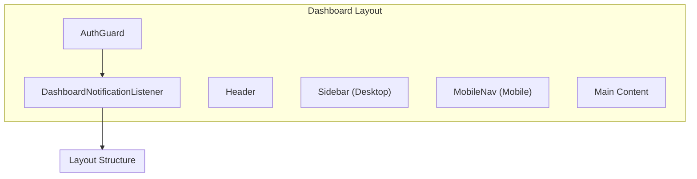

# Layout Components

## Overview

Components that define the application's layout structure, including the header, sidebar, and mobile navigation. These are used in the dashboard layout to provide consistent navigation across all protected pages.

## Layout Architecture



## Components

| Component | File | Purpose |
|-----------|------|---------|
| Header | `Header.tsx` | Top navigation bar with search and user menu |
| Sidebar | `Sidebar.tsx` | Desktop side navigation |
| MobileNav | `MobileNav.tsx` | Mobile bottom/slide navigation |
| UserMenu | `UserMenu.tsx` | User dropdown in header |

## Header

Top navigation bar containing logo, global search, notifications, and user menu.

### Features

- Logo/brand link to dashboard
- Global search trigger
- Notification bell with unread count
- User menu dropdown

### Structure

```tsx
<header className="border-b h-16">
  <div className="flex items-center justify-between px-4">
    {/* Logo */}
    <Link href="/dashboard">
      <Logo />
    </Link>

    {/* Right side */}
    <div className="flex items-center gap-4">
      <GlobalSearch />
      <NotificationBell />
      <UserMenu />
    </div>
  </div>
</header>
```

---

## Sidebar

Desktop side navigation with collapsible design.

### Features

- Navigation links with icons
- Active state highlighting
- Collapsible (controlled by uiStore)
- Section groupings

### Navigation Items

| Section | Items |
|---------|-------|
| Main | Dashboard, Quizzes, Categories |
| Progress | Achievements, Leaderboard |
| Social | Friends, Discussions |
| User | Profile, Favorites, Settings |

### Structure

```tsx
<aside className={cn(
  "hidden md:flex flex-col border-r",
  sidebarOpen ? "w-64" : "w-16"
)}>
  {/* Navigation links */}
  <nav className="flex-1 p-4 space-y-2">
    {navItems.map(item => (
      <NavLink
        key={item.href}
        href={item.href}
        icon={item.icon}
        active={pathname === item.href}
      >
        {sidebarOpen && item.label}
      </NavLink>
    ))}
  </nav>

  {/* Collapse toggle */}
  <button onClick={toggleSidebar}>
    {sidebarOpen ? <ChevronLeft /> : <ChevronRight />}
  </button>
</aside>
```

### Using Sidebar State

```tsx
import { useUIStore } from "@/store/uiStore";

function Sidebar() {
  const { sidebarOpen, toggleSidebar } = useUIStore();

  return (
    <aside className={cn("transition-all", sidebarOpen ? "w-64" : "w-16")}>
      {/* ... */}
    </aside>
  );
}
```

---

## MobileNav

Mobile navigation that appears on small screens.

### Features

- Bottom navigation bar (always visible)
- Hamburger menu for additional items
- Slide-out drawer for full menu

### Structure

```tsx
<div className="md:hidden">
  {/* Fixed bottom bar */}
  <nav className="fixed bottom-0 left-0 right-0 border-t bg-background">
    <div className="flex justify-around py-2">
      <NavButton href="/dashboard" icon={<Home />} />
      <NavButton href="/quizzes" icon={<BookOpen />} />
      <NavButton href="/profile" icon={<User />} />
      <MenuButton onClick={openDrawer} />
    </div>
  </nav>

  {/* Slide-out drawer */}
  <Sheet open={drawerOpen} onOpenChange={setDrawerOpen}>
    <SheetContent side="left">
      {/* Full navigation menu */}
    </SheetContent>
  </Sheet>
</div>
```

---

## UserMenu

Dropdown menu for user actions in the header.

### Features

- User avatar and name
- Profile link
- Settings link
- Theme toggle
- Sign out action

### Structure

```tsx
<DropdownMenu>
  <DropdownMenuTrigger asChild>
    <Button variant="ghost" className="flex items-center gap-2">
      <Avatar>
        <AvatarImage src={user?.avatar_url} />
        <AvatarFallback>{initials}</AvatarFallback>
      </Avatar>
      <span className="hidden sm:inline">{user?.name}</span>
    </Button>
  </DropdownMenuTrigger>
  <DropdownMenuContent align="end">
    <DropdownMenuItem asChild>
      <Link href="/profile">Profile</Link>
    </DropdownMenuItem>
    <DropdownMenuItem asChild>
      <Link href="/settings">Settings</Link>
    </DropdownMenuItem>
    <DropdownMenuSeparator />
    <DropdownMenuItem onClick={handleSignOut}>
      Sign Out
    </DropdownMenuItem>
  </DropdownMenuContent>
</DropdownMenu>
```

---

## Dashboard Layout Integration

The layout components are composed in the dashboard layout:

```tsx
// app/(dashboard)/layout.tsx
export default function DashboardLayout({ children }: { children: ReactNode }) {
  return (
    <AuthGuard requireAuth={true}>
      {/* Real-time notification toasts */}
      <DashboardNotificationListener />

      <div className="flex h-screen flex-col overflow-hidden">
        {/* Top header */}
        <Header />

        <div className="flex flex-1 min-h-0">
          {/* Desktop sidebar (hidden on mobile) */}
          <Sidebar />

          {/* Mobile navigation (hidden on desktop) */}
          <MobileNav />

          {/* Main content area */}
          <main className="flex-1 overflow-y-auto">
            <div className="container mx-auto px-4 py-6">
              {children}
            </div>
          </main>
        </div>
      </div>
    </AuthGuard>
  );
}
```

---

## Responsive Behavior

| Breakpoint | Header | Sidebar | MobileNav |
|------------|--------|---------|-----------|
| < md (mobile) | Simplified | Hidden | Visible (bottom bar) |
| >= md (desktop) | Full | Visible | Hidden |

```css
/* Sidebar - desktop only */
.sidebar {
  @apply hidden md:flex;
}

/* MobileNav - mobile only */
.mobile-nav {
  @apply md:hidden;
}
```

---

## Navigation Links

Shared navigation configuration:

```tsx
const navItems = [
  { href: "/dashboard", label: "Dashboard", icon: Home },
  { href: "/quizzes", label: "Quizzes", icon: BookOpen },
  { href: "/categories", label: "Categories", icon: Grid },
  { href: "/achievements", label: "Achievements", icon: Trophy },
  { href: "/leaderboard", label: "Leaderboard", icon: Award },
  { href: "/friends", label: "Friends", icon: Users },
  { href: "/discussions", label: "Discussions", icon: MessageSquare },
  { href: "/profile", label: "Profile", icon: User },
  { href: "/favorites", label: "Favorites", icon: Heart },
  { href: "/settings", label: "Settings", icon: Settings },
];
```

## Related Documentation

- [Parent: Components Overview](../README.md)
- [App Router](../../app/README.md) - Route structure
- [Auth Components](../auth/README.md) - AuthGuard
- [UI Store](../../store/README.md) - Sidebar state
