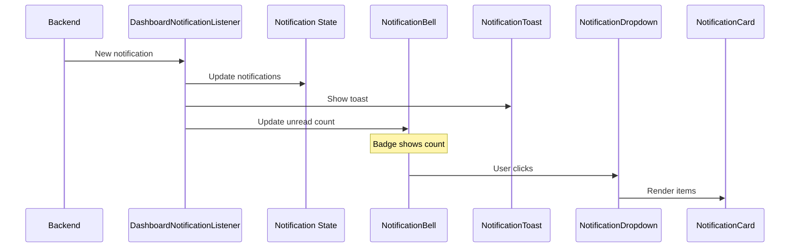

# Notification Components

## Overview

Components for displaying in-app notifications, alerts, and real-time updates. Handles friend requests, achievement unlocks, quiz invitations, and system announcements.

## Components

| Component | File | Purpose |
|-----------|------|---------|
| NotificationBell | `NotificationBell.tsx` | Header bell icon with badge |
| NotificationDropdown | `NotificationDropdown.tsx` | Dropdown notification list |
| NotificationCard | `NotificationCard.tsx` | Single notification item |
| NotificationList | `NotificationList.tsx` | Full notification page list |
| NotificationToast | `NotificationToast.tsx` | Toast-style notifications |
| DashboardNotificationListener | `DashboardNotificationListener.tsx` | Real-time listener |

## Notification Flow



## NotificationBell

Bell icon in header with unread notification count.

### Features

- Animated badge for unread count
- Click to open dropdown
- Accessible button with aria-label

### Usage

```tsx
import { NotificationBell } from "@/components/notification/NotificationBell";

// In header
<NotificationBell />
```

---

## NotificationDropdown

Dropdown menu showing recent notifications.

### Features

- Last 5 notifications
- Mark all as read button
- Scroll area for overflow
- Link to full notification page
- Empty state with bell icon

### Props

Uses internal hooks:
- `useNotifications({ limit: 5 })`
- `useMarkAllNotificationsAsRead()`

### Display per Item

- Type-specific icon and color
- Title and message
- Relative timestamp
- Unread indicator (left border)
- Clickable action URL

### Usage

```tsx
import { NotificationDropdown } from "@/components/notification/NotificationDropdown";

// In header
<NotificationDropdown />
```

---

## NotificationCard

Single notification display.

### Props

| Prop | Type | Description |
|------|------|-------------|
| `notification` | `Notification` | Notification data |
| `onClick` | `() => void` | Click handler |

### Notification Types

| Type | Icon | Color | Action |
|------|------|-------|--------|
| `friend_request` | UserPlus | Blue | `/friends/requests` |
| `achievement` | Trophy | Yellow | `/achievements` |
| `quiz_completed` | CheckCircle | Green | `/quizzes/{id}/results` |
| `discussion_reply` | MessageSquare | Purple | `/discussions/{id}` |
| `system` | Bell | Gray | None |

### Usage

```tsx
<NotificationCard
  notification={notification}
  onClick={() => markAsRead(notification.id)}
/>
```

---

## NotificationList

Full-page notification list with pagination.

### Props

| Prop | Type | Description |
|------|------|-------------|
| `notifications` | `Notification[]` | All notifications |
| `isLoading` | `boolean` | Loading state |
| `hasMore` | `boolean` | More pages available |
| `onLoadMore` | `() => void` | Load more handler |

### Features

- Grouped by date (Today, Yesterday, Earlier)
- Infinite scroll loading
- Mark individual as read
- Delete notifications

### Usage

```tsx
<NotificationList
  notifications={notifications}
  isLoading={isLoading}
  hasMore={hasNextPage}
  onLoadMore={fetchNextPage}
/>
```

---

## DashboardNotificationListener

Background component for real-time notifications.

### Purpose

- Polls for new notifications
- Shows toast for new items
- Updates notification count
- Runs in dashboard layout

### Features

- Polling interval (30 seconds)
- Deduplication of shown toasts
- Background tab handling
- Automatic reconnection

### Usage

```tsx
// In dashboard layout
<DashboardNotificationListener />
```

---

## NotificationToast

Toast notification popup.

### Props

| Prop | Type | Description |
|------|------|-------------|
| `notification` | `Notification` | Notification to display |
| `onDismiss` | `() => void` | Dismiss callback |
| `duration` | `number` | Auto-dismiss (ms) |

### Features

- Animated entrance/exit
- Type-specific styling
- Click to navigate
- Manual dismiss

### Usage

```tsx
<NotificationToast
  notification={newNotification}
  onDismiss={() => {}}
  duration={5000}
/>
```

---

## Utility Functions

From `lib/notification-utils.ts`:

```typescript
// Get icon component for notification type
getNotificationIcon(type: NotificationType): IconComponent

// Get color scheme for notification type
getNotificationColor(type: NotificationType): { bg: string; icon: string }

// Format relative time ("2 minutes ago")
formatNotificationTime(date: string): string

// Get navigation URL for notification
getNotificationActionUrl(type: NotificationType, data: any): string | null
```

## Data Types

```typescript
interface Notification {
  id: string;
  user_id: string;
  type: NotificationType;
  title: string;
  message: string;
  data: Record<string, any>;
  is_read: boolean;
  created_at: string;
}

type NotificationType =
  | "friend_request"
  | "friend_accepted"
  | "achievement"
  | "quiz_completed"
  | "discussion_reply"
  | "system";
```

## Related Documentation

- [Parent: Components Overview](../README.md)
- [Layout Components](../layout/README.md) - Header integration
- [Notification Types](../../types/README.md)
- [useNotifications Hook](../../hooks/README.md)

