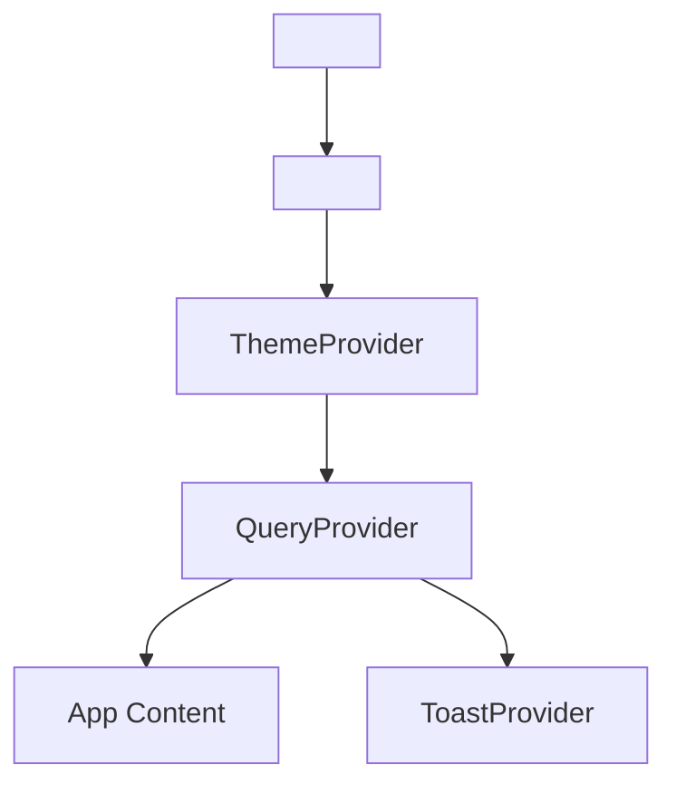

# Context Providers

## Overview

React context providers that wrap the application to provide global functionality. These are composed in the root layout to make their features available throughout the app.

## Provider Hierarchy



## Providers

| Provider | File | Purpose |
|----------|------|---------|
| ThemeProvider | `theme-provider.tsx` | Dark/light mode theming |
| QueryProvider | `query-provider.tsx` | TanStack Query client |
| ToastProvider | `toast-provider.tsx` | Toast notifications |

## ThemeProvider

Wraps the application with next-themes for dark/light mode support.

### Configuration

```tsx
// theme-provider.tsx
import { ThemeProvider as NextThemesProvider } from "next-themes";

export function ThemeProvider({ children, ...props }: ThemeProviderProps) {
  return <NextThemesProvider {...props}>{children}</NextThemesProvider>;
}
```

### Usage in Layout

```tsx
// app/layout.tsx
<ThemeProvider
  attribute="class"           // Use class-based theming
  defaultTheme="system"       // Follow system preference
  enableSystem                // Enable system detection
  disableTransitionOnChange   // Prevent flash on change
>
  {children}
</ThemeProvider>
```

### Theme Hook

```tsx
import { useTheme } from "next-themes";

function ThemeToggle() {
  const { theme, setTheme, systemTheme } = useTheme();

  return (
    <Button onClick={() => setTheme(theme === "dark" ? "light" : "dark")}>
      {theme === "dark" ? <Sun /> : <Moon />}
    </Button>
  );
}
```

### Available Themes

- `"light"` - Light mode
- `"dark"` - Dark mode
- `"system"` - Follow OS preference

### CSS Variables

Theme colors are defined in `globals.css`:

```css
:root {
  --background: 0 0% 100%;
  --foreground: 222.2 84% 4.9%;
  /* ... more colors */
}

.dark {
  --background: 222.2 84% 4.9%;
  --foreground: 210 40% 98%;
  /* ... dark mode colors */
}
```

---

## QueryProvider

Provides TanStack Query client for data fetching and caching.

### Configuration

```tsx
// query-provider.tsx
import { QueryClient, QueryClientProvider } from "@tanstack/react-query";
import { ReactQueryDevtools } from "@tanstack/react-query-devtools";

export function QueryProvider({ children }: { children: React.ReactNode }) {
  const [queryClient] = useState(
    () =>
      new QueryClient({
        defaultOptions: {
          queries: {
            staleTime: 60 * 1000,        // 1 minute
            refetchOnWindowFocus: false, // Don't refetch on tab focus
            retry: 1,                    // Retry once on failure
          },
        },
      })
  );

  return (
    <QueryClientProvider client={queryClient}>
      {children}
      <ReactQueryDevtools initialIsOpen={false} />
    </QueryClientProvider>
  );
}
```

### Default Options

| Option | Value | Description |
|--------|-------|-------------|
| `staleTime` | 60000 (1 min) | Data considered fresh |
| `refetchOnWindowFocus` | `false` | Don't auto-refetch on focus |
| `retry` | `1` | Retry failed requests once |

### DevTools

React Query DevTools are included in development:

- Floating button in bottom-left corner
- Shows all cached queries
- Query status (fresh, stale, fetching)
- Manual refetch/invalidate

### Usage

```tsx
import { useQuery, useMutation, useQueryClient } from "@tanstack/react-query";

// In any component within QueryProvider
const { data, isLoading } = useQuery({
  queryKey: ["quizzes"],
  queryFn: getQuizzes,
});

const queryClient = useQueryClient();
queryClient.invalidateQueries({ queryKey: ["quizzes"] });
```

---

## ToastProvider

Provides toast notification functionality using Sonner.

### Configuration

```tsx
// toast-provider.tsx
import { Toaster } from "sonner";

export function ToastProvider() {
  return (
    <Toaster
      position="top-right"
      richColors
      closeButton
      duration={4000}
    />
  );
}
```

### Options

| Option | Value | Description |
|--------|-------|-------------|
| `position` | `"top-right"` | Toast position |
| `richColors` | `true` | Semantic colors |
| `closeButton` | `true` | Show close button |
| `duration` | `4000` | Auto-dismiss time (ms) |

### Usage

```tsx
import { toast } from "sonner";

// Success
toast.success("Quiz completed!");

// Error
toast.error("Failed to submit");

// Info
toast.info("New quiz available");

// Warning
toast.warning("Time running low");

// With description
toast.success("Achievement Unlocked", {
  description: "You completed 10 quizzes!",
});

// With action
toast("New friend request", {
  action: {
    label: "View",
    onClick: () => router.push("/friends/requests"),
  },
});

// Promise (loading → success/error)
toast.promise(submitQuiz(answers), {
  loading: "Submitting...",
  success: "Quiz submitted!",
  error: "Submission failed",
});
```

---

## Provider Composition

In the root layout, providers are nested in order:

```tsx
// app/layout.tsx
export default function RootLayout({ children }: { children: React.ReactNode }) {
  return (
    <html lang="en" suppressHydrationWarning>
      <body className={inter.className}>
        <ThemeProvider
          attribute="class"
          defaultTheme="system"
          enableSystem
          disableTransitionOnChange
        >
          <QueryProvider>
            {children}
            <ToastProvider />
          </QueryProvider>
        </ThemeProvider>
      </body>
    </html>
  );
}
```

### Why This Order?

1. **ThemeProvider** (outermost): Needs to wrap everything for theme classes
2. **QueryProvider**: Provides data fetching for all components
3. **ToastProvider**: Renders toast container, needs Query context for data

---

## Adding New Providers

1. Create provider file:

```tsx
// providers/my-provider.tsx
"use client";

import { createContext, useContext, useState } from "react";

interface MyContextType {
  value: string;
  setValue: (value: string) => void;
}

const MyContext = createContext<MyContextType | undefined>(undefined);

export function MyProvider({ children }: { children: React.ReactNode }) {
  const [value, setValue] = useState("");

  return (
    <MyContext.Provider value={{ value, setValue }}>
      {children}
    </MyContext.Provider>
  );
}

export function useMyContext() {
  const context = useContext(MyContext);
  if (!context) {
    throw new Error("useMyContext must be used within MyProvider");
  }
  return context;
}
```

2. Add to layout:

```tsx
<ThemeProvider>
  <QueryProvider>
    <MyProvider>
      {children}
    </MyProvider>
  </QueryProvider>
</ThemeProvider>
```

## Related Documentation

- [Parent: Components Overview](../README.md)
- [Store](../../store/README.md) - Zustand (alternative to Context)
- [Hooks](../../hooks/README.md) - Custom hooks using these providers
