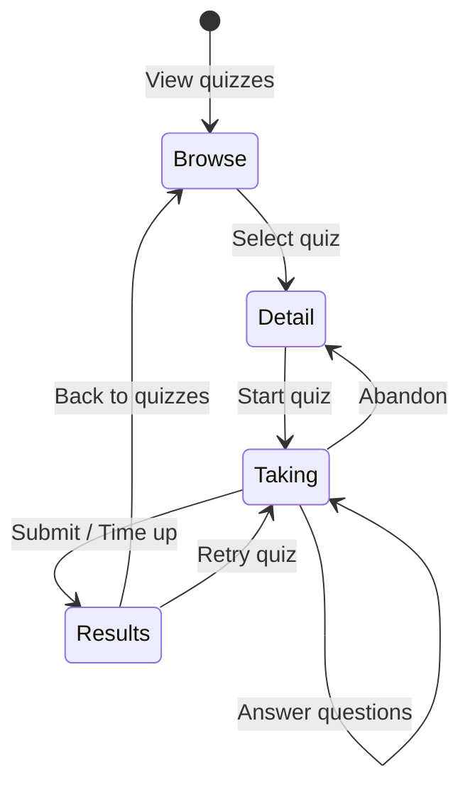
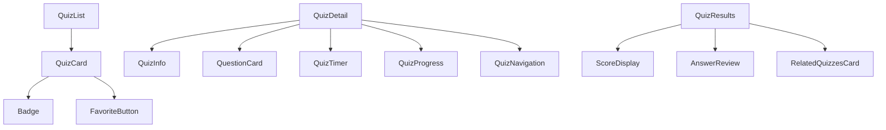
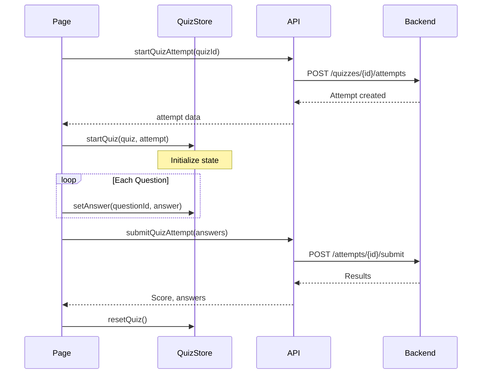

# Quiz Components

## Overview

Components for displaying, browsing, and taking quizzes. This is the core feature of QuizNinja.

## Quiz Flow



## Components

| Component | File | Purpose |
|-----------|------|---------|
| QuizCard | `QuizCard.tsx` | Quiz preview card in lists |
| QuizList | `QuizList.tsx` | Grid/list of quiz cards |
| QuestionCard | `QuestionCard.tsx` | Single question display |
| QuizTimer | `QuizTimer.tsx` | Countdown timer |
| QuizProgress | `QuizProgress.tsx` | Progress indicator |
| QuizResults | `QuizResults.tsx` | Results display |
| QuizNavigation | `QuizNavigation.tsx` | Question navigation |
| QuizFilters | `QuizFilters.tsx` | Filter controls |
| QuizSearch | `QuizSearch.tsx` | Search input |
| RelatedQuizzesCard | `RelatedQuizzesCard.tsx` | Related quiz suggestions |

## Component Relationships



## QuizCard

Preview card for quizzes in lists.

### Props

| Prop | Type | Description |
|------|------|-------------|
| `quiz` | `Quiz` | Quiz data |
| `completedAttempt` | `QuizAttempt?` | User's completion data |
| `onSelect` | `(id: string) => void` | Selection handler |

### Usage

```tsx
<QuizCard
  quiz={quiz}
  completedAttempt={attempt}
  onSelect={(id) => router.push(`/quizzes/${id}`)}
/>
```

### Display

- Title and description
- Category badge
- Difficulty indicator (color-coded)
- Question count
- Time limit
- Favorite button
- Completion status (if attempted)

---

## QuestionCard

Displays a single question during quiz taking.

### Props

| Prop | Type | Description |
|------|------|-------------|
| `question` | `Question` | Question data |
| `answer` | `QuizAnswer?` | Selected answer |
| `onAnswer` | `(questionId, answer) => void` | Answer handler |
| `showCorrect` | `boolean` | Show correct answer (results) |
| `disabled` | `boolean` | Disable interactions |

### Question Types

```tsx
// Multiple Choice
{question.question_type === "multiple_choice" && (
  <RadioGroup value={selectedOption} onValueChange={handleSelect}>
    {question.options.map((option, index) => (
      <RadioGroupItem key={index} value={option} />
    ))}
  </RadioGroup>
)}

// True/False
{question.question_type === "true_false" && (
  <div className="flex gap-4">
    <Button onClick={() => handleSelect("true")}>True</Button>
    <Button onClick={() => handleSelect("false")}>False</Button>
  </div>
)}
```

---

## QuizTimer

Countdown timer for timed quizzes.

### Props

| Prop | Type | Description |
|------|------|-------------|
| `onTimeUp` | `() => void` | Callback when time expires |

### Features

- Displays MM:SS format
- Changes color when low (< 60s)
- Auto-submits on time up
- Uses `quizStore.timeRemaining`

### Usage

```tsx
<QuizTimer onTimeUp={handleAutoSubmit} />
```

---

## QuizProgress

Visual progress through quiz questions.

### Props

| Prop | Type | Description |
|------|------|-------------|
| `current` | `number` | Current question index |
| `total` | `number` | Total questions |
| `answers` | `Record<string, QuizAnswer>` | Answered questions |
| `onNavigate` | `(index: number) => void` | Navigation handler |

### Display Options

```tsx
// Progress bar
<Progress value={(current / total) * 100} />

// Question dots (clickable)
<div className="flex gap-2">
  {Array.from({ length: total }).map((_, i) => (
    <button
      key={i}
      onClick={() => onNavigate(i)}
      className={cn(
        "w-3 h-3 rounded-full",
        i === current && "bg-primary",
        answers[questions[i].id] && "bg-green-500",
        !answers[questions[i].id] && "bg-muted"
      )}
    />
  ))}
</div>
```

---

## QuizNavigation

Previous/Next/Submit buttons.

### Props

| Prop | Type | Description |
|------|------|-------------|
| `onPrevious` | `() => void` | Previous question |
| `onNext` | `() => void` | Next question |
| `onSubmit` | `() => void` | Submit quiz |
| `isFirst` | `boolean` | Is first question |
| `isLast` | `boolean` | Is last question |
| `isSubmitting` | `boolean` | Submission in progress |

### Usage

```tsx
<QuizNavigation
  onPrevious={() => quizStore.previousQuestion()}
  onNext={() => quizStore.nextQuestion()}
  onSubmit={handleSubmit}
  isFirst={currentIndex === 0}
  isLast={currentIndex === questions.length - 1}
  isSubmitting={isSubmitting}
/>
```

---

## QuizResults

Results display after quiz completion.

### Props

| Prop | Type | Description |
|------|------|-------------|
| `attempt` | `QuizAttempt` | Completed attempt |
| `quiz` | `Quiz` | Quiz data |

### Display

- Score (e.g., 8/10)
- Percentage
- Pass/fail status
- Time taken
- Answer review (correct/incorrect)
- Retry button
- Related quizzes

---

## QuizFilters

Filter controls for quiz browsing.

### Props

| Prop | Type | Description |
|------|------|-------------|
| `filters` | `QuizFilters` | Current filters |
| `onChange` | `(filters) => void` | Filter change handler |

### Filter Options

- Category (dropdown)
- Difficulty (beginner/intermediate/advanced)
- Featured only (toggle)

---

## State Management

Quiz-taking uses `quizStore`:

```tsx
import { useQuizStore } from "@/store/quizStore";

function QuizTaking() {
  const {
    currentQuiz,
    currentQuestionIndex,
    answers,
    timeRemaining,
    setAnswer,
    nextQuestion,
    previousQuestion,
  } = useQuizStore();

  // ...
}
```

## Data Flow



## Related Documentation

- [Parent: Components Overview](../README.md)
- [Quiz Routes](../../app/(dashboard)/README.md)
- [Quiz Store](../../store/README.md)
- [Quiz Hooks](../../hooks/README.md)
- [Quiz Types](../../types/README.md)
