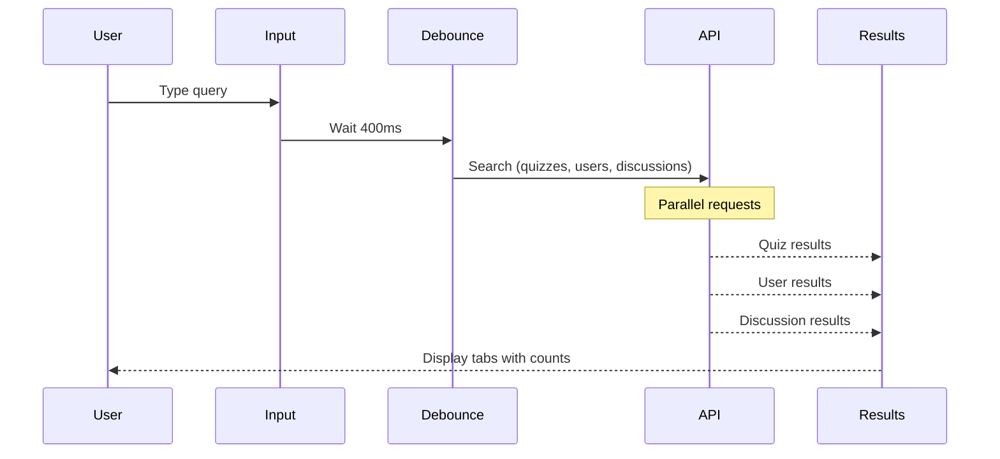

# Search Components

## Overview

Global search functionality allowing users to find quizzes, users, and discussions across the entire application.

## Components

| Component | File | Purpose |
|-----------|------|---------|
| GlobalSearch | `GlobalSearch.tsx` | Full-featured search dialog |

## GlobalSearch

Comprehensive search interface with multi-entity results.

### Props

| Prop | Type | Description |
|------|------|-------------|
| `onClose` | `() => void` | Close dialog handler |

### Features

- Search across quizzes, users, and discussions
- Debounced search input (400ms)
- Tabbed results by entity type
- Result counts per tab
- Glassmorphic design
- Quick navigation links

### Search Flow



### Search Entities

| Tab | Hook | Results |
|-----|------|---------|
| Quizzes | `useQuizzes({ search })` | Quiz cards (max 6) |
| Users | `useSearchUsers(query)` | User list items |
| Discussions | `useDiscussions({ search })` | Discussion previews |

### Minimum Query Length

```tsx
const showResults = debouncedQuery.length >= 2;
```

### Visual Structure

```tsx
// Header with gradient background
<div className="bg-gradient-to-br from-violet-600 via-indigo-600 to-purple-700">
  <h2>Search QuizNinja</h2>
  <Input placeholder="Search for quizzes, users, or discussions..." />
</div>

// Body with glassmorphism
<div className="bg-white/90 dark:bg-slate-900/90 backdrop-blur-xl">
  <Tabs defaultValue="quizzes">
    <TabsList>
      <TabsTrigger value="quizzes">Quizzes</TabsTrigger>
      <TabsTrigger value="users">Users</TabsTrigger>
      <TabsTrigger value="discussions">Discussions</TabsTrigger>
    </TabsList>
    {/* Tab content */}
  </Tabs>
</div>
```

### Tab Result Counts

```tsx
<TabsTrigger value="quizzes">
  <BookOpen className="h-4 w-4" />
  Quizzes
  {quizResults.length > 0 && (
    <Badge>{quizResults.length}</Badge>
  )}
</TabsTrigger>
```

### Empty/Initial States

**Initial State (no query):**
```tsx
<div className="text-center py-12">
  <Search className="h-10 w-10" />
  <h3>What are you looking for?</h3>
  <p>Find quizzes, connect with friends, or browse discussions</p>
  <p>Start typing to search (minimum 2 characters)</p>

  {/* Quick Links */}
  <div className="flex gap-3">
    <Link href="/quizzes">Browse Quizzes</Link>
    <Link href="/friends">Find Friends</Link>
    <Link href="/discussions">Discussions</Link>
  </div>
</div>
```

**No Results:**
```tsx
<div className="text-center p-8">
  <BookOpen className="h-8 w-8" />
  <p>No quizzes found matching "{query}"</p>
</div>
```

**Loading:**
```tsx
<div className="flex items-center justify-center gap-3">
  <Loader2 className="h-5 w-5 animate-spin" />
  <p>Searching quizzes...</p>
</div>
```

### Result Actions

```tsx
// Quiz results - grid with QuizCard components
<div className="grid grid-cols-1 md:grid-cols-2 gap-4">
  {quizResults.map(quiz => (
    <QuizCard key={quiz.id} quiz={quiz} />
  ))}
</div>

// View all results link (when 6+ results)
{quizResults.length >= 6 && (
  <Link href={`/quizzes?search=${query}`}>
    <Button>View All Results</Button>
  </Link>
)}
```

### Usage

```tsx
import { GlobalSearch } from "@/components/search/GlobalSearch";
import { Dialog, DialogContent } from "@/components/ui/dialog";

function Header() {
  const [searchOpen, setSearchOpen] = useState(false);

  return (
    <>
      <Button onClick={() => setSearchOpen(true)}>
        <Search className="h-4 w-4" />
      </Button>

      <Dialog open={searchOpen} onOpenChange={setSearchOpen}>
        <DialogContent className="max-w-4xl p-0">
          <GlobalSearch onClose={() => setSearchOpen(false)} />
        </DialogContent>
      </Dialog>
    </>
  );
}
```

### Keyboard Shortcuts

Consider adding:
- `Cmd/Ctrl + K` - Open search
- `Escape` - Close search
- `Arrow keys` - Navigate results
- `Enter` - Select result

## Hooks Used

```typescript
// Debounce search input
const debouncedQuery = useDebounce(searchQuery, 400);

// Search quizzes
const { data: quizzes } = useQuizzes({
  search: debouncedQuery,
  limit: 6,
});

// Search users
const { data: users } = useSearchUsers(debouncedQuery);

// Search discussions
const { data: discussions } = useDiscussions({
  search: debouncedQuery,
  limit: 6,
});
```

## Related Documentation

- [Parent: Components Overview](../README.md)
- [Layout Components](../layout/README.md) - Header integration
- [Quiz Components](../quiz/README.md) - QuizCard
- [useDebounce Hook](../../hooks/README.md)

