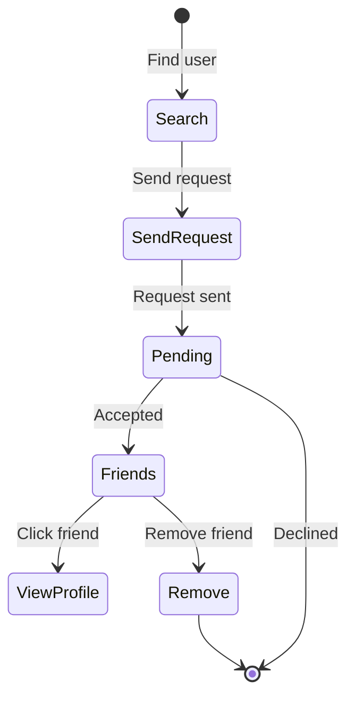

# Social Components

## Overview

Components for social features including friends management, user search, and friend requests. Enables users to connect with others and compete on quizzes together.

## Components

| Component | File | Purpose |
|-----------|------|---------|
| FriendCard | `FriendCard.tsx` | Display friend with actions |
| FriendList | `FriendList.tsx` | Grid/list of friends |
| FriendRequestCard | `FriendRequestCard.tsx` | Pending request display |
| UserSearch | `UserSearch.tsx` | Search for users |

## Social Flow



## FriendCard

Card displaying a friend with profile info and actions.

### Props

| Prop | Type | Description |
|------|------|-------------|
| `friend` | `Friend` | Friend data |

### Features

- Avatar with initials fallback
- Name and email display
- "Friends since" date badge
- View profile button
- Remove friend option (with confirmation dialog)
- Glassmorphic design with hover effects

### Actions

```tsx
// View profile
<Link href={`/profile/${friend.id}`}>
  <Button>View Profile</Button>
</Link>

// Remove friend (with confirmation)
<AlertDialog>
  <AlertDialogContent>
    <AlertDialogTitle>Remove Friend?</AlertDialogTitle>
    <AlertDialogDescription>
      Are you sure you want to remove {friend.name}?
    </AlertDialogDescription>
  </AlertDialogContent>
</AlertDialog>
```

### Usage

```tsx
import { FriendCard } from "@/components/social/FriendCard";

<FriendCard friend={friend} />
```

---

## FriendList

Grid layout for displaying friends.

### Props

| Prop | Type | Description |
|------|------|-------------|
| `friends` | `Friend[]` | Friends array |
| `isLoading` | `boolean` | Loading state |
| `emptyMessage` | `string` | Empty state message |

### Features

- Responsive grid (1-3 columns)
- Loading skeleton state
- Empty state with icon

### Usage

```tsx
import { FriendList } from "@/components/social/FriendList";

<FriendList
  friends={friends}
  isLoading={isLoading}
  emptyMessage="No friends yet. Search for users to connect!"
/>
```

---

## FriendRequestCard

Displays incoming or outgoing friend requests.

### Props

| Prop | Type | Description |
|------|------|-------------|
| `request` | `FriendRequest` | Request data |
| `type` | `"incoming" \| "outgoing"` | Request direction |

### Incoming Request Actions

- Accept request
- Decline request

### Outgoing Request Actions

- Cancel request

### Usage

```tsx
import { FriendRequestCard } from "@/components/social/FriendRequestCard";

// Incoming request
<FriendRequestCard request={request} type="incoming" />

// Outgoing request
<FriendRequestCard request={request} type="outgoing" />
```

---

## UserSearch

Search interface for finding users.

### Props

| Prop | Type | Description |
|------|------|-------------|
| `onSelect` | `(user: User) => void` | User selection handler |
| `excludeIds` | `string[]` | User IDs to exclude |

### Features

- Debounced search input
- Search results dropdown
- Shows user avatar, name, email
- Add friend button
- Loading and empty states

### Usage

```tsx
import { UserSearch } from "@/components/social/UserSearch";

<UserSearch
  onSelect={(user) => sendFriendRequest(user.id)}
  excludeIds={existingFriendIds}
/>
```

---

## Friends Page Structure

```tsx
// /friends page
<div className="space-y-8">
  {/* Search Section */}
  <Card>
    <CardHeader>
      <CardTitle>Find Friends</CardTitle>
    </CardHeader>
    <CardContent>
      <UserSearch onSelect={handleAddFriend} />
    </CardContent>
  </Card>

  {/* Pending Requests */}
  {pendingRequests.length > 0 && (
    <section>
      <h2>Friend Requests</h2>
      <div className="grid gap-4">
        {pendingRequests.map(request => (
          <FriendRequestCard
            key={request.id}
            request={request}
            type="incoming"
          />
        ))}
      </div>
    </section>
  )}

  {/* Friends List */}
  <section>
    <h2>My Friends ({friends.length})</h2>
    <FriendList friends={friends} />
  </section>
</div>
```

## Data Types

```typescript
interface Friend {
  id: string;
  name: string;
  email?: string;
  avatar_url?: string;
  friends_since: string;
}

interface FriendRequest {
  id: string;
  from_user: User;
  to_user: User;
  status: "pending" | "accepted" | "declined";
  created_at: string;
}

type FriendshipStatus =
  | "none"
  | "pending_sent"
  | "pending_received"
  | "friends";
```

## Hooks Used

```typescript
// Get friends list
const { data: friends } = useFriends();

// Get pending requests
const { data: requests } = useFriendRequests();

// Send friend request
const sendRequest = useSendFriendRequest();

// Accept/decline request
const acceptRequest = useAcceptFriendRequest();
const declineRequest = useDeclineFriendRequest();

// Remove friend
const removeFriend = useRemoveFriend();

// Search users
const { data: results } = useSearchUsers(query);
```

## Related Documentation

- [Parent: Components Overview](../README.md)
- [Profile Components](../profile/README.md)
- [User Types](../../types/README.md)
- [useFriends Hook](../../hooks/README.md)

