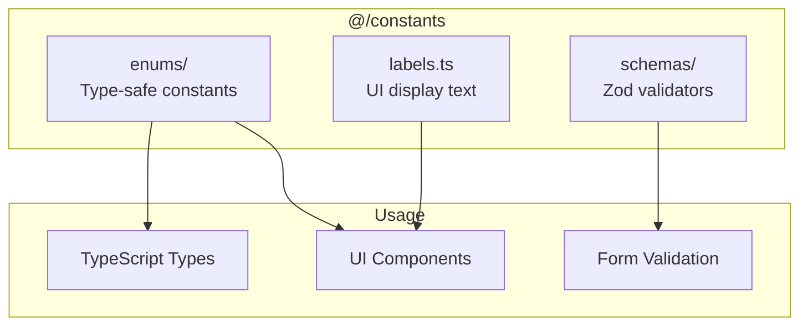

# Constants

## Overview

This folder contains centralized constants, type-safe enums, validation schemas, and UI labels. All constants are exported from `@/constants` for easy importing throughout the application.

## Architecture



## Directory Structure

```
constants/
├── index.ts              # Barrel export (import from @/constants)
├── labels.ts             # Human-readable labels for UI
├── enums/                # Type-safe enum objects
│   ├── index.ts          # Barrel export
│   ├── quiz.ts           # Quiz difficulty, question types, attempt status
│   ├── user.ts           # Theme, profile visibility, friend status
│   ├── notification.ts   # Notification types
│   ├── discussion.ts     # Discussion types, sort options
│   ├── achievement.ts    # Achievement categories
│   ├── leaderboard.ts    # Leaderboard time periods
│   └── common.ts         # Shared constants
└── schemas/              # Zod validation schemas for enums
    ├── index.ts          # Barrel export
    └── validators.ts     # Enum validators
```

## Usage

### Importing Constants

```tsx
// Import everything from @/constants
import {
  QuizDifficulty,
  DIFFICULTY_LABELS,
  isQuizDifficulty
} from "@/constants";

// Use the enum
const difficulty = QuizDifficulty.BEGINNER; // "beginner"

// Get display label
const label = DIFFICULTY_LABELS[difficulty]; // "Beginner"

// Type guard for validation
if (isQuizDifficulty(userInput)) {
  // userInput is typed as QuizDifficulty
}
```

## Enum Pattern

We use **const objects** instead of TypeScript enums for better tree-shaking and runtime behavior.

### Structure

```tsx
// 1. Const object with values
export const QuizDifficulty = {
  BEGINNER: 'beginner',
  INTERMEDIATE: 'intermediate',
  ADVANCED: 'advanced',
} as const;

// 2. Type derived from object
export type QuizDifficulty = typeof QuizDifficulty[keyof typeof QuizDifficulty];
// Result: "beginner" | "intermediate" | "advanced"

// 3. Array of all values
export const QUIZ_DIFFICULTIES = Object.values(QuizDifficulty);
// Result: ["beginner", "intermediate", "advanced"]

// 4. Type guard for runtime validation
export function isQuizDifficulty(value: unknown): value is QuizDifficulty {
  return typeof value === 'string' && QUIZ_DIFFICULTIES.includes(value as QuizDifficulty);
}
```

### Why Const Objects?

| Feature | TypeScript Enum | Const Object |
|---------|-----------------|--------------|
| Tree-shaking | Partial | Full |
| Runtime values | Numeric by default | String values |
| Type inference | Requires extra work | Automatic |
| Type guards | Manual | Easy to implement |

## Available Enums

### Quiz (`enums/quiz.ts`)

| Enum | Values | Purpose |
|------|--------|---------|
| `QuizDifficulty` | beginner, intermediate, advanced | Quiz difficulty levels |
| `QuestionType` | multiple_choice, true_false, short_answer | Question formats |
| `AttemptStatus` | in_progress, completed, abandoned | Quiz attempt states |

### User (`enums/user.ts`)

| Enum | Values | Purpose |
|------|--------|---------|
| `Theme` | light, dark, system | UI theme preferences |
| `ProfileVisibility` | public, friends_only, private | Profile privacy |
| `FriendRequestStatus` | pending, accepted, rejected | Friend request states |
| `FriendshipStatus` | none, pending_sent, pending_received, friends | Relationship states |
| `NotificationFrequency` | instant, daily, weekly, never | Notification settings |
| `FriendRequestAction` | accept, decline | Request response actions |

### Notification (`enums/notification.ts`)

| Enum | Values | Purpose |
|------|--------|---------|
| `NotificationType` | friend_request, friend_accepted, achievement_unlocked, quiz_reminder, discussion_reply, system | Notification categories |

### Discussion (`enums/discussion.ts`)

| Enum | Values | Purpose |
|------|--------|---------|
| `DiscussionType` | question, general, bug_report, feature_request, discussion | Post types |
| `DiscussionSort` | recent, popular | Sort options |

### Achievement (`enums/achievement.ts`)

| Enum | Values | Purpose |
|------|--------|---------|
| `AchievementCategory` | quiz_master, social, streak, knowledge, competitor | Achievement groups |
| `AchievementRequirementType` | quizzes_completed, total_points, accuracy_percentage, etc. | Requirement types |

### Leaderboard (`enums/leaderboard.ts`)

| Enum | Values | Purpose |
|------|--------|---------|
| `LeaderboardPeriod` | all_time, monthly, weekly | Time filters |

## Labels (`labels.ts`)

Human-readable display labels for all enums, used in UI components.

### Label Records

```tsx
// Direct mapping from enum value to display text
export const DIFFICULTY_LABELS: Record<QuizDifficulty, string> = {
  beginner: 'Beginner',
  intermediate: 'Intermediate',
  advanced: 'Advanced',
};

// Usage
const label = DIFFICULTY_LABELS[quiz.difficulty];
```

### Dropdown Options

Pre-formatted arrays for select components:

```tsx
// Value/label pairs for dropdowns
export const DIFFICULTY_OPTIONS = [
  { value: 'beginner', label: 'Beginner' },
  { value: 'intermediate', label: 'Intermediate' },
  { value: 'advanced', label: 'Advanced' },
] as const;

// Usage in Select component
<Select>
  {DIFFICULTY_OPTIONS.map(opt => (
    <SelectItem key={opt.value} value={opt.value}>
      {opt.label}
    </SelectItem>
  ))}
</Select>
```

### Available Labels

| Label Record | Options Array | Purpose |
|--------------|---------------|---------|
| `DIFFICULTY_LABELS` | `DIFFICULTY_OPTIONS` | Quiz difficulty |
| `NOTIFICATION_TYPE_LABELS` | - | Notification types |
| `THEME_LABELS` | `THEME_OPTIONS` | Theme settings |
| `PROFILE_VISIBILITY_LABELS` | `PROFILE_VISIBILITY_OPTIONS` | Privacy settings |
| `NOTIFICATION_FREQUENCY_LABELS` | `NOTIFICATION_FREQUENCY_OPTIONS` | Notification frequency |
| `DISCUSSION_SORT_LABELS` | `DISCUSSION_SORT_OPTIONS` | Discussion sorting |
| `DISCUSSION_TYPE_LABELS` | `DISCUSSION_TYPE_OPTIONS` | Discussion categories |
| `ACHIEVEMENT_CATEGORY_LABELS` | `ACHIEVEMENT_CATEGORY_OPTIONS` | Achievement groups |

## Schemas (`schemas/`)

Zod schemas for validating enum values, typically used in API responses or form inputs.

```tsx
import { quizDifficultySchema } from "@/constants";

// Validate API response
const result = quizDifficultySchema.safeParse(apiData.difficulty);
if (result.success) {
  // result.data is typed as QuizDifficulty
}
```

## Adding New Constants

### 1. Create New Enum

```tsx
// constants/enums/myFeature.ts

export const MyStatus = {
  ACTIVE: 'active',
  INACTIVE: 'inactive',
  PENDING: 'pending',
} as const;

export type MyStatus = typeof MyStatus[keyof typeof MyStatus];
export const MY_STATUSES = Object.values(MyStatus);

export function isMyStatus(value: unknown): value is MyStatus {
  return typeof value === 'string' && MY_STATUSES.includes(value as MyStatus);
}
```

### 2. Export from Barrel

```tsx
// constants/enums/index.ts
export * from './myFeature';
```

### 3. Add Labels

```tsx
// constants/labels.ts
import type { MyStatus } from './enums/myFeature';

export const MY_STATUS_LABELS: Record<MyStatus, string> = {
  active: 'Active',
  inactive: 'Inactive',
  pending: 'Pending',
};

export const MY_STATUS_OPTIONS = [
  { value: 'active', label: 'Active' },
  { value: 'inactive', label: 'Inactive' },
  { value: 'pending', label: 'Pending' },
] as const;
```

### 4. Add Schema Validator (Optional)

```tsx
// constants/schemas/validators.ts
import { z } from 'zod';
import { MY_STATUSES } from '../enums/myFeature';

export const myStatusSchema = z.enum(MY_STATUSES);
```

## Common Patterns

### Type Guards in Components

```tsx
function QuizBadge({ difficulty }: { difficulty: string }) {
  // Validate before using
  if (!isQuizDifficulty(difficulty)) {
    return null;
  }

  // Now TypeScript knows difficulty is QuizDifficulty
  return <Badge>{DIFFICULTY_LABELS[difficulty]}</Badge>;
}
```

### Conditional Styling

```tsx
const difficultyColors: Record<QuizDifficulty, string> = {
  beginner: 'text-green-500',
  intermediate: 'text-yellow-500',
  advanced: 'text-red-500',
};

<span className={difficultyColors[quiz.difficulty]}>
  {DIFFICULTY_LABELS[quiz.difficulty]}
</span>
```

### Form Defaults

```tsx
const form = useForm({
  defaultValues: {
    difficulty: QuizDifficulty.BEGINNER,
    theme: Theme.SYSTEM,
  },
});
```

## Related Documentation

- [Parent: Source Overview](../README.md)
- [Enums](./enums/README.md) - Detailed enum documentation
- [Types](../types/README.md) - TypeScript type definitions
- [Schemas](../schemas/README.md) - Zod validation schemas