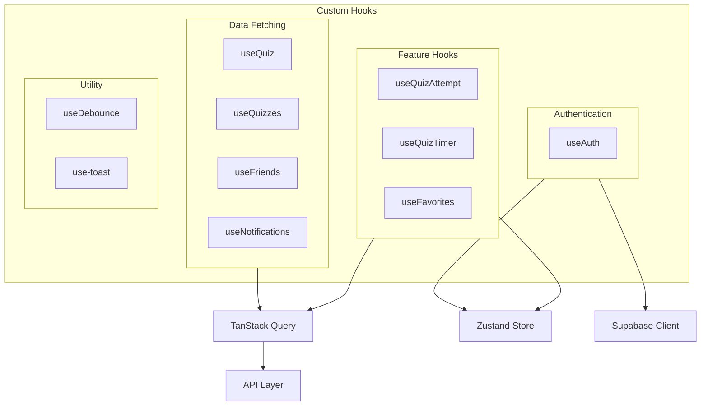

# Custom Hooks

## Overview

This folder contains custom React hooks for data fetching, state management, and shared logic. Most hooks wrap TanStack Query for server state management, while others integrate with Zustand stores or provide utility functionality.

## Architecture



## Hook Categories

### Data Fetching Hooks

| Hook | Purpose | API |
|------|---------|-----|
| `useQuizzes` | Fetch paginated quiz list | `getQuizzes` |
| `useQuiz` | Fetch single quiz | `getQuiz` |
| `useFeaturedQuizzes` | Fetch featured quizzes | `getFeaturedQuizzes` |
| `useCategories` | Fetch quiz categories | `getCategories` |
| `useFriends` | Fetch friends list | `getFriends` |
| `useFriendRequests` | Fetch friend requests | `getFriendRequests` |
| `useNotifications` | Fetch notifications | `getNotifications` |
| `useAchievements` | Fetch achievements | `getAchievements` |
| `useDiscussions` | Fetch discussions | `getDiscussions` |
| `useLeaderboard` | Fetch leaderboard | `getLeaderboard` |
| `useProfile` | Fetch user profile | `getProfile` |
| `useUserStats` | Fetch user statistics | `getUserStats` |

### Authentication Hooks

| Hook | Purpose | Source |
|------|---------|--------|
| `useAuth` | Auth state + listener | Zustand + Supabase |

### Feature Hooks

| Hook | Purpose | Dependencies |
|------|---------|--------------|
| `useQuizAttempt` | Quiz attempt management | API + Store |
| `useQuizTimer` | Quiz countdown timer | Store |
| `useQuizQuestions` | Fetch quiz questions | API |
| `useFavorites` | Favorite management | API |
| `useAchievementProgress` | Achievement progress | API |
| `useSearchUsers` | User search | API |
| `useOnboarding` | Onboarding flow | API |
| `useCompletedQuizMap` | Track completed quizzes | API |

### Utility Hooks

| Hook | Purpose |
|------|---------|
| `useDebounce` | Debounce value changes |
| `use-toast` | Toast notifications |
| `useNewNotificationToast` | New notification alerts |

## Key Hooks Documentation

### `useAuth` - Authentication

Manages authentication state, syncing Supabase session with Zustand store.

```tsx
import { useAuth } from "@/hooks/useAuth";

function MyComponent() {
  const { user, session, isLoading, isAuthenticated } = useAuth();

  if (isLoading) return <Spinner />;
  if (!isAuthenticated) return <LoginPrompt />;

  return <div>Hello, {user?.name}</div>;
}
```

**Returns:**
- `user: User | null` - Current user
- `session: Session | null` - Auth session with JWT
- `isLoading: boolean` - Auth initialization in progress
- `isAuthenticated: boolean` - Whether user is logged in

**Behavior:**
1. On mount, checks Supabase for existing session
2. Sets up auth state change listener
3. Updates Zustand store on auth changes
4. Cleans up listener on unmount

---

### `useQuizzes` - Quiz List

Fetches paginated quiz list with filters.

```tsx
import { useQuizzes } from "@/hooks/useQuizzes";

function QuizList() {
  const { data, isLoading, error } = useQuizzes({
    category: "science",
    difficulty: "intermediate",
    limit: 10,
    offset: 0,
  });

  if (isLoading) return <Skeleton />;
  if (error) return <Error message={error.message} />;

  return (
    <div>
      {data?.quizzes.map(quiz => (
        <QuizCard key={quiz.id} quiz={quiz} />
      ))}
      <Pagination
        total={data?.total}
        pageSize={data?.page_size}
        currentPage={data?.page}
      />
    </div>
  );
}
```

**Parameters:** `QuizFilters`
- `category?: string` - Filter by category
- `difficulty?: string` - Filter by difficulty
- `search?: string` - Search term
- `is_featured?: boolean` - Featured only
- `limit?: number` - Page size
- `offset?: number` - Pagination offset

**Returns:** `UseQueryResult<QuizListResponse>`

---

### `useQuiz` - Single Quiz

Fetches a single quiz by ID.

```tsx
import { useQuiz } from "@/hooks/useQuiz";

function QuizDetail({ id }: { id: string }) {
  const { data: quiz, isLoading, error } = useQuiz(id);

  if (isLoading) return <Skeleton />;
  if (error) return <Error />;

  return (
    <div>
      <h1>{quiz?.title}</h1>
      <Badge>{quiz?.difficulty}</Badge>
    </div>
  );
}
```

**Parameters:**
- `id: string` - Quiz ID
- `enabled?: boolean` - Conditionally enable query

---

### `useNotifications` - Notifications

Fetches notifications with real-time updates.

```tsx
import {
  useNotifications,
  useNotificationStats,
  useMarkNotificationAsRead,
  useMarkAllNotificationsAsRead,
} from "@/hooks/useNotifications";

function NotificationList() {
  const { data: notifications, isLoading } = useNotifications();
  const { data: stats } = useNotificationStats();
  const markAsRead = useMarkNotificationAsRead();
  const markAllAsRead = useMarkAllNotificationsAsRead();

  return (
    <div>
      <header>
        <span>Unread: {stats?.unread}</span>
        <button onClick={() => markAllAsRead.mutate()}>
          Mark all read
        </button>
      </header>

      {notifications?.map(notification => (
        <NotificationCard
          key={notification.id}
          notification={notification}
          onRead={() => markAsRead.mutate(notification.id)}
        />
      ))}
    </div>
  );
}
```

**Features:**
- Auto-refetch every 60 seconds
- Refetch on window focus
- Optimistic updates for mark as read
- Stats with unread count

---

### `useFavorites` - Favorite Management

Manages favorite quizzes with optimistic updates.

```tsx
import { useFavorites, useToggleFavorite, useIsFavorite } from "@/hooks/useFavorites";

function QuizCard({ quiz }: { quiz: Quiz }) {
  const { data: isFavorite } = useIsFavorite(quiz.id);
  const toggleFavorite = useToggleFavorite();

  const handleToggle = () => {
    toggleFavorite.mutate({
      quizId: quiz.id,
      isFavorite: !!isFavorite,
    });
  };

  return (
    <Card>
      <h3>{quiz.title}</h3>
      <button onClick={handleToggle}>
        <Heart filled={isFavorite} />
      </button>
    </Card>
  );
}
```

---

### `useQuizAttempt` - Quiz Taking

Manages active quiz attempt state.

```tsx
import { useQuizAttempt } from "@/hooks/useQuizAttempt";

function QuizTaking({ quizId }: { quizId: string }) {
  const {
    startAttempt,
    submitAttempt,
    updateAnswer,
    isStarting,
    isSubmitting,
  } = useQuizAttempt(quizId);

  const handleStart = async () => {
    const attempt = await startAttempt();
    // Quiz started, attempt created
  };

  const handleSubmit = async (answers: QuizAnswer[]) => {
    const result = await submitAttempt(answers);
    // Navigate to results
  };

  // ...
}
```

---

### `useDebounce` - Utility

Debounces a value for delayed updates.

```tsx
import { useDebounce } from "@/hooks/useDebounce";

function SearchInput() {
  const [search, setSearch] = useState("");
  const debouncedSearch = useDebounce(search, 300); // 300ms delay

  // Fetch only when debounced value changes
  const { data } = useQuizzes({ search: debouncedSearch });

  return (
    <input
      value={search}
      onChange={(e) => setSearch(e.target.value)}
      placeholder="Search quizzes..."
    />
  );
}
```

**Parameters:**
- `value: T` - Value to debounce
- `delay: number` - Delay in milliseconds (default: 500)

---

## TanStack Query Patterns

### Query Keys

Use consistent query keys from `QUERY_KEYS` constant:

```tsx
import { QUERY_KEYS } from "@/lib/constants";

// Consistent keys
queryKey: [QUERY_KEYS.QUIZZES, filters]
queryKey: [QUERY_KEYS.QUIZ, id]
queryKey: [QUERY_KEYS.NOTIFICATIONS, "stats"]
```

### Stale Time

Configure based on data freshness requirements:

```tsx
// Rarely changing data (categories)
staleTime: 10 * 60 * 1000, // 10 minutes

// Frequently changing (notifications)
staleTime: 2 * 60 * 1000, // 2 minutes

// Always fresh (leaderboard)
staleTime: 0,
```

### Mutations with Optimistic Updates

```tsx
const queryClient = useQueryClient();

return useMutation({
  mutationFn: markNotificationAsRead,

  // Optimistic update
  onMutate: async (notificationId) => {
    await queryClient.cancelQueries({ queryKey: [QUERY_KEYS.NOTIFICATIONS] });

    const previous = queryClient.getQueryData([QUERY_KEYS.NOTIFICATIONS]);

    queryClient.setQueryData([QUERY_KEYS.NOTIFICATIONS], (old) => {
      // Update optimistically
    });

    return { previous };
  },

  // Rollback on error
  onError: (err, vars, context) => {
    queryClient.setQueryData([QUERY_KEYS.NOTIFICATIONS], context.previous);
  },

  // Refetch on success
  onSuccess: () => {
    queryClient.invalidateQueries({ queryKey: [QUERY_KEYS.NOTIFICATIONS] });
  },
});
```

### Conditional Queries

```tsx
// Only fetch when ID is available
const { data } = useQuiz(id, { enabled: !!id });

// Only fetch when authenticated
const { isAuthenticated } = useAuth();
const { data } = useFriends({ enabled: isAuthenticated });
```

## Creating New Hooks

### Data Fetching Hook

```tsx
// hooks/useMyData.ts
import { useQuery, UseQueryResult } from "@tanstack/react-query";
import { getMyData } from "@/lib/api/myData";
import { QUERY_KEYS } from "@/lib/constants";
import type { MyData } from "@/types/myData";

export function useMyData(id: string): UseQueryResult<MyData, Error> {
  return useQuery({
    queryKey: [QUERY_KEYS.MY_DATA, id],
    queryFn: () => getMyData(id),
    enabled: !!id,
    staleTime: 5 * 60 * 1000, // 5 minutes
  });
}
```

### Mutation Hook

```tsx
// hooks/useUpdateMyData.ts
import { useMutation, useQueryClient } from "@tanstack/react-query";
import { updateMyData } from "@/lib/api/myData";
import { QUERY_KEYS } from "@/lib/constants";
import { toast } from "sonner";

export function useUpdateMyData() {
  const queryClient = useQueryClient();

  return useMutation({
    mutationFn: updateMyData,
    onSuccess: () => {
      queryClient.invalidateQueries({ queryKey: [QUERY_KEYS.MY_DATA] });
      toast.success("Updated successfully");
    },
    onError: () => {
      toast.error("Failed to update");
    },
  });
}
```

### Utility Hook

```tsx
// hooks/useLocalStorage.ts
import { useState, useEffect } from "react";

export function useLocalStorage<T>(key: string, initialValue: T) {
  const [value, setValue] = useState<T>(() => {
    if (typeof window === "undefined") return initialValue;
    const stored = localStorage.getItem(key);
    return stored ? JSON.parse(stored) : initialValue;
  });

  useEffect(() => {
    localStorage.setItem(key, JSON.stringify(value));
  }, [key, value]);

  return [value, setValue] as const;
}
```

## Common Pitfalls

### Missing "use client"

Data fetching hooks using TanStack Query need the directive:

```tsx
"use client";

import { useQuery } from "@tanstack/react-query";
// ...
```

### Inconsistent Query Keys

Use the `QUERY_KEYS` constant to avoid typos:

```tsx
// Bad - easy to typo
queryKey: ["quizes", id]

// Good - use constant
queryKey: [QUERY_KEYS.QUIZZES, id]
```

### Forgetting Error Handling

Always handle loading and error states:

```tsx
const { data, isLoading, error } = useMyData(id);

if (isLoading) return <Spinner />;
if (error) return <ErrorMessage error={error} />;

return <DataDisplay data={data} />;
```

## Related Documentation

- [Parent: Source Overview](../README.md)
- [Store](../store/README.md) - Zustand stores
- [API Layer](../lib/api/README.md) - API functions
- [Types](../types/README.md) - Return types
