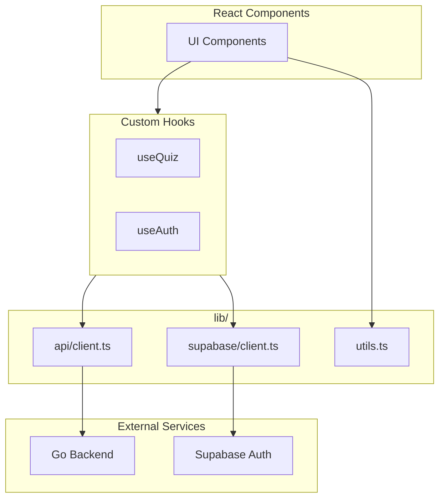

# Library & Utilities

## Overview

This folder contains shared utilities, API client configuration, and external service integrations. It serves as the infrastructure layer between React components and external services.

## Directory Structure

```
lib/
├── api/                    # API integration layer
│   ├── client.ts          # Axios client with interceptors
│   ├── endpoints.ts       # API endpoint constants
│   ├── auth.ts            # Auth API functions
│   ├── quiz.ts            # Quiz API functions
│   ├── user.ts            # User API functions
│   ├── friends.ts         # Friends API functions
│   ├── achievements.ts    # Achievements API functions
│   ├── notifications.ts   # Notifications API functions
│   ├── discussions.ts     # Discussions API functions
│   ├── leaderboard.ts     # Leaderboard API functions
│   ├── favorites.ts       # Favorites API functions
│   └── preferences.ts     # Preferences API functions
│
├── supabase/              # Supabase client
│   └── client.ts          # Auth client and helpers
│
├── utils.ts               # Utility functions (cn, etc.)
├── constants.ts           # Shared constants
├── logger.ts              # Logging utilities
├── notification-utils.ts  # Notification helpers
└── category-colors.ts     # Category color mappings
```

## Architecture



## API Layer (`api/`)

The API layer handles all HTTP communication with the backend. See [API Documentation](./api/README.md) for details.

### Quick Reference

```tsx
import { apiClient } from "@/lib/api/client";
import { getQuizzes, getQuiz, submitQuizAttempt } from "@/lib/api/quiz";

// Direct client usage
const data = await apiClient.get<Quiz>("/quizzes/123");

// Service function usage (preferred)
const quizzes = await getQuizzes({ category: "science" });
const quiz = await getQuiz("123");
```

## Supabase Client (`supabase/`)

Handles authentication with Supabase. See [Supabase Documentation](./supabase/README.md) for details.

### Quick Reference

```tsx
import { supabase, getSession, signIn, signOut } from "@/lib/supabase/client";

// Get current session
const session = await getSession();

// Sign in
await signIn(email, password);

// Sign out
await signOut();

// Listen to auth changes
onAuthStateChange((event, session) => {
  console.log(event, session);
});
```

## Utility Functions

### `utils.ts` - Core Utilities

#### `cn()` - Class Name Merger

Combines Tailwind CSS classes with conflict resolution:

```tsx
import { cn } from "@/lib/utils";

// Basic usage
cn("px-4 py-2", "bg-blue-500");
// => "px-4 py-2 bg-blue-500"

// Handles conflicts (last wins)
cn("px-4", "px-8");
// => "px-8"

// Conditional classes
cn("base-class", isActive && "active", isDisabled && "disabled");
// => "base-class active" (if isActive is true)

// Common pattern in components
<div className={cn(
  "rounded-lg border",
  variant === "primary" && "bg-primary text-white",
  variant === "secondary" && "bg-secondary",
  className // Allow override from props
)} />
```

### `logger.ts` - Logging Utilities

Structured logging for different modules:

```tsx
import { apiLogger, supabaseLogger, authLogger } from "@/lib/logger";

// API logging
apiLogger.info("Fetching quizzes", { filters });
apiLogger.error("API request failed", error);

// Supabase logging
supabaseLogger.info("Session refreshed");

// Auth logging
authLogger.warn("Invalid credentials");
```

### `constants.ts` - Shared Constants

API error messages and other shared values:

```tsx
import { API_ERROR_MESSAGES, QUERY_KEYS } from "@/lib/constants";

// Error messages
API_ERROR_MESSAGES.UNAUTHORIZED  // "Unauthorized"
API_ERROR_MESSAGES.NETWORK_ERROR // "Network error"
API_ERROR_MESSAGES.SERVER_ERROR  // "Server error"

// Query keys for TanStack Query
QUERY_KEYS.QUIZZES       // "quizzes"
QUERY_KEYS.NOTIFICATIONS // "notifications"
```

### `notification-utils.ts` - Notification Helpers

Utilities for notification handling:

```tsx
import { formatNotification, getNotificationIcon } from "@/lib/notification-utils";

const formatted = formatNotification(notification);
const icon = getNotificationIcon(notification.type);
```

### `category-colors.ts` - Category Styling

Color mappings for quiz categories:

```tsx
import { getCategoryColor, getCategoryIcon } from "@/lib/category-colors";

const color = getCategoryColor("science"); // "blue"
const icon = getCategoryIcon("science");   // BeakerIcon
```

## Common Patterns

### Error Handling

```tsx
import { handleAPIError } from "@/lib/api/client";

try {
  await submitQuiz(data);
} catch (error) {
  const message = handleAPIError(error);
  toast.error(message);
}
```

### Environment Variables

```tsx
// Use config module instead of direct access
import { env } from "@/config/env";

const apiUrl = env.api.baseUrl;
```

### Type-Safe API Calls

```tsx
import { apiClient } from "@/lib/api/client";
import type { Quiz } from "@/types/quiz";

// Typed response
const quiz = await apiClient.get<Quiz>(`/quizzes/${id}`);
// quiz is typed as Quiz
```

## Adding New Utilities

### New API Service

1. Create file in `lib/api/`:

```tsx
// lib/api/myService.ts
import { apiClient } from "./client";
import { API_ENDPOINTS } from "./endpoints";
import type { MyEntity } from "@/types/myEntity";

export async function getMyEntities(): Promise<MyEntity[]> {
  return apiClient.get(API_ENDPOINTS.MY_SERVICE.LIST);
}

export async function getMyEntity(id: string): Promise<MyEntity> {
  return apiClient.get(API_ENDPOINTS.MY_SERVICE.GET(id));
}
```

2. Add endpoints:

```tsx
// lib/api/endpoints.ts
export const API_ENDPOINTS = {
  // ... existing
  MY_SERVICE: {
    LIST: "/my-service",
    GET: (id: string) => `/my-service/${id}`,
  },
};
```

### New Utility Function

Add to `utils.ts` or create a new file:

```tsx
// lib/utils.ts
export function formatDate(date: string): string {
  return new Date(date).toLocaleDateString();
}

// Or create lib/date-utils.ts for multiple date functions
```

## Related Documentation

- [Parent: Source Overview](../README.md)
- [API Layer](./api/README.md) - Detailed API documentation
- [Supabase Client](./supabase/README.md) - Auth documentation
- [Hooks](../hooks/README.md) - Hooks that use these utilities
