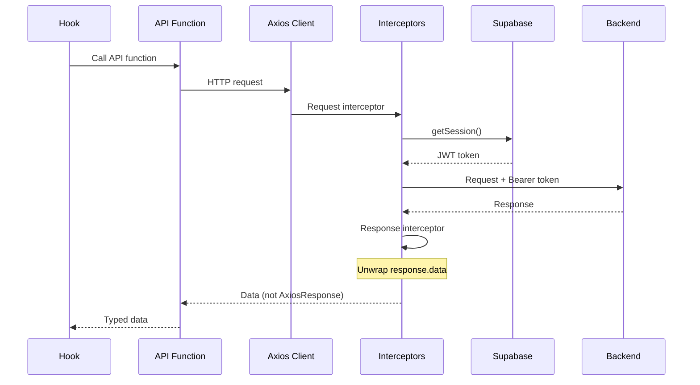

# API Layer

## Overview

This folder contains the API integration layer for communicating with the Go backend. It uses Axios with interceptors for authentication and error handling, providing type-safe API functions organized by domain.

## Architecture



## Files

| File | Domain | Functions |
|------|--------|-----------|
| `client.ts` | Core | Axios instance, interceptors, error handling |
| `endpoints.ts` | Config | API endpoint constants |
| `auth.ts` | Auth | login, register, logout |
| `quiz.ts` | Quizzes | getQuizzes, getQuiz, startAttempt, submitAttempt |
| `user.ts` | Users | getProfile, updateProfile, getUserStats |
| `friends.ts` | Social | getFriends, sendRequest, acceptRequest |
| `achievements.ts` | Achievements | getAchievements, getProgress |
| `notifications.ts` | Notifications | getNotifications, markAsRead |
| `discussions.ts` | Discussions | getDiscussions, createDiscussion, addReply |
| `leaderboard.ts` | Leaderboard | getLeaderboard, getUserRank |
| `favorites.ts` | Favorites | getFavorites, addFavorite, removeFavorite |
| `preferences.ts` | Settings | getPreferences, updatePreferences |

## Client Configuration (`client.ts`)

### Axios Instance

```tsx
const axiosInstance = axios.create({
  baseURL: process.env.NEXT_PUBLIC_API_BASE_URL || "http://127.0.0.1:8080/api/v1",
  timeout: 30000,
  headers: {
    "Content-Type": "application/json",
  },
});
```

### Request Interceptor

Automatically attaches JWT token from Supabase session:

```tsx
apiClient.interceptors.request.use(async (config) => {
  const session = await getSession();
  if (session?.access_token) {
    config.headers.Authorization = `Bearer ${session.access_token}`;
  }
  return config;
});
```

### Response Interceptor

Unwraps response data and handles errors:

```tsx
apiClient.interceptors.response.use(
  (response) => response.data, // Return data directly
  async (error) => {
    // Handle 401 - redirect to login
    // Handle 403 - forbidden
    // Handle 404 - not found
    // Handle 5xx - server error
  }
);
```

**Important:** The response interceptor returns `response.data` directly, not the full Axios response. This means:

```tsx
// Response is already unwrapped
const quizzes = await apiClient.get("/quizzes");
// quizzes is the data, NOT { data: quizzes, status: 200, ... }

// DON'T do this - it will be undefined
const wrong = await apiClient.get("/quizzes");
console.log(wrong.data); // undefined!
```

## Endpoints (`endpoints.ts`)

Centralized endpoint definitions:

```tsx
export const API_ENDPOINTS = {
  AUTH: {
    LOGIN: "/auth/login",
    REGISTER: "/auth/register",
    LOGOUT: "/auth/logout",
  },
  QUIZZES: {
    LIST: "/quizzes",
    FEATURED: "/quizzes/featured",
    BY_CATEGORY: (category: string) => `/quizzes/category/${category}`,
  },
  QUIZ: {
    GET: (id: string) => `/quizzes/${id}`,
    QUESTIONS: (id: string) => `/quizzes/${id}/questions`,
    START_ATTEMPT: (id: string) => `/quizzes/${id}/attempts`,
    SUBMIT_ATTEMPT: (id: string, attemptId: string) =>
      `/quizzes/${id}/attempts/${attemptId}/submit`,
  },
  // ... more endpoints
};
```

## API Functions by Domain

### Quiz API (`quiz.ts`)

```tsx
import {
  getQuizzes,
  getQuiz,
  getQuizQuestions,
  startQuizAttempt,
  submitQuizAttempt,
  getFeaturedQuizzes,
} from "@/lib/api/quiz";

// Get paginated quizzes with filters
const { quizzes, total, page } = await getQuizzes({
  category: "science",
  difficulty: "intermediate",
  limit: 10,
  offset: 0,
});

// Get single quiz
const quiz = await getQuiz("quiz-id");

// Get questions for quiz
const questions = await getQuizQuestions("quiz-id");

// Start a quiz attempt
const attempt = await startQuizAttempt("quiz-id");

// Submit answers
const result = await submitQuizAttempt("quiz-id", attempt.id, {
  answers: [
    { question_id: "q1", selected_option_index: 0 },
    { question_id: "q2", selected_option_index: 2 },
  ],
});
```

### Auth API (`auth.ts`)

```tsx
import { loginUser, registerUser, logoutUser } from "@/lib/api/auth";

// Login
const { user, session } = await loginUser({
  email: "user@example.com",
  password: "password",
});

// Register
const { user } = await registerUser({
  email: "user@example.com",
  password: "password",
  name: "John Doe",
});

// Logout
await logoutUser();
```

### Friends API (`friends.ts`)

```tsx
import {
  getFriends,
  getFriendRequests,
  sendFriendRequest,
  respondToFriendRequest,
  removeFriend,
  searchUsers,
} from "@/lib/api/friends";

// Get friends list
const friends = await getFriends();

// Get pending requests
const requests = await getFriendRequests();

// Send request
await sendFriendRequest(userId);

// Accept/decline request
await respondToFriendRequest(requestId, "accept");
await respondToFriendRequest(requestId, "decline");

// Remove friend
await removeFriend(friendId);

// Search users
const users = await searchUsers("john");
```

### Notifications API (`notifications.ts`)

```tsx
import {
  getNotifications,
  getNotificationStats,
  markNotificationAsRead,
  markAllNotificationsAsRead,
  deleteNotification,
} from "@/lib/api/notifications";

// Get notifications
const notifications = await getNotifications({ limit: 20 });

// Get unread count
const { total, unread } = await getNotificationStats();

// Mark as read
await markNotificationAsRead(notificationId);

// Mark all as read
await markAllNotificationsAsRead();
```

### Achievements API (`achievements.ts`)

```tsx
import {
  getAchievements,
  getUserAchievements,
  getAchievementProgress,
  checkAchievements,
} from "@/lib/api/achievements";

// Get all achievements
const achievements = await getAchievements();

// Get user's earned achievements
const userAchievements = await getUserAchievements();

// Get progress toward achievements
const progress = await getAchievementProgress();

// Check for new achievements (call after quiz completion)
const newAchievements = await checkAchievements();
```

### Leaderboard API (`leaderboard.ts`)

```tsx
import {
  getLeaderboard,
  getUserRank,
  getLeaderboardStats,
} from "@/lib/api/leaderboard";

// Get leaderboard
const { entries, total } = await getLeaderboard({
  period: "weekly",
  limit: 100,
});

// Get current user's rank
const { rank, score } = await getUserRank();
```

### Favorites API (`favorites.ts`)

```tsx
import {
  getFavorites,
  addFavorite,
  removeFavorite,
  checkIsFavorite,
} from "@/lib/api/favorites";

// Get favorite quizzes
const favorites = await getFavorites();

// Add to favorites
await addFavorite(quizId);

// Remove from favorites
await removeFavorite(quizId);

// Check if favorited
const isFavorite = await checkIsFavorite(quizId);
```

### Discussions API (`discussions.ts`)

```tsx
import {
  getDiscussions,
  getDiscussion,
  createDiscussion,
  updateDiscussion,
  deleteDiscussion,
  likeDiscussion,
  getReplies,
  addReply,
  likeReply,
} from "@/lib/api/discussions";

// Get discussions
const { discussions, total } = await getDiscussions({
  sort: "recent",
  type: "question",
});

// Create discussion
const discussion = await createDiscussion({
  title: "Help with quiz",
  content: "How do I...",
  type: "question",
});

// Get replies
const replies = await getReplies(discussionId);

// Add reply
await addReply(discussionId, { content: "You can..." });

// Like
await likeDiscussion(discussionId);
await likeReply(replyId);
```

## Error Handling

### handleAPIError Helper

```tsx
import { handleAPIError } from "@/lib/api/client";

try {
  await submitQuizAttempt(quizId, attemptId, answers);
} catch (error) {
  const message = handleAPIError(error);
  toast.error(message);
}
```

### Error Response Format

```tsx
interface APIError {
  message: string;
  status: number;
  code?: string;
  details?: Record<string, any>;
}
```

### Status Code Handling

| Status | Handling |
|--------|----------|
| 401 | Redirect to `/login` |
| 403 | "Forbidden" error message |
| 404 | "Not found" error message |
| 422 | Validation error message |
| 500+ | "Server error" message |

## Usage Patterns

### In Custom Hooks

```tsx
// hooks/useQuizzes.ts
import { useQuery } from "@tanstack/react-query";
import { getQuizzes } from "@/lib/api/quiz";

export function useQuizzes(filters: QuizFilters) {
  return useQuery({
    queryKey: ["quizzes", filters],
    queryFn: () => getQuizzes(filters),
  });
}
```

### In Components (Direct)

For one-off calls not needing caching:

```tsx
import { submitQuizAttempt } from "@/lib/api/quiz";

async function handleSubmit() {
  try {
    const result = await submitQuizAttempt(quizId, attemptId, answers);
    router.push(`/quizzes/${quizId}/results/${result.attempt.id}`);
  } catch (error) {
    toast.error(handleAPIError(error));
  }
}
```

## Adding New API Functions

1. Add endpoint to `endpoints.ts`:

```tsx
export const API_ENDPOINTS = {
  // ... existing
  MY_FEATURE: {
    LIST: "/my-feature",
    GET: (id: string) => `/my-feature/${id}`,
    CREATE: "/my-feature",
  },
};
```

2. Create service file:

```tsx
// api/myFeature.ts
import { apiClient } from "./client";
import { API_ENDPOINTS } from "./endpoints";
import type { MyFeature, MyFeatureListResponse } from "@/types/myFeature";

export async function getMyFeatures(): Promise<MyFeatureListResponse> {
  return apiClient.get(API_ENDPOINTS.MY_FEATURE.LIST);
}

export async function getMyFeature(id: string): Promise<MyFeature> {
  return apiClient.get(API_ENDPOINTS.MY_FEATURE.GET(id));
}

export async function createMyFeature(data: CreateMyFeatureRequest): Promise<MyFeature> {
  return apiClient.post(API_ENDPOINTS.MY_FEATURE.CREATE, data);
}
```

3. Create corresponding hook in `hooks/`:

```tsx
// hooks/useMyFeatures.ts
import { useQuery, useMutation, useQueryClient } from "@tanstack/react-query";
import { getMyFeatures, createMyFeature } from "@/lib/api/myFeature";

export function useMyFeatures() {
  return useQuery({
    queryKey: ["myFeatures"],
    queryFn: getMyFeatures,
  });
}

export function useCreateMyFeature() {
  const queryClient = useQueryClient();

  return useMutation({
    mutationFn: createMyFeature,
    onSuccess: () => {
      queryClient.invalidateQueries({ queryKey: ["myFeatures"] });
    },
  });
}
```

## Common Pitfalls

### Response Already Unwrapped

```tsx
// WRONG - response is already data
const response = await apiClient.get("/quizzes");
console.log(response.data); // undefined!

// CORRECT - response IS the data
const quizzes = await apiClient.get("/quizzes");
console.log(quizzes); // Quiz[]
```

### Missing Auth Token

If API calls fail with 401, ensure:
1. User is logged in
2. Supabase session exists
3. Token hasn't expired

### Network Errors

Check `NEXT_PUBLIC_API_BASE_URL` in `.env.local` matches your backend URL.

## Related Documentation

- [Parent: Library Overview](../README.md)
- [Supabase Client](../supabase/README.md) - Session for auth headers
- [Hooks](../../hooks/README.md) - Hooks using these API functions
- [Types](../../types/README.md) - Type definitions for responses
