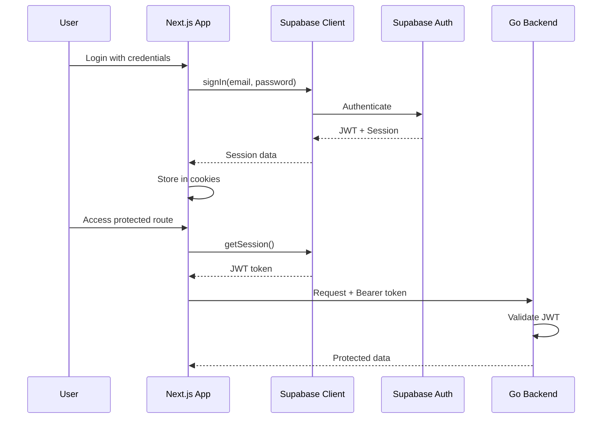
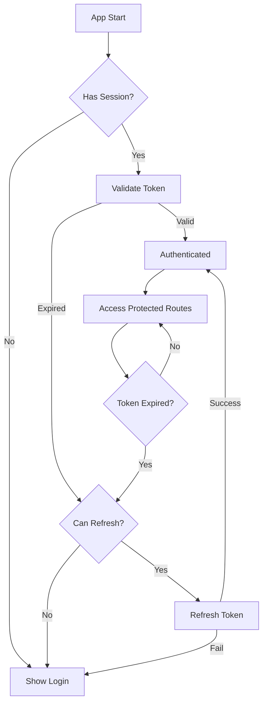

# Supabase Client

## Overview

This module provides the Supabase client configuration for authentication. QuizNinja uses Supabase Auth for user authentication, with JWT tokens passed to the Go backend for API authorization.

## Architecture



## Client Configuration

### Cookie-Based Auth

We use `createClientComponentClient` from `@supabase/auth-helpers-nextjs` for cookie-based authentication, which:

- Works with Next.js App Router
- Enables SSR session access
- Allows middleware to read auth state
- Automatically refreshes tokens

```tsx
import { createClientComponentClient } from "@supabase/auth-helpers-nextjs";

export const supabase = createClientComponentClient();
```

### Environment Variables

Required in `.env.local`:

```env
NEXT_PUBLIC_SUPABASE_URL=https://your-project.supabase.co
NEXT_PUBLIC_SUPABASE_ANON_KEY=your-anon-key
```

## Exported Functions

### `getSession()`

Get the current user session.

```tsx
import { getSession } from "@/lib/supabase/client";

const session = await getSession();

if (session) {
  console.log("User ID:", session.user.id);
  console.log("Access Token:", session.access_token);
}
```

**Returns:** `Session | null`

### `getUser()`

Get the current authenticated user.

```tsx
import { getUser } from "@/lib/supabase/client";

const user = await getUser();

if (user) {
  console.log("Email:", user.email);
  console.log("Name:", user.user_metadata.full_name);
}
```

**Returns:** `User | null`

### `signIn(email, password)`

Sign in with email and password.

```tsx
import { signIn } from "@/lib/supabase/client";

try {
  const data = await signIn("user@example.com", "password");
  console.log("Logged in:", data.user);
} catch (error) {
  console.error("Login failed:", error.message);
}
```

**Returns:** `{ user, session }`

**Throws:** `AuthError` on failure

### `signUp(email, password, fullName)`

Register a new user.

```tsx
import { signUp } from "@/lib/supabase/client";

try {
  const data = await signUp("user@example.com", "password", "John Doe");
  console.log("Registered:", data.user);
} catch (error) {
  console.error("Registration failed:", error.message);
}
```

**Returns:** `{ user, session }`

**Note:** User metadata (full_name) is stored in `user.user_metadata`.

### `signOut()`

Sign out the current user.

```tsx
import { signOut } from "@/lib/supabase/client";

try {
  await signOut();
  console.log("Logged out");
} catch (error) {
  console.error("Logout failed:", error.message);
}
```

### `onAuthStateChange(callback)`

Listen to authentication state changes.

```tsx
import { onAuthStateChange } from "@/lib/supabase/client";

const { data: { subscription } } = onAuthStateChange((event, session) => {
  console.log("Auth event:", event);
  // Events: SIGNED_IN, SIGNED_OUT, TOKEN_REFRESHED, USER_UPDATED

  if (event === "SIGNED_IN") {
    // User signed in
  }

  if (event === "SIGNED_OUT") {
    // User signed out
  }
});

// Cleanup
subscription.unsubscribe();
```

**Events:**
- `SIGNED_IN` - User signed in
- `SIGNED_OUT` - User signed out
- `TOKEN_REFRESHED` - Token was refreshed
- `USER_UPDATED` - User data updated
- `PASSWORD_RECOVERY` - Password recovery initiated

## Integration with API Client

The API client uses `getSession()` to attach JWT tokens to requests:

```tsx
// lib/api/client.ts
apiClient.interceptors.request.use(async (config) => {
  const session = await getSession();
  if (session?.access_token) {
    config.headers.Authorization = `Bearer ${session.access_token}`;
  }
  return config;
});
```

## Usage in Components

### AuthGuard Component

Protects routes requiring authentication:

```tsx
// components/auth/AuthGuard.tsx
"use client";

import { useEffect, useState } from "react";
import { useRouter } from "next/navigation";
import { getSession } from "@/lib/supabase/client";

export function AuthGuard({ children }) {
  const router = useRouter();
  const [isAuthenticated, setIsAuthenticated] = useState(false);
  const [isLoading, setIsLoading] = useState(true);

  useEffect(() => {
    async function checkAuth() {
      const session = await getSession();
      if (!session) {
        router.push("/login");
      } else {
        setIsAuthenticated(true);
      }
      setIsLoading(false);
    }
    checkAuth();
  }, [router]);

  if (isLoading) return <LoadingSpinner />;
  if (!isAuthenticated) return null;

  return children;
}
```

### Login Form

```tsx
import { signIn } from "@/lib/supabase/client";

async function handleLogin(data: LoginFormData) {
  try {
    await signIn(data.email, data.password);
    router.push("/dashboard");
  } catch (error) {
    toast.error(error.message);
  }
}
```

### Session Listener

```tsx
import { onAuthStateChange } from "@/lib/supabase/client";
import { useAuthStore } from "@/store/authStore";

useEffect(() => {
  const { data: { subscription } } = onAuthStateChange((event, session) => {
    if (session) {
      useAuthStore.getState().setSession(session);
    } else {
      useAuthStore.getState().clearAuth();
    }
  });

  return () => subscription.unsubscribe();
}, []);
```

## Session Flow



## Common Patterns

### Check Authentication

```tsx
const session = await getSession();
const isAuthenticated = !!session;
```

### Get User ID

```tsx
const session = await getSession();
const userId = session?.user?.id;
```

### Get JWT for External Services

```tsx
const session = await getSession();
const jwt = session?.access_token;
```

## Troubleshooting

### Session is null after login

Ensure you're using the cookie-based client and not the regular client:

```tsx
// Correct - cookie-based
import { createClientComponentClient } from "@supabase/auth-helpers-nextjs";

// Wrong - doesn't persist session
import { createClient } from "@supabase/supabase-js";
```

### Token not refreshing

The auth helper automatically refreshes tokens. If issues persist:

1. Check that `NEXT_PUBLIC_SUPABASE_URL` is correct
2. Verify the user's session hasn't been revoked in Supabase dashboard
3. Clear cookies and re-login

### CORS errors

Ensure your Supabase project has the correct redirect URLs configured in Authentication > URL Configuration.

## Related Documentation

- [Parent: Library Overview](../README.md)
- [API Client](../api/README.md) - Uses session for auth headers
- [Auth Store](../../store/README.md) - Zustand store for auth state
- [Auth Components](../../components/auth/README.md) - Login/Register forms
