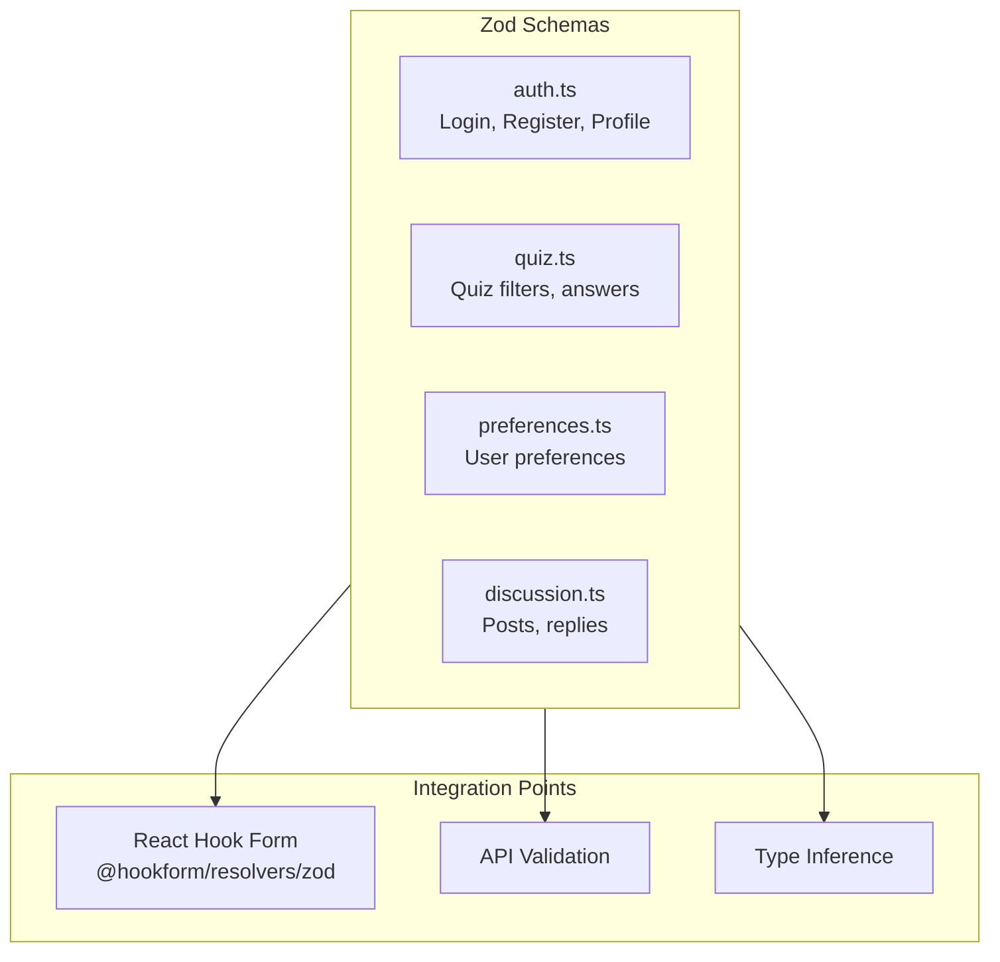

# Validation Schemas

## Overview

This folder contains Zod validation schemas for form validation, API request/response validation, and runtime type checking. Schemas are organized by feature domain and integrate with React Hook Form for form handling.

## Architecture



## Files

| File | Domain | Schemas |
|------|--------|---------|
| `auth.ts` | Authentication | loginSchema, registerSchema, profileUpdateSchema, passwordChangeSchema |
| `quiz.ts` | Quizzes | quizFiltersSchema, quizAnswerSchema |
| `preferences.ts` | Settings | preferencesSchema |
| `discussion.ts` | Discussions | createDiscussionSchema, replySchema |
| `friends.ts` | Social | friendRequestSchema |
| `notification.ts` | Notifications | notificationFiltersSchema |
| `achievement.ts` | Achievements | achievementFiltersSchema |
| `leaderboard.ts` | Leaderboard | leaderboardFiltersSchema |

## Auth Schemas (`auth.ts`)

### loginSchema

Validates login form data.

```tsx
import { loginSchema, type LoginFormData } from "@/schemas/auth";

const schema = z.object({
  email: z.string().min(1, "Email is required").email("Invalid email"),
  password: z.string().min(1, "Password is required").min(6, "Min 6 characters"),
  rememberMe: z.boolean().optional().default(false),
});

type LoginFormData = z.infer<typeof loginSchema>;
// { email: string; password: string; rememberMe?: boolean }
```

### registerSchema

Validates registration with password confirmation.

```tsx
const schema = z.object({
  name: z.string()
    .min(1, "Name is required")
    .min(2, "Min 2 characters")
    .max(50, "Max 50 characters")
    .regex(/^[a-zA-Z\s'-]+$/, "Letters only"),
  email: z.string().email("Invalid email"),
  password: z.string()
    .min(8, "Min 8 characters")
    .regex(/[a-z]/, "Needs lowercase")
    .regex(/[A-Z]/, "Needs uppercase")
    .regex(/[0-9]/, "Needs number"),
  confirmPassword: z.string(),
}).refine(data => data.password === data.confirmPassword, {
  message: "Passwords don't match",
  path: ["confirmPassword"],
});
```

### profileUpdateSchema

Validates profile update form with optional fields.

```tsx
const schema = z.object({
  name: z.string().min(2).max(50).optional(),
  email: z.string().email().optional(),
  avatar_url: z.string().url().optional().or(z.literal("")),
  bio: z.string().max(500).optional(),
});
```

### passwordChangeSchema

Validates password change with current password verification.

```tsx
const schema = z.object({
  currentPassword: z.string().min(1),
  newPassword: z.string().min(8).regex(/[a-z]/).regex(/[A-Z]/).regex(/[0-9]/),
  confirmNewPassword: z.string(),
})
.refine(data => data.newPassword === data.confirmNewPassword, {
  message: "Passwords don't match",
  path: ["confirmNewPassword"],
})
.refine(data => data.currentPassword !== data.newPassword, {
  message: "New password must be different",
  path: ["newPassword"],
});
```

## Usage Patterns

### With React Hook Form

The primary use case is form validation with `@hookform/resolvers/zod`:

```tsx
import { useForm } from "react-hook-form";
import { zodResolver } from "@hookform/resolvers/zod";
import { loginSchema, type LoginFormData } from "@/schemas/auth";

function LoginForm() {
  const form = useForm<LoginFormData>({
    resolver: zodResolver(loginSchema),
    defaultValues: {
      email: "",
      password: "",
      rememberMe: false,
    },
  });

  const onSubmit = (data: LoginFormData) => {
    // data is fully validated and typed
    console.log(data.email, data.password);
  };

  return (
    <form onSubmit={form.handleSubmit(onSubmit)}>
      <input {...form.register("email")} />
      {form.formState.errors.email && (
        <span>{form.formState.errors.email.message}</span>
      )}
      {/* ... */}
    </form>
  );
}
```

### Type Inference

Schemas automatically generate TypeScript types:

```tsx
import { z } from "zod";
import { loginSchema } from "@/schemas/auth";

// Infer the type from the schema
type LoginFormData = z.infer<typeof loginSchema>;

// Equivalent to:
// {
//   email: string;
//   password: string;
//   rememberMe?: boolean;
// }
```

### API Response Validation

Validate API responses at runtime:

```tsx
import { quizSchema } from "@/schemas/quiz";

async function fetchQuiz(id: string) {
  const response = await apiClient.get(`/quizzes/${id}`);

  // Validate response matches expected shape
  const result = quizSchema.safeParse(response);

  if (!result.success) {
    console.error("Invalid API response:", result.error);
    throw new Error("Invalid quiz data from API");
  }

  return result.data; // Fully typed Quiz
}
```

### Partial Validation

Use `.partial()` for update forms where all fields are optional:

```tsx
const updateSchema = profileSchema.partial();

// All fields become optional
type UpdateData = z.infer<typeof updateSchema>;
```

### Custom Error Messages

Provide user-friendly error messages:

```tsx
const schema = z.object({
  email: z.string({
    required_error: "Please enter your email",
    invalid_type_error: "Email must be text",
  }).email({
    message: "Please enter a valid email address",
  }),
});
```

### Refinements

Add custom validation logic:

```tsx
const schema = z.object({
  startDate: z.date(),
  endDate: z.date(),
}).refine(
  data => data.endDate > data.startDate,
  {
    message: "End date must be after start date",
    path: ["endDate"], // Show error on endDate field
  }
);
```

### Transform

Transform data during validation:

```tsx
const schema = z.object({
  email: z.string().email().transform(val => val.toLowerCase()),
  tags: z.string().transform(val => val.split(",").map(t => t.trim())),
});

// Input: { email: "USER@Example.COM", tags: "a, b, c" }
// Output: { email: "user@example.com", tags: ["a", "b", "c"] }
```

## Schema Patterns

### Required vs Optional

```tsx
// Required (default)
name: z.string()

// Optional (undefined allowed)
bio: z.string().optional()

// Nullable (null allowed)
avatar: z.string().nullable()

// Optional with default
rememberMe: z.boolean().optional().default(false)
```

### String Validation

```tsx
z.string()
  .min(1, "Required")           // Non-empty
  .min(8, "Min 8 chars")        // Minimum length
  .max(100, "Max 100 chars")    // Maximum length
  .email("Invalid email")       // Email format
  .url("Invalid URL")           // URL format
  .regex(/pattern/, "Message")  // Custom pattern
  .trim()                       // Remove whitespace
  .toLowerCase()                // Transform
```

### Number Validation

```tsx
z.number()
  .min(0, "Must be positive")
  .max(100, "Max 100")
  .int("Must be integer")
  .positive("Must be positive")
```

### Enum Validation

```tsx
import { QUIZ_DIFFICULTIES } from "@/constants";

// From const array
const difficultySchema = z.enum(QUIZ_DIFFICULTIES);

// Manual enum
const statusSchema = z.enum(["active", "inactive", "pending"]);
```

### Array Validation

```tsx
z.array(z.string())
  .min(1, "At least one item")
  .max(10, "Max 10 items")
  .nonempty("Cannot be empty")
```

### Object Composition

```tsx
const addressSchema = z.object({
  street: z.string(),
  city: z.string(),
});

const userSchema = z.object({
  name: z.string(),
  address: addressSchema, // Nested object
});
```

## Adding New Schemas

1. Create or edit the appropriate domain file:

```tsx
// schemas/myFeature.ts
import { z } from "zod";

export const myFeatureSchema = z.object({
  name: z.string().min(1, "Name is required"),
  description: z.string().max(500).optional(),
  priority: z.number().min(1).max(5),
});

export type MyFeatureFormData = z.infer<typeof myFeatureSchema>;
```

2. Use in component:

```tsx
import { useForm } from "react-hook-form";
import { zodResolver } from "@hookform/resolvers/zod";
import { myFeatureSchema, type MyFeatureFormData } from "@/schemas/myFeature";

function MyFeatureForm() {
  const form = useForm<MyFeatureFormData>({
    resolver: zodResolver(myFeatureSchema),
  });
  // ...
}
```

## Common Pitfalls

### Missing Error Messages

Always provide user-friendly messages:

```tsx
// Bad - generic error
z.string().min(8)

// Good - clear message
z.string().min(8, "Password must be at least 8 characters")
```

### Type vs Runtime

Schema validates at runtime, type is for compile time:

```tsx
// This compiles but fails at runtime if data is wrong
const data: LoginFormData = { email: "not-email", password: "" };

// Use safeParse for runtime validation
const result = loginSchema.safeParse(data);
if (!result.success) {
  // Handle validation errors
}
```

### Async Validation

Use `.refine()` with async for server-side checks:

```tsx
const schema = z.object({
  username: z.string().refine(
    async (val) => {
      const exists = await checkUsernameExists(val);
      return !exists;
    },
    { message: "Username already taken" }
  ),
});

// Must use parseAsync
await schema.parseAsync(data);
```

## Related Documentation

- [Parent: Source Overview](../README.md)
- [Types](../types/README.md) - TypeScript type definitions
- [Constants](../constants/README.md) - Enum values for schema enums
- [Auth Components](../components/auth/README.md) - Forms using these schemas
