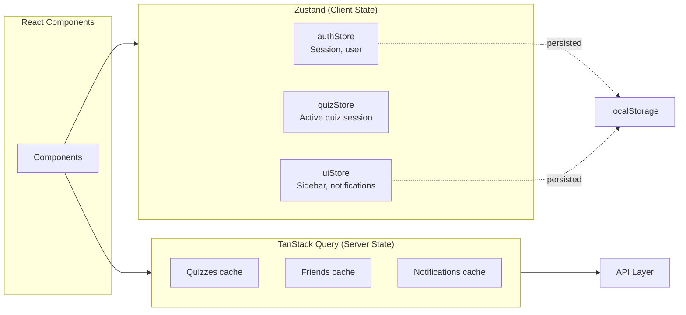
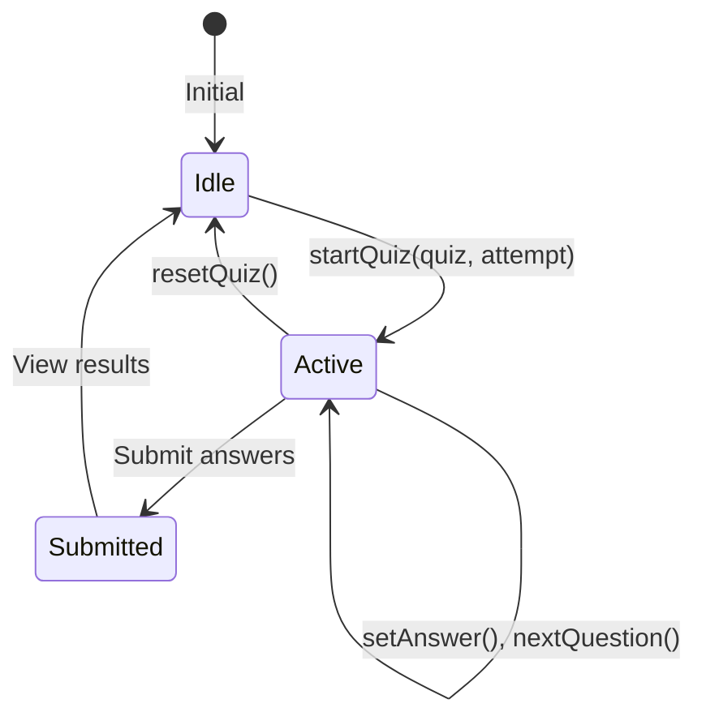

# State Management

## Overview

QuizNinja uses **Zustand** for client-side state management, combined with **TanStack Query** for server state. This separation ensures clean architecture where Zustand handles UI state and TanStack Query handles data fetching and caching.

## Architecture



## When to Use Which

| Use Zustand For | Use TanStack Query For |
|-----------------|------------------------|
| UI state (sidebar, modals) | Data from API |
| Auth session | Lists (quizzes, friends) |
| Form state | Single entities |
| Quiz-taking session | Real-time data |
| Theme preferences | Cached data |

## Stores

### `authStore.ts` - Authentication State

Manages user authentication state with localStorage persistence.

#### State Shape

```tsx
interface AuthState {
  user: User | null;           // Current user
  session: Session | null;     // Auth session with JWT
  isLoading: boolean;          // Auth initialization state
  isAuthenticated: boolean;    // Computed auth status
}
```

#### Actions

| Action | Parameters | Description |
|--------|------------|-------------|
| `setUser` | `user: User \| null` | Set current user |
| `setSession` | `session: Session \| null` | Set session (also sets user) |
| `setLoading` | `loading: boolean` | Set loading state |
| `clearAuth` | - | Clear all auth state |
| `logout` | - | Clear state for logout |

#### Persistence

Only the `session` is persisted to localStorage:

```tsx
persist(
  (set) => ({ /* state */ }),
  {
    name: "auth-storage",
    partialize: (state) => ({ session: state.session }),
  }
)
```

#### Usage

```tsx
import { useAuthStore } from "@/store/authStore";

// In component
function MyComponent() {
  const { user, isAuthenticated, setSession, logout } = useAuthStore();

  if (!isAuthenticated) {
    return <LoginPrompt />;
  }

  return <div>Welcome, {user?.name}</div>;
}

// Outside React (in API client, etc.)
const session = useAuthStore.getState().session;
```

---

### `quizStore.ts` - Quiz Session State

Manages the active quiz-taking session. **Not persisted** - quiz progress is lost on page refresh.

#### State Shape

```tsx
interface QuizState {
  // Current quiz data
  currentQuiz: Quiz | null;
  currentAttempt: QuizAttempt | null;

  // Quiz navigation
  currentQuestionIndex: number;
  answers: Record<string, QuizAnswer>; // Keyed by question_id

  // Timer
  timeRemaining: number | null; // Seconds
  startTime: number | null;
}
```

#### Actions

| Action | Parameters | Description |
|--------|------------|-------------|
| `startQuiz` | `quiz, attempt` | Initialize quiz session |
| `resetQuiz` | - | Clear quiz state |
| `setAnswer` | `questionId, answer` | Record answer |
| `getAnswer` | `questionId` | Get recorded answer |
| `nextQuestion` | - | Go to next question |
| `previousQuestion` | - | Go to previous question |
| `goToQuestion` | `index` | Jump to question |
| `setTimeRemaining` | `seconds` | Update timer |
| `decrementTime` | - | Decrease time by 1s |

#### Usage

```tsx
import { useQuizStore } from "@/store/quizStore";

function QuizTaking() {
  const {
    currentQuiz,
    currentQuestionIndex,
    answers,
    timeRemaining,
    nextQuestion,
    setAnswer,
  } = useQuizStore();

  const handleAnswer = (questionId: string, optionIndex: number) => {
    setAnswer(questionId, {
      question_id: questionId,
      selected_option_index: optionIndex,
      selected_answer: currentQuiz.questions[currentQuestionIndex].options[optionIndex],
    });
    nextQuestion();
  };

  return (/* ... */);
}
```

#### Quiz Flow



---

### `uiStore.ts` - UI State

Manages UI preferences with localStorage persistence.

#### State Shape

```tsx
interface UIState {
  sidebarOpen: boolean;        // Sidebar collapsed/expanded
  notificationCount: number;   // Unread notification badge
}
```

#### Actions

| Action | Parameters | Description |
|--------|------------|-------------|
| `toggleSidebar` | - | Toggle sidebar state |
| `setSidebarOpen` | `open: boolean` | Set sidebar state |
| `setNotificationCount` | `count: number` | Set notification count |
| `incrementNotificationCount` | - | Add 1 to count |
| `decrementNotificationCount` | - | Remove 1 from count |

#### Usage

```tsx
import { useUIStore } from "@/store/uiStore";

function Sidebar() {
  const { sidebarOpen, toggleSidebar } = useUIStore();

  return (
    <aside className={cn("w-64", !sidebarOpen && "w-16")}>
      <button onClick={toggleSidebar}>
        {sidebarOpen ? "Collapse" : "Expand"}
      </button>
    </aside>
  );
}

function NotificationBell() {
  const { notificationCount } = useUIStore();

  return (
    <button className="relative">
      <BellIcon />
      {notificationCount > 0 && (
        <span className="badge">{notificationCount}</span>
      )}
    </button>
  );
}
```

---

## Common Patterns

### Selecting State

Select only what you need to prevent unnecessary re-renders:

```tsx
// Good - only re-renders when user changes
const user = useAuthStore((state) => state.user);

// Avoid - re-renders on any store change
const { user, session, isLoading } = useAuthStore();
```

### Multiple Selectors

```tsx
// For multiple values, use separate selectors
const user = useAuthStore((state) => state.user);
const isAuthenticated = useAuthStore((state) => state.isAuthenticated);

// Or create a custom selector hook
function useAuthUser() {
  return useAuthStore((state) => ({
    user: state.user,
    isAuthenticated: state.isAuthenticated,
  }));
}
```

### Outside React

Access store state outside components:

```tsx
// Get current state
const session = useAuthStore.getState().session;

// Update state
useAuthStore.getState().setSession(newSession);

// Subscribe to changes
const unsubscribe = useAuthStore.subscribe(
  (state) => state.isAuthenticated,
  (isAuth) => console.log("Auth changed:", isAuth)
);
```

### Combining with TanStack Query

```tsx
function QuizList() {
  // Server state from TanStack Query
  const { data: quizzes, isLoading } = useQuizzes();

  // Client state from Zustand
  const isAuthenticated = useAuthStore((state) => state.isAuthenticated);

  if (!isAuthenticated) return <LoginPrompt />;
  if (isLoading) return <Skeleton />;

  return <QuizGrid quizzes={quizzes} />;
}
```

## Adding a New Store

1. Create the store file:

```tsx
// store/myStore.ts
import { create } from "zustand";
import { persist } from "zustand/middleware"; // If needed

interface MyState {
  // State
  value: string;
  count: number;

  // Actions
  setValue: (value: string) => void;
  increment: () => void;
  reset: () => void;
}

export const useMyStore = create<MyState>()(
  persist(
    (set, get) => ({
      value: "",
      count: 0,

      setValue: (value) => set({ value }),

      increment: () => set((state) => ({ count: state.count + 1 })),

      reset: () => set({ value: "", count: 0 }),
    }),
    {
      name: "my-storage", // localStorage key
      partialize: (state) => ({ value: state.value }), // Only persist value
    }
  )
);
```

2. Use in component:

```tsx
import { useMyStore } from "@/store/myStore";

function MyComponent() {
  const { value, count, setValue, increment } = useMyStore();
  // ...
}
```

## Common Pitfalls

### Hydration Mismatch

Persisted stores can cause SSR hydration mismatches:

```tsx
// Solution: Don't render persisted values until hydrated
const [mounted, setMounted] = useState(false);

useEffect(() => {
  setMounted(true);
}, []);

if (!mounted) return <Skeleton />;
```

### Over-Storing Server Data

Don't duplicate server state in Zustand:

```tsx
// Bad - duplicates data
const quizzes = useQuizStore((state) => state.quizzes);
setQuizzes(await fetchQuizzes()); // Stored in Zustand

// Good - use TanStack Query
const { data: quizzes } = useQuery({
  queryKey: ["quizzes"],
  queryFn: fetchQuizzes,
});
```

### Forgetting to Clean Up

Reset state when appropriate:

```tsx
// Clean up quiz state when leaving
useEffect(() => {
  return () => {
    useQuizStore.getState().resetQuiz();
  };
}, []);
```

## Related Documentation

- [Parent: Source Overview](../README.md)
- [Hooks](../hooks/README.md) - Custom hooks using stores
- [Supabase Client](../lib/supabase/README.md) - Auth integration
- [API Layer](../lib/api/README.md) - Data fetching (for TanStack Query)