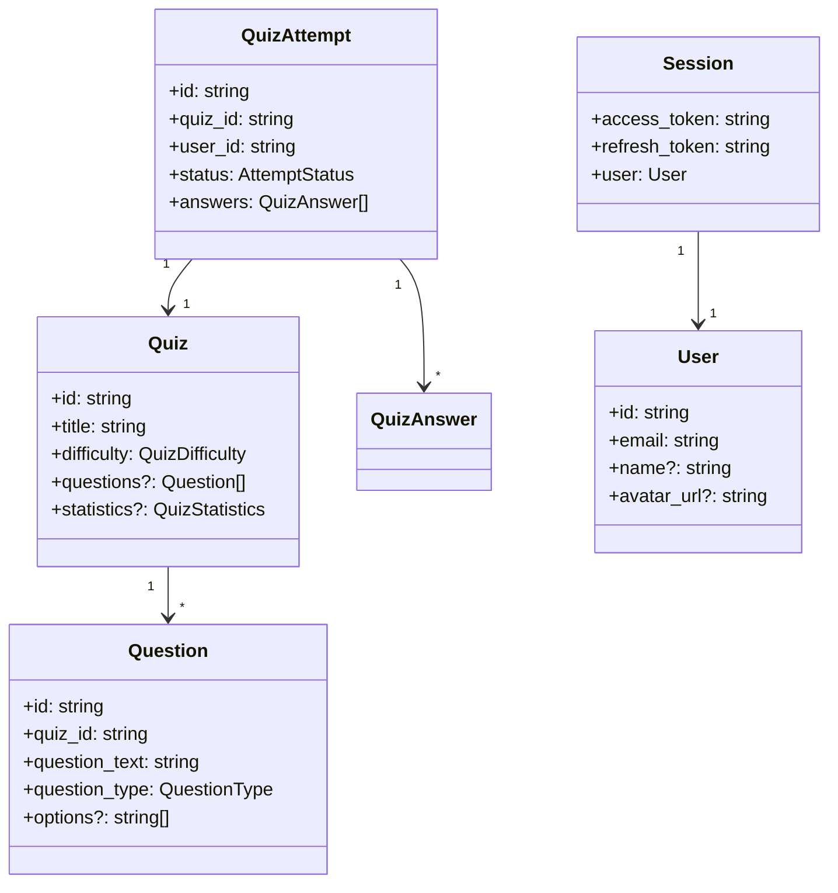

# TypeScript Types

## Overview

This folder contains TypeScript type definitions for all domain entities in the application. Types are organized by feature domain and provide type safety across components, hooks, and API interactions.

## Type Dependency Diagram



## Files

| File | Domain | Key Types |
|------|--------|-----------|
| `quiz.ts` | Quiz system | Quiz, Question, QuizAttempt, QuizAnswer, Category |
| `auth.ts` | Authentication | User, Session, Profile, LoginCredentials |
| `user.ts` | User profiles | UserProfile, UserStats, UserPreferences |
| `achievement.ts` | Achievements | Achievement, UserAchievement, AchievementProgress |
| `notification.ts` | Notifications | Notification, NotificationStats |
| `discussion.ts` | Discussions | Discussion, Reply, DiscussionStats |
| `favorites.ts` | Favorites | Favorite, FavoriteQuiz |
| `api.ts` | API responses | APIError, PaginatedResponse |
| `globals.d.ts` | Global declarations | Module augmentations |

## Quiz Types (`quiz.ts`)

### Core Types

```tsx
interface Quiz {
  id: string;
  title: string;
  description: string;
  category: string;
  difficulty: QuizDifficulty;      // From @/constants
  question_count: number;
  time_limit?: number;             // Seconds
  points: number;
  is_featured: boolean;
  questions?: Question[];          // Optional, loaded separately
  statistics?: QuizStatistics;     // Computed stats
  user_best_score?: number;        // User-specific
  user_has_attempted?: boolean;
}

interface Question {
  id: string;
  quiz_id: string;
  question_text: string;
  question_type: QuestionType;     // multiple_choice, true_false, short_answer
  points: number;
  order_index: number;
  options?: string[];              // For multiple choice
  correct_answer?: string;         // Hidden until submitted
  explanation?: string;
}

interface QuizAttempt {
  id: string;
  quiz_id: string;
  user_id: string;
  status: AttemptStatus;           // in_progress, completed, abandoned
  score: number;
  total_points: number;
  started_at: string;
  completed_at?: string;
  answers: QuizAnswer[];
}
```

### Response Types

```tsx
interface QuizListResponse {
  quizzes: Quiz[];
  total: number;
  page: number;
  page_size: number;
  total_pages: number;
}

interface QuizFilters {
  category?: string;
  difficulty?: string;
  search?: string;
  is_featured?: boolean;
  limit?: number;
  offset?: number;
}
```

## Auth Types (`auth.ts`)

```tsx
interface User {
  id: string;
  email: string;
  name?: string;
  full_name?: string;
  avatar_url?: string;
  created_at: string;
  updated_at: string;
}

interface Session {
  access_token: string;
  refresh_token: string;
  expires_in: number;
  expires_at?: number;
  user: User;
}

interface Profile {
  id: string;
  user_id: string;
  name?: string;
  email: string;
  bio?: string;
  avatar_url?: string;
}

interface LoginCredentials {
  email: string;
  password: string;
}

interface RegisterCredentials {
  email: string;
  password: string;
  full_name: string;
}
```

## Achievement Types (`achievement.ts`)

```tsx
interface Achievement {
  id: string;
  key: string;                      // Unique identifier
  name: string;
  description: string;
  category: AchievementCategory;
  icon_url?: string;
  requirement_type: AchievementRequirementType;
  requirement_value: number;
  points: number;
}

interface UserAchievement {
  id: string;
  achievement_id: string;
  user_id: string;
  unlocked_at: string;
  achievement: Achievement;
}

interface AchievementProgress {
  achievement: Achievement;
  current_value: number;
  is_unlocked: boolean;
  unlocked_at?: string;
  progress_percentage: number;
}
```

## Notification Types (`notification.ts`)

```tsx
interface Notification {
  id: string;
  user_id: string;
  type: NotificationType;
  title: string;
  message: string;
  is_read: boolean;
  data?: Record<string, any>;      // Additional metadata
  created_at: string;
}

interface NotificationStats {
  total: number;
  unread: number;
}
```

## Discussion Types (`discussion.ts`)

```tsx
interface Discussion {
  id: string;
  user_id: string;
  title: string;
  content: string;
  type: DiscussionType;
  likes_count: number;
  replies_count: number;
  is_liked?: boolean;              // Current user's like status
  author?: UserProfile;
  created_at: string;
}

interface Reply {
  id: string;
  discussion_id: string;
  user_id: string;
  content: string;
  likes_count: number;
  is_liked?: boolean;
  author?: UserProfile;
  created_at: string;
}
```

## API Types (`api.ts`)

```tsx
interface APIError {
  message: string;
  status?: number;
  code?: string;
  details?: Record<string, any>;
}

interface PaginatedResponse<T> {
  data: T[];
  total: number;
  page: number;
  page_size: number;
  total_pages: number;
}
```

## Usage Patterns

### Importing Types

```tsx
// Import specific types
import type { Quiz, Question, QuizAttempt } from "@/types/quiz";
import type { User, Session } from "@/types/auth";

// Use in component props
interface QuizCardProps {
  quiz: Quiz;
  onSelect: (id: string) => void;
}
```

### With API Responses

```tsx
import type { Quiz, QuizListResponse } from "@/types/quiz";

async function fetchQuizzes(): Promise<QuizListResponse> {
  return apiClient.get("/quizzes");
}

// Type-safe access
const response = await fetchQuizzes();
const firstQuiz: Quiz = response.quizzes[0];
```

### With Enums

Types use enums from `@/constants` for type safety:

```tsx
import type { QuizDifficulty } from "@/constants";
import type { Quiz } from "@/types/quiz";

// Quiz.difficulty is typed as QuizDifficulty
function getDifficultyColor(quiz: Quiz): string {
  switch (quiz.difficulty) {
    case "beginner": return "green";
    case "intermediate": return "yellow";
    case "advanced": return "red";
  }
}
```

### Partial Types

Use `Partial<T>` for update operations:

```tsx
import type { Profile } from "@/types/auth";

interface UpdateProfileRequest {
  profile: Partial<Profile>;
}
```

### Pick and Omit

Create subset types for specific use cases:

```tsx
// Only the fields needed for a card display
type QuizCardData = Pick<Quiz, "id" | "title" | "difficulty" | "category">;

// Everything except computed fields
type QuizInput = Omit<Quiz, "id" | "created_at" | "updated_at" | "statistics">;
```

## Type Conventions

### Naming

- **Interfaces**: PascalCase, singular noun (e.g., `Quiz`, `User`)
- **Response Types**: Suffix with `Response` (e.g., `QuizListResponse`)
- **Request Types**: Suffix with `Request` or `Credentials` (e.g., `LoginCredentials`)
- **Filter Types**: Suffix with `Filters` (e.g., `QuizFilters`)

### Optional Fields

Use `?` for fields that may not always be present:

```tsx
interface Quiz {
  id: string;                // Always present
  questions?: Question[];    // May not be loaded
  statistics?: QuizStatistics; // Computed, may be absent
}
```

### Relation Loading

Related data is optional since it may be loaded separately:

```tsx
interface Quiz {
  category: string;           // Always the category ID
  questions?: Question[];     // Optionally populated
}
```

## Adding New Types

1. Create or edit the appropriate domain file
2. Export the type
3. Use enums from `@/constants` where applicable
4. Add JSDoc comments for complex types

```tsx
// types/myFeature.ts

import type { MyStatus } from "@/constants";

/**
 * Represents a feature entity
 */
export interface MyFeature {
  id: string;
  name: string;
  status: MyStatus;
  created_at: string;
}

/**
 * API response for listing features
 */
export interface MyFeatureListResponse {
  features: MyFeature[];
  total: number;
}
```

## Related Documentation

- [Parent: Source Overview](../README.md)
- [Constants/Enums](../constants/README.md) - Enum types used in interfaces
- [Schemas](../schemas/README.md) - Zod schemas for validation
- [API Layer](../lib/api/README.md) - API functions using these types
